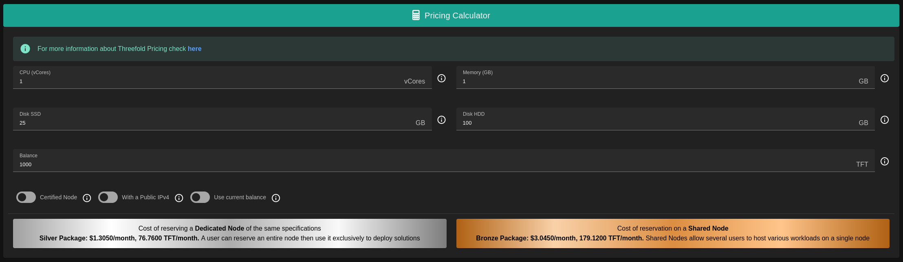

# TF Resource Calculator

A tool provided by ThreeFold that allows users to estimate and calculate potential cost of a deployment on the ThreeFold grid. The resource calculator takes into account various factors, including deployment resources, node certification, currnet balance, and in return it displays an accurate estimate for the deployment in terms of ThreeFold Tokens (TFT) and in USD per month.

