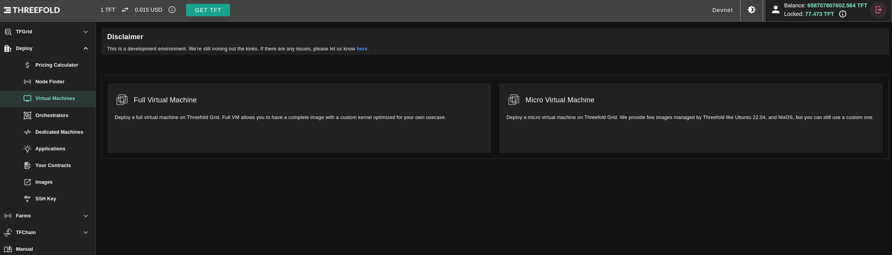

<h1> Virtual Machines </h2>

On the TFGrid, you can deploy both micro and full virtual machines.

***

<h2> Table of Contents </h2>

- [Micro and Full VM Differences ](../solutions/vm_differences.md)
- [Full Virtual Machine](../solutions/fullVm.md)
- [Micro Virtual Machine](../solutions/vm.md)
