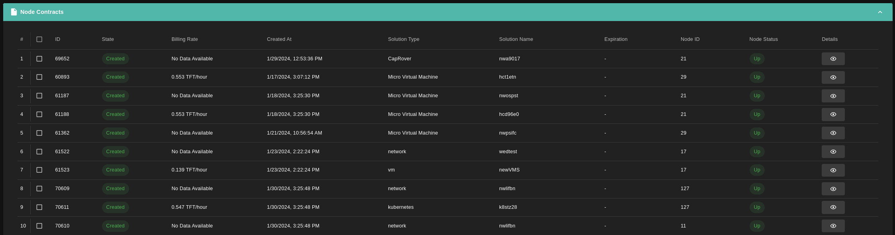
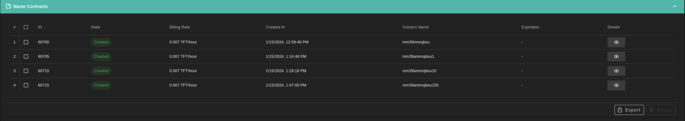
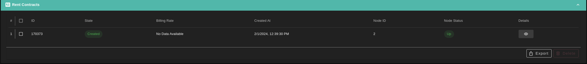

# Contracts

From the Contracts section you can check your contracts by navigating to the `Deploy` then `Your Contracts` tab from the sidebar.

From there you will see the `Contracts List`, the list is split into three different sections. these sections are:

### Node contracts

### Name contracts

### Rent contracts

This list includes the following information about each contract.

- Contract ID.
- Contract Type.
- Contract State (Created, Deleted, GracePeriod).
- Solution Typw
- Billing Rate (in TFT/Hour).
- Solution Name.
- Created At.
- Expiration (Only appears if the contract is in GracePeriod).
- Node ID
- Node Status (Up, Down, Standby).
- Show Details (This button will display the detailed information of the desired contract).

   

## Cancel Contract

You can also cancel the target contract/s by select the contract you want to cancel

- Click on the checkbox on the left side of the contract row
- Click on the delete button in the bottom right of the table
- Review the contract/s ID then click on *Delete* button

Note:

>- You can Cancel all you contracts by clicking on the checkbox on the left side of the table header then click on *Delete* button.
>- It is advisable to remove the contract from its solution page, especially when multiple contracts may be linked to the same instance.
