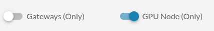
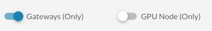
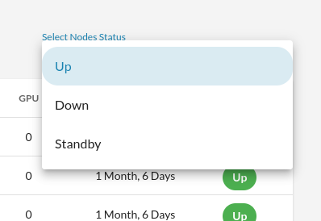
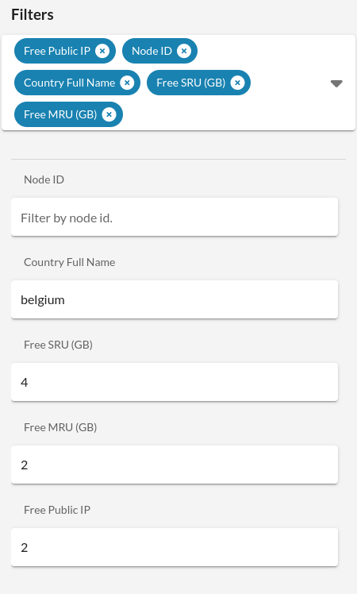
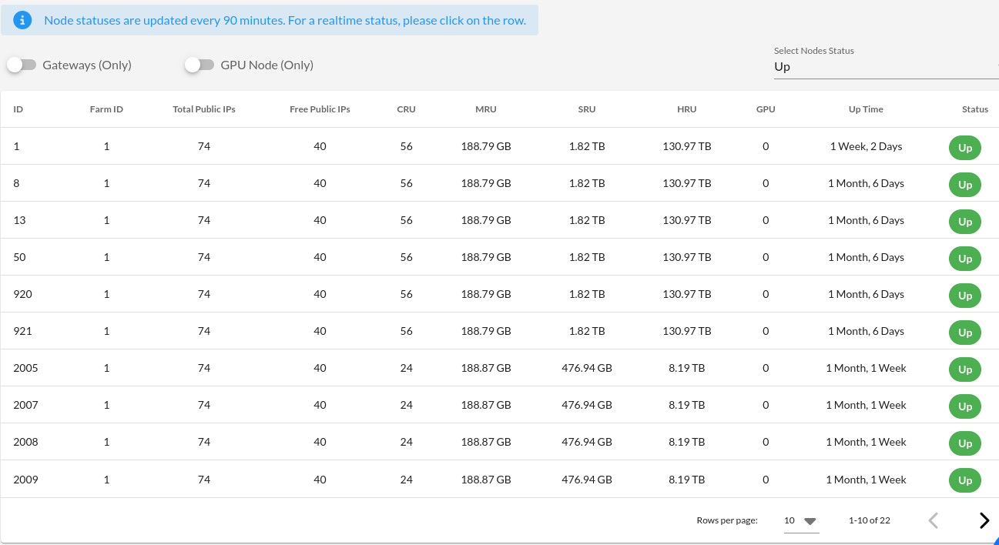
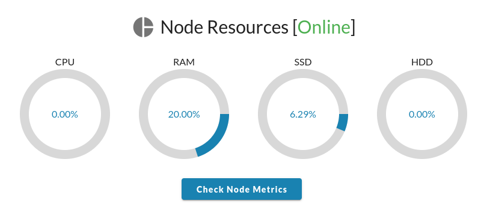
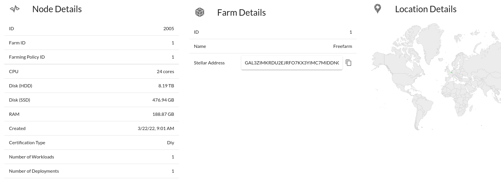
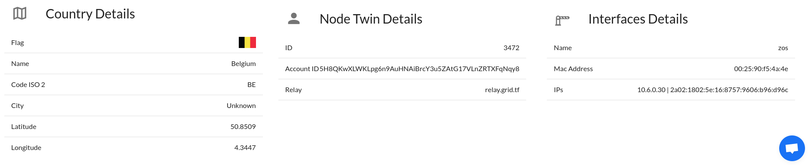
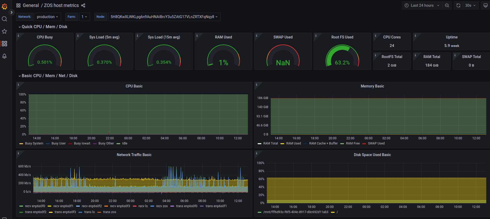

<h1> ThreeFold Nodes Explorer </h1>

<h2>Table of Contents</h2>

- [Introduction](#introduction)
- [Nodes Explorer Links](#nodes-explorer-links)
- [Nodes Explorer Parameters](#nodes-explorer-parameters)
- [Nodes Explorer Filters](#nodes-explorer-filters)
  - [Note on Public IP](#note-on-public-ip)
- [Finding a Node](#finding-a-node)
- [Questions and Feedback](#questions-and-feedback)

***

## Introduction

In this section, we cover how to use the ThreeFold Nodes Explorer to find capacity on the TFGrid. 

Using the ThreeFold Nodes Explorer is a quick way to make sure that you are deploying on a node that is optimal for your specific workload. For example, you can use the Explorer to verify that there is enough capacity on a given node for your workload requirements.

## Nodes Explorer Links

Each network has a specific Dashboard. Make sure to use the correct URL that corresponds to the network you are deploying on.

- [Devnet Dashboard](https://dashboard.dev.grid.tf)
  - [Nodes Explorer](https://dashboard.dev.grid.tf/#/deploy/nodes)
- [Qanet Dashboard](https://dashboard.qa.grid.tf)
  - [Nodes Explorer](https://dashboard.qa.grid.tf/explorer/nodes)
- [Testnet Dashboard](https://dashboard.test.grid.tf)
  - [Nodes Explorer](https://dashboard.test.grid.tf/explorer/nodes)
- [Mainnet Dashboard](https://dashboard.grid.tf) 
  - [Nodes Explorer](https://dashboard.grid.tf/explorer/nodes)

## Nodes Explorer Parameters

There are many ways to use the Nodes Explorer. 

To search only nodes with GPU, click on the toggle button **GPU Node (Only)**.

To search only gateway nodes, click on the toggle button **Gateways (Only)**.

On the right of the window, there is a drop-down menu to filter nodes based on their status: **Up**, **Down** and **Standby**. By default, this is set to **Up**.

Note that you can combine all those parameters.

## Nodes Explorer Filters

You can use different filters to narrow down your search. They are as follows:

- Node ID
- Twin ID
- Farm IDs
- Farm Name
- Country Full Name
- Free SRU (GB)
- Total HRU (GB)
- Total MRU (GB)
- Total CRU (Cores)
- Free Public IP

### Note on Public IP

If you want to find a node with a public IP, it is recommended to set the filter **Free Public IP** to at least **2**. This will make sure that the public IP of the nodes presented to you are properly set.

## Finding a Node

To give you an overview of the search process, let's look for a node in Belgium with at least 4GB of SSD storage, 2GB of memory and an available public IP. We simply select those filters in the filter menu and set the filter information:

The nodes corresponding to your search are then presented to you:

At any time, you can click on a given node to see the node information:

You can also click on **Check Node Metrics** to see the node information on Grafana. Using Grafana can be quite useful to get some very precise node data.

Once you've found a proper node for your deployment, take note of its node ID. There are different ways to deploy on a node. For example, you can use [Terraform](../../terraform/terraform_readme.md) or [Pulumi](../../pulumi/pulumi_readme.md).

## Questions and Feedback

If you have any questions, you can ask the ThreeFold community for help on the [ThreeFold Forum](http://forum.threefold.io/) or on the [ThreeFold Grid Tester Community](https://t.me/threefoldtesting) on Telegram. You can also reach the [ThreeFold Support](https://threefoldfaq.crisp.help/en/) for help.