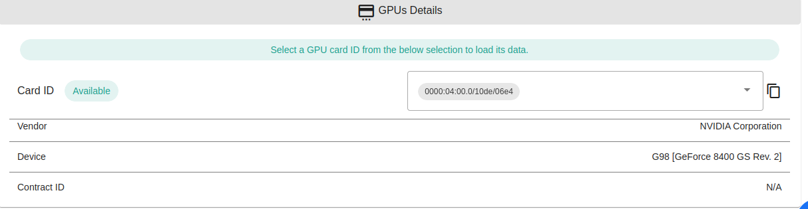

<h1> GPU Support and the TF Explorer </h1>

<h2> Table of Contents </h2>

- [Introduction](#introduction)
- [TF Explorer](#tf-explorer)
- [Statistics View](#statistics-view)

***

## Introduction

TF Explorer is a powerful tool that empowers users to navigate and interact with the ThreeFold Grid seamlessly. Offering a comprehensive Statistics View, the TF Explorer provides real-time insights into the network, enabling users to make informed decisions and optimize their experiences within the decentralized ecosystem.

One of the groundbreaking advancements introduced in the ThreeFold Grid is the support for GPUs. This addition opens up new possibilities for users seeking enhanced computational capabilities. However, it's important to note that to leverage GPU support, users must rent the entire 3Node as a dedicated server. This ensures the optimal utilization of GPU resources and provides users with a dedicated environment for deploying GPU-accelerated workloads on the TFGrid.

## TF Explorer

- A new filter for GPU supported node is now available on the TF Explorer
- GPU count
- Filtering capabilities based on the model / device

On the details pages is shown the card information and its status (`reserved` or `available`) also the ID that’s needed to be used during deployments is easily accessible and has a copy to clipboard button.

Here’s an example of how it looks in case of reserved

The TF Dashboard is where to reserve the nodes the farmer should be able to set the extra fees on the form and the user also should be able to reserve and get the details of the node (cost including the extrafees, GPU informations).

***

## Statistics View

A simple card with GPUs count been added.

