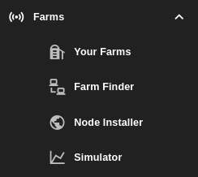

# Farms

Here you will find everything farming related. this includes:

- Monitoring, creating, and updating your farms from the [Your Farms](./your_farms.md) section where you can also check your nodes and update multiple things like the public configuration and extra fees of the node.
- Exploring and finding farms that are available on the ThreeFold grid from the [Farm Finder](./farms_finder.md) section.
- Generating your own boot device for your system from the [Node Installer](./node_installer.md) section.
- Estimating and calculating potential earnings from farming on the ThreeFold Grid from the [Simulator](./simulator.md) section.

   

***

## Table of Content

- [Your Farms](./your_farms.md)
- [Farm Finder](./farms_finder.md)
- [Node Installer](./node_installer.md)
- [Simulator](./simulator.md)