# Farms <!-- omit from toc -->

This comprehensive guide aims to provide users with detailed instructions and insights into efficiently managing their _Farms_. Farms encompass servers and storage devices contributing computational and storage capabilities to the grid, empowering users to oversee, maintain, and optimize their resources effectively.

- [Getting started](#getting-started)
- [Create a new Farm](#create-a-new-farm)
- [Manage Your Farms](#manage-your-farms)
  - [Add a public IP to your Farm](#add-a-public-ip-to-your-farm)
  - [Add a Stellar address for payout](#add-a-stellar-address-for-payout)
  - [Generate your node bootstrap image](#generate-your-node-bootstrap-image)
  - [Additional information](#additional-information)
- [Manage Your Nodes](#manage-your-nodes)
  - [Node information](#node-information)
  - [Extra Fees](#extra-fees)
  - [Public Configuration](#public-configuration)
    - [The Difference Between IPs Assigned to Nodes Versus a Farm](#the-difference-between-ips-assigned-to-nodes-versus-a-farm)

## Getting started

After logging in to the TF Dashboard, on the sidebar click on **Dashboard** then _Your Farms_ .

## Create a new Farm

If you want to start farming, you need a farmID, the ID of the farm that is owning the hardware node(s) you connect to the TFGrid.

**Currently on**:

- [Devnet](https://dashboard.dev.grid.tf/)
- [Qanet](https://dashboard.qa.grid.tf/)
- [Testnet](https://dashboard.test.grid.tf/)
- [Mainnet](https://dashboard.grid.tf/)

Click `Create Farm` and choose a name.

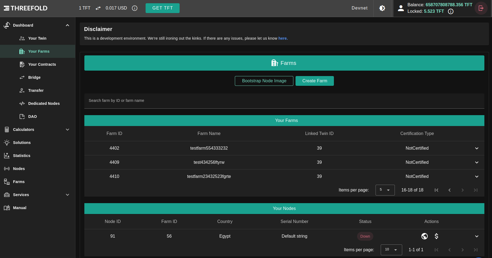

Click on `Create`.

The farm is by default set up as 'DIY'. A farm can become certified through certification program.
Also a pricing policy is defined. Pricing policy is currently the same for all farms, the field is created for future use.

## Manage Your Farms

You can browse your Farms in _Farms_ table; Farms table contains all your own farms and its your entry point to manage your farm as in the following sections.

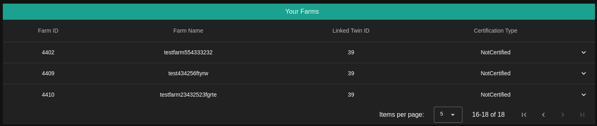

### Add a public IP to your Farm

If you have public IPv4 addresses available that can be used for usage on the TFGrid, you can add them in your farm.
Click `ADD IP`, specify the addresses, the gateway and click `CREATE`.
You can add them one by one or using range of IPs.

**Some notes about adding a new IPs**:

- Be careful not to create a new IP range that contains an IP address that already exists; doing so will result in an error.
- Verify that both the gateway address and the IP address are correct.
- Be careful not to include the same gateway address in a new IP range.

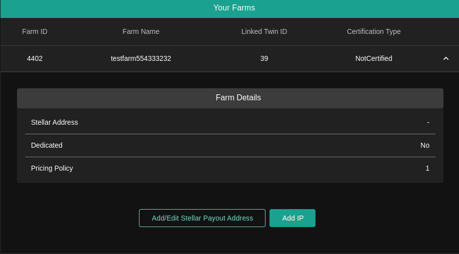

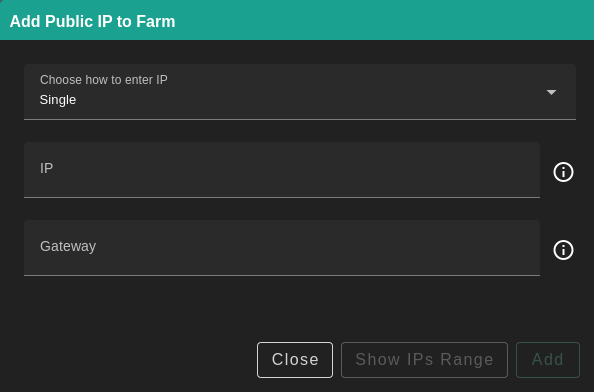

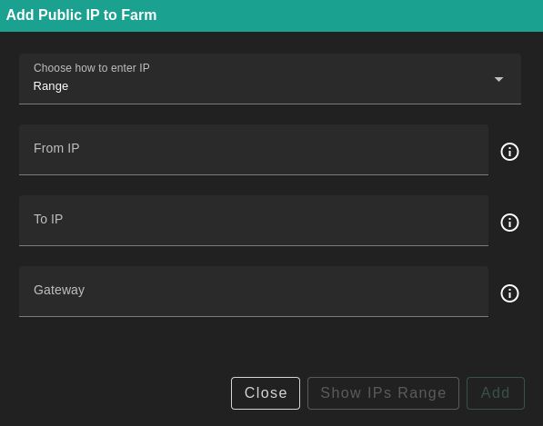

Deleting IPv4 addresses is also possible here. The `Deployed Contract ID` gives an indication of whether an IP is currently used. If it is 0, it is safe to remove it.

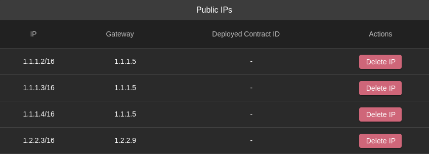

### Add a Stellar address for payout

In a first phase, farming of tokens still results in payout on the Stellar network. So to get the farming reward, a Stellar address needs to be provided.

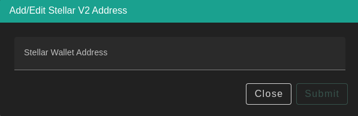

You can read about different ways to store TFT [here](../../threefold_token/storing_tft/storing_tft.md). Make sure to use a Stellar wallet for your farming rewards.

### Generate your node bootstrap image

Once you know your farmID, you can set up your node on TFGrid3. Click on `Bootstrap Node Image`.

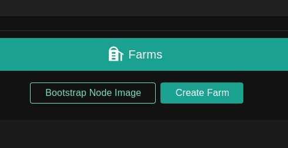

Read more Zero-OS bootstrap image [here](../../farmers/3node_building/2_bootstrap_image.md).

### Additional information

After booting a node, the info will become available in `Your Nodes` table, including the status info along with the minting and fixup receipts.

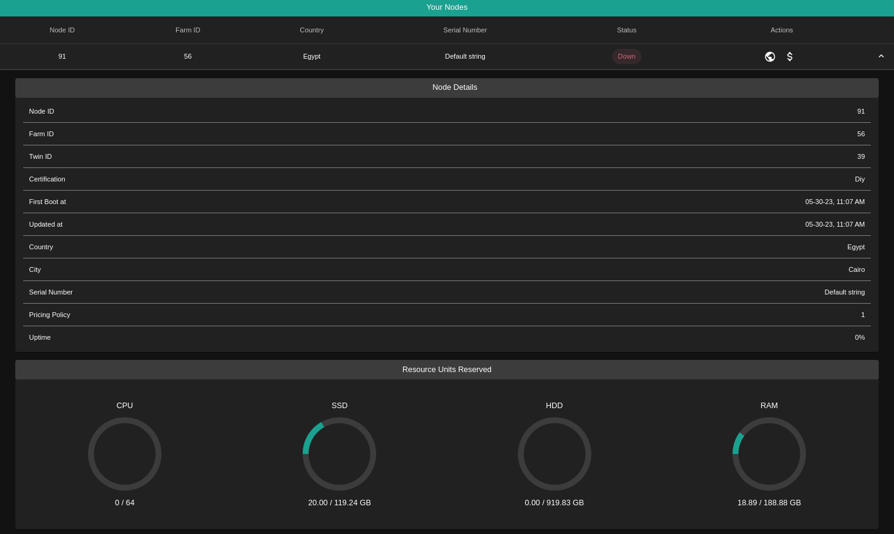

Clicking on the node statistics will open up a calendar where you can view the periods the node was minting or undergoing a fixup. Clicking on the periods will show a popup with the start and end datetimes, receipt hash and the amount of TFTs minted (if it is a minting receipt).

You can also download a single node's receipts using the `Download Receipts` button within the node statistics. Moreover, you can download all of the nodes' receipts using the `Download Receipts` button on the top left corner of the farm nodes table.

## Manage Your Nodes

as in farms table _Nodes_ table contains all your own nodes and its your entry point to manage your farm as in the following sections.

### Node information

Expand your node information by clicking on the expand button in the target node row.

### Extra Fees

You can set a price for the special hardware you’re providing e.g. GPUs while renting.

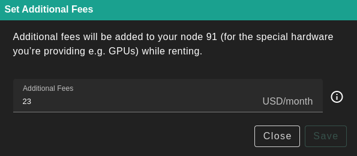

- Under the **Your Nodes** table, locate the target node and click **Set Additional Fees** under **Actions**
- Set a monthly fee (in USD) and click **Save**

### Public Configuration

To configure public IP addresses to a specific Node

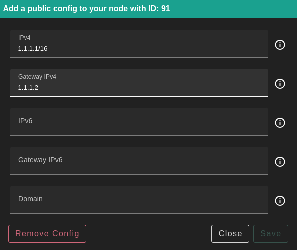

- Under the **Your Nodes** table, locate the target node and click **Add a public config** under **Actions**
- Fill in the necessary information and click save. Only the IPv4 address and gateway are necessary.

> The IPv6 address and the Domain are optional but if you provide The IPv6 you have to provide its Domain.

#### The Difference Between IPs Assigned to Nodes Versus a Farm

---

IPs assigned to a farm are available to be rented by workloads. They can be assigned to virtual machines for example. IPs assigned to nodes enable each node to become a gateway.
