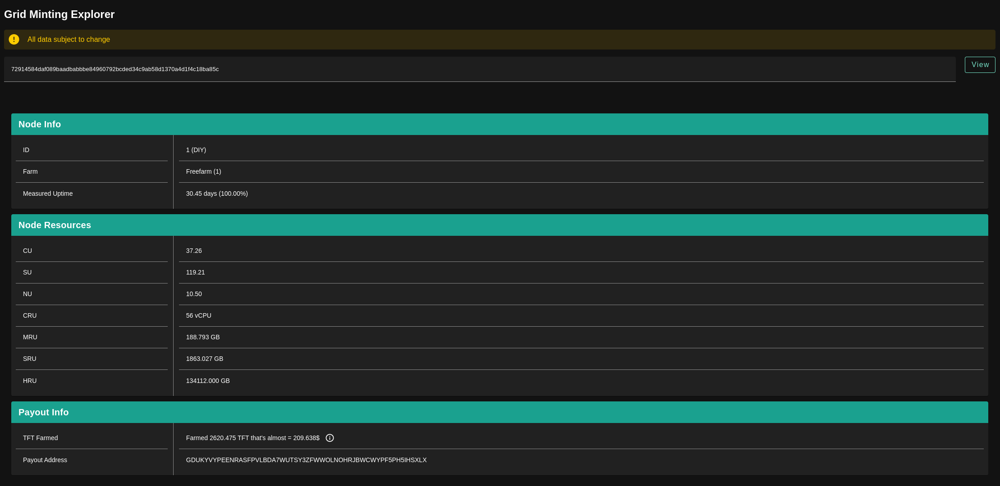

# Services

This section contains shortcuts for important grid services that the user might need.

### 0-Bootstrap

Generate your own boot device for your system and download Zero-OS Images

### 0-Hub

Find or Publish your Flist

### Grid Health

Check the status of ThreeFold services

### Minting

TFGrid Minting Explorer

### Monitoring

Monitor and check the metrics and status of Zero-OS nodes

