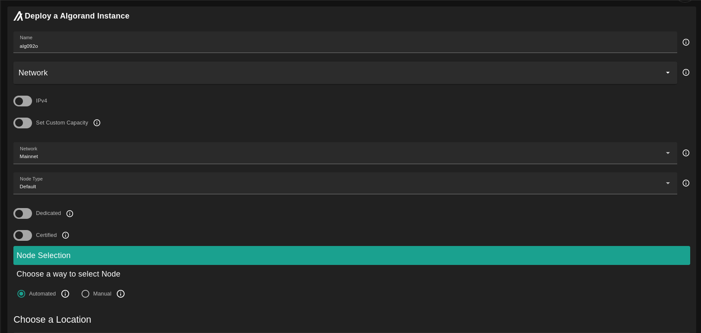
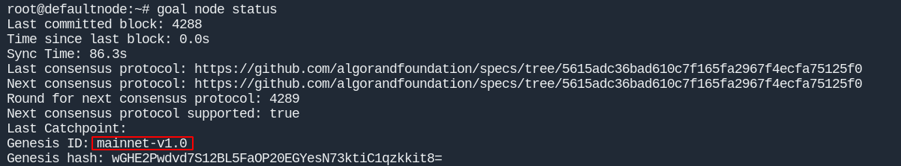
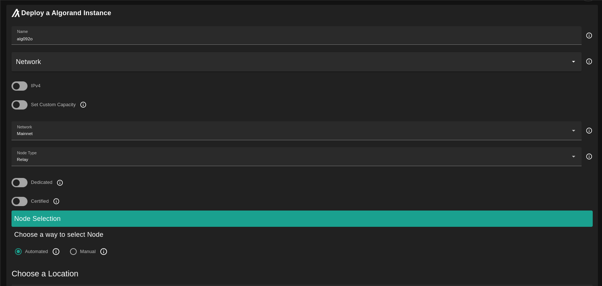
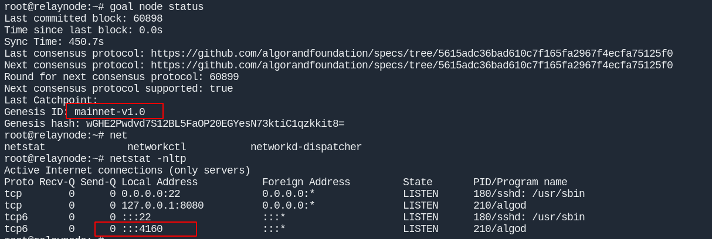
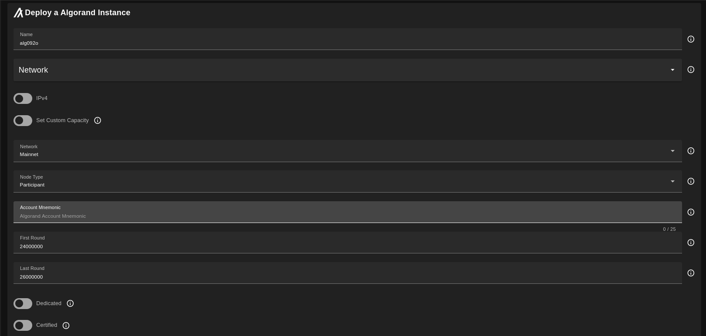
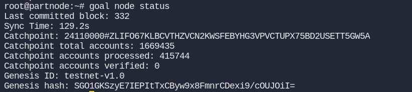
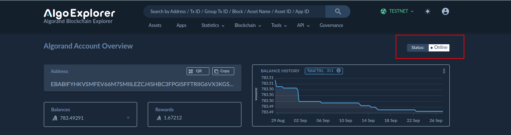

<h1> Algorand </h1>

<h2>Table of Contents</h2>

- [Introduction](#introduction)
- [Prerequisites](#prerequisites)
  - [Algorand Structure](#algorand-structure)
- [Run Default Node](#run-default-node)
- [Run Relay Node](#run-relay-node)
- [Run Participant Node](#run-participant-node)
- [Run Indexer Node](#run-indexer-node)
- [Select Capacity](#select-capacity)

***

## Introduction

[Algorand](https://www.algorand.com/) builds technology that accelerates the convergence between decentralized and traditional finance by enabling the simple creation of next-generation financial products, protocols, and exchange of value.

## Prerequisites

- Make sure you have a [wallet](../wallet_connector.md)
- From the sidebar click on **Applications**
- Click on **Algorand**

### Algorand Structure

- Algorand has two main [types](https://developer.algorand.org/docs/run-a-node/setup/types/#:~:text=The%20Algorand%20network%20is%20comprised,%2C%20and%20non%2Drelay%20nodes.) of nodes (Relay or Participant) you can run also a 4 networks you can run your node against. Combining the types you can get:
  - Defualt:
    This is a Non-relay and Non-participant
    It can run on (Devnet, Testnet, Betanet, Mainnet)
  - Relay:
    Relay node Can't be participant.
    It can run only on (Testnet, Mainnet)
  - Participant:
    Can run on any of the four nets.
  - Indexer:
    It is a default node but with Archival Mode enbled which will make you able to query the data of the blockchain.

## Run Default Node

The basic type. you select any network you want. and for the node type select Default.

after the deployment is done. `ssh` to the node and run `goal node status`

here you see your node run against mainnet.

## Run Relay Node

Relay nodes are where other nodes connect. Therefore, a relay node must be able to support a large number of connections and handle the processing load associated with all the data flowing to and from these connections. Thus, relay nodes require significantly more power than non-relay nodes. Relay nodes are always configured in archival mode.

The relay node must be publicaly accessable. so it must have public ip.

after the deployment is done. `ssh` to the node and run `goal node status` to see the status of the node. and also you can check if the right port is listening (:4161 for testnet, and :4160 for mainnet)

The next step accourding to the [docs](https://developer.algorand.org/docs/run-a-node/setup/types/#relay-node) is to register your `ip:port` on Algorand Public SRV.

## Run Participant Node

Participation means participation in the Algorand consensus protocol. An account that participates in the Algorand consensus protocol is eligible and available to be selected to propose and vote on new blocks in the Algorand blockchain.
Participation node is responsible for hosting participation keys for one or more online accounts.

What you need?
- Account mnemonics on the network you deploy on (offline) you can check the status for you account on the AlgoExplorer. search by your account id.

  The account needs to have some microAlgo to sign the participation transaction.
  - [Main net explorer](https://algoexplorer.io/)
  - [Test net explorer](https://testnet.algoexplorer.io/)

- First Round: is the first block you need your participaiton node to validate from. you can choose the last block form the explorer.
  
- Last Round: is the final block your node can validate. let's make it 30M

after the deployment is done. `ssh` to the node and run `goal node status` to see the status of the node. you see it do catchup. and the fast catchup is to make the node sync with the latest block faster by only fetch the last 1k blocks. after it done it will start create the participation keys.

now if you check the explorer you can see the status of the account turned to Online

## Run Indexer Node

The primary purpose of this Indexer is to provide a REST API interface of API calls to support searching the Algorand Blockchain. The Indexer REST APIs retrieve the blockchain data from a PostgreSQL compatible database that must be populated. This database is populated using the same indexer instance or a separate instance of the indexer which must connect to the algod process of a running Algorand node to read block data. This node must also be an Archival node to make searching the entire blockchain possible.

After it finish you can access the indexer API at port `8980` and here are the [endpoint](https://developer.algorand.org/docs/rest-apis/indexer/) you can access.

## Select Capacity

The default scinario the capacity is computed based on the node (network/type) accourding to this [reference](https://howbigisalgorand.com/).
But you still can change this only to higher values by selecting the option `Set Custom Capacity`
  