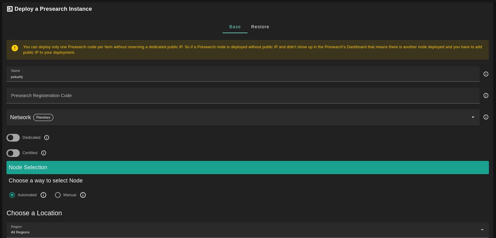
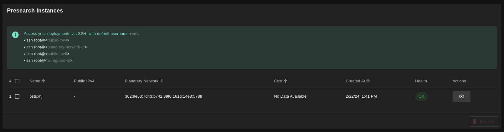

<h1> Presearch </h1>

<h2> Table of Contents </h2>

- [Introduction](#introduction)
- [Prerequisites](#prerequisites)
- [Deploy a Presearch Node](#deploy-a-presearch-node)
- [Migrate an Existing Presearch Node to the TFGrid](#migrate-an-existing-presearch-node-to-the-tfgrid)
- [Verify if a 3Node Already Runs a Presearch Workload](#verify-if-a-3node-already-runs-a-presearch-workload)
- [Learn More About Presearch](#learn-more-about-presearch)
- [Questions and Feedback](#questions-and-feedback)

***

## Introduction

[Presearch](https://www.presearch.io/) is a community-powered, decentralized search engine that provides better results while protecting your privacy and rewarding you when you search. This weblet deploys a Presearch node. Presearch Nodes are used to process user search requests, and node operators earn Presearch PRE tokens for joining and supporting the network.

## Prerequisites

- Make sure you have a [wallet](../wallet_connector.md)
- From the sidebar click on **Applications**
- Click on **Presearch**

## Deploy a Presearch Node



- Enter an instance name.

- You need to sign up on Presearch in order to get your *Presearch Registration Code*. To sign up, go to the [Presearch](https://presearch.com) website, create your account and then head to your [dashboard](https://nodes.presearch.com/dashboard) to find your registration code.

- Choose the network
   - `Public IPv4` flag gives the virtual machine a Public IPv4
   - `Planetary Network` to connect the Virtual Machine to Planetary network

- `Dedicated` flag to retrieve only dedeicated nodes 
- `Certified` flag to retrieve only certified nodes 
- Choose the location of the node
   - `Region`
   - `Country`
   - `Farm Name`

- Choose the node to deploy the Virtual Machine on 
> Or you can select a specific node with manual selection.

## Migrate an Existing Presearch Node to the TFGrid

Now what if you already have a Presearch node deployed somewhere and would like to migrate to Threefold?

We got you! All you need to do is:

1. Login to your old server that has your node via SSH.
2. Run `docker cp presearch-node:/app/node/.keys presearch-node-keys` in order to generate your key-pair.
3. Head to the *Restore* tab in the Presearch weblet and paste your key-pair in the fields below and you'll be good to deploy!


After that is done you can see a list of all of your deployed instances



Now head to your [dashboard](https://nodes.presearch.com/dashboard) again and scroll down to **Current Nodes**, you'll see your newly created node up and connected!


## Verify if a 3Node Already Runs a Presearch Workload

You can do the following to verify if a Presearch workload deployed without a public IP address already has a Presearch workload running. Note that you will first need to deploy a Presearch workload on the 3Node. After deployment, you can SSH into the VM and do the verification.

* SSH into the VM running the Presearch workload
  * ```
    ssh root@<VM_IP_Address>
    ```
* List running containers and identity the Presearch container
  * ```
    docker ps
    ```
* Print the logs of the Presearch container
  * ```
    docker logs <Presearch_container_name>
    ```
* If there is no other Presearch workload running on the 3Node, you will see a similar output:
  * > 2023-10-16T12:18:33.780Z info: Node is listening for searches...
* If there is another Presearch workload running on the 3Node, you will see a similar output:
  * > 2023-10-16T12:24:00.346Z error: Duplicate IP: This IP Address is already running another Node. Only one Node is permitted per IP Address.
  * If there is another Presearch workload running, you will need to either deploy on another 3Node with a public IP or deploy on another node without a public IP that isn't running a Presearch deployment.
  


## Learn More About Presearch

To learn more about Presearch, you can read the [Presearch documentation](https://docs.presearch.io/).

## Questions and Feedback

If you have any questions, you can ask the ThreeFold community for help on the [ThreeFold Forum](http://forum.threefold.io/) or on the [ThreeFold Grid Tester Community](https://t.me/threefoldtesting) on Telegram.