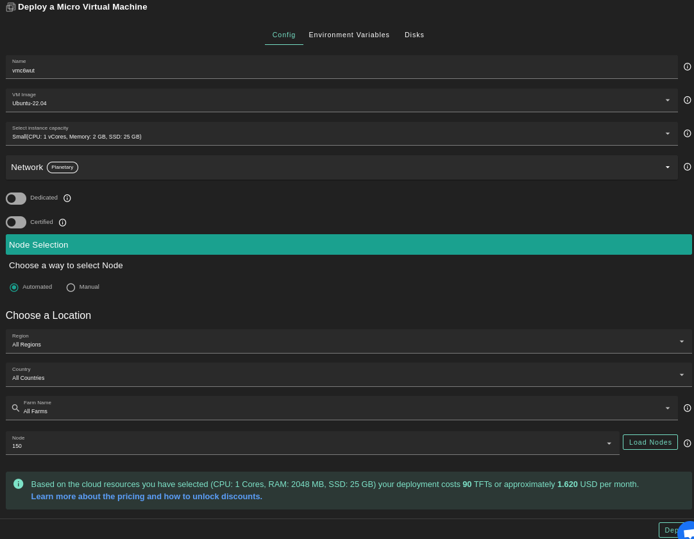
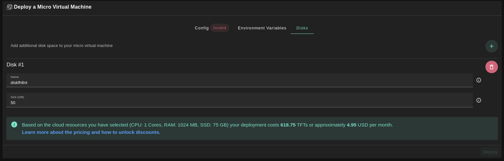
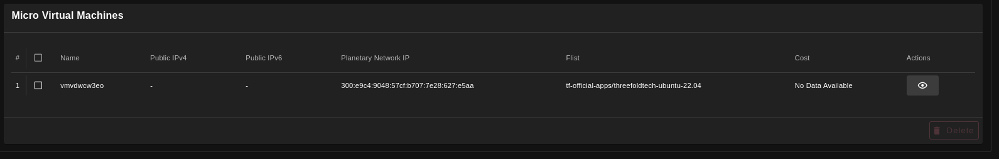
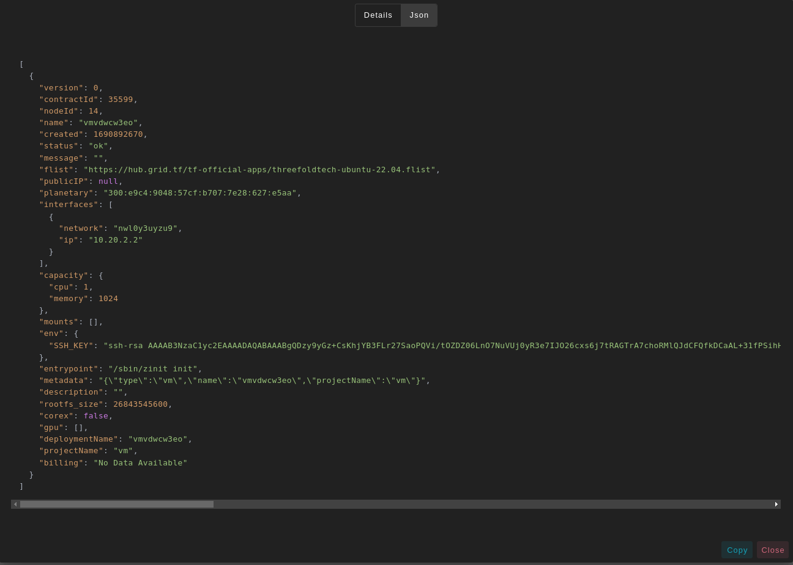

<h1> Micro Virtual Machine </h1>

<h2>Table of Contents </h2>

- [Introduction](#introduction)
- [Deployment](#deployment)

***

## Introduction

We present the steps to deploy a micro VM on the TFGrid.

## Deployment

Deploy a new virtual machine on the Threefold Grid

- Make sure you have a [wallet](../wallet_connector.md)
- From the sidebar click on **Solutions**
- Click on **Micro Virtual Machine**

__Process__ : 

- Fill in the instance name: it's used to reference the VM in the future.
- Choose the image from the drop down (e.g Alpine, Ubuntu) or you can click on `Other` and manually specify the flist URL and the entrypoint.
- Select a capacity package:
    - **Small**: {cpu: 1, memory: 2, diskSize: 25 }
    - **Medium**: {cpu: 2, memory: 4, diskSize: 50 }
    - **Large**: {cpu: 4, memory: 16, diskSize: 100}
    - Or choose a **Custom** plan
- Choose the network
   - `Public IPv4` flag gives the virtual machine a Public IPv4
   - `Public IPv6` flag gives the virtual machine a Public IPv6
   - `Planetary Network` to connect the Virtual Machine to Planetary network
   - `Wireguard Access` to add a wireguard acces to the Virtual Machine
- `GPU` flag to add GPU to the Virtual machine
- `Dedicated` flag to retrieve only dedicated nodes 
- `Certified` flag to retrieve only certified nodes 
- Choose the location of the node
   - `Region`
   - `Country`
   - `Farm Name`
- Choose the node to deploy the Virtual Machine on 
> Or you can select a specific node with manual selection.

* In the section `Environment Variables`, you can add any environment variables that the machine might need

* In the section `Disks`, You can attach one or more disks to the Virtual Machine by clicking on the Disks tab and the plus `+` sign and specify the following parameters
   - Disk name 
   - Disk size

in the bottom of the page you can see a list of all of the virual machines you deployed. you can click on `Show details` for more details

You can also go to JSON tab for full details
