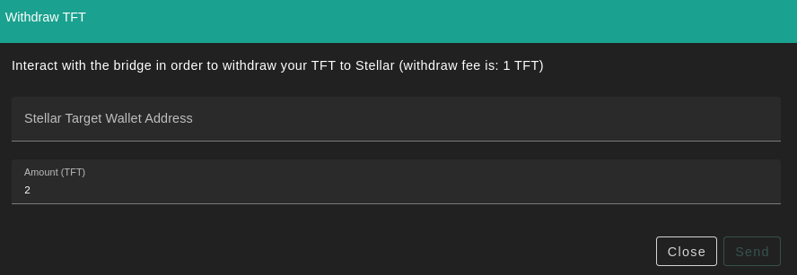

# TF Token Bridge

Transferring TFT between Stellar and Tfchain

## Usage

This document will explain how you can transfer TFT from Tfchain to Stellar and back.

## Prerequisites

- Stellar wallet

- Account on TFchain (use TF Dashboard to create one).

## Stellar to Tfchain

You can deposit to Tfchain using the bridge page on the TF Dashboard

A deposit of tokens from the Stellar network onto TF-Chain needs to happen from a Stellar wallet, like in the ThreeFold Connect App.

You have 2 options:

- TFT needs to be sent to the bridge account
- specifying in the memo field the twinID that was generated with the Twin creation e.g. twin_110 (dont forget twin_)
- Note there is a transaction cost of 1 TFT.

Or

- You can scan the QR code

## Tfchain to Stellar

You can bridge back to stellar using the bridge page on the dashboard, click *withdraw*:

After indicating the destination address and the amount to be transferred, click *Send*.

A withdraw fee of 1 TFT will be taken, so make sure you send a larger amount as 1 TFT.
The amount withdrawn from TFChain will be sent to your Stellar wallet.
