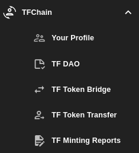

# TFChain

Here you will find everything related to the ThreeFold chain. this includes:

- Detailed account information from the [Your Profile](./your_profile.md) section.
- Information about what DAO is and how to vote on DAO proposals from the [TF DAO](./tf_dao.md) section.
- Transferring TFTs on different chains from the [TF Token Bridge](./tf_token_bridge.md) section.
- Transferring TFTs on the TFChain from the [TF Token Transfer](./tf_token_transfer.md) section.
- getting miniting reports from the [TF Minting Reports](./tf_minting_reports.md) section.

   

***
## Table of Content

- [Your Profile](./your_profile.md)
- [TF DAO](./tf_dao.md)
- [TF Token Bridge](./tf_token_bridge.md)
- [TF Token Transfer](./tf_token_transfer.md)
- [TF Minting Reports](./tf_minting_reports.md)