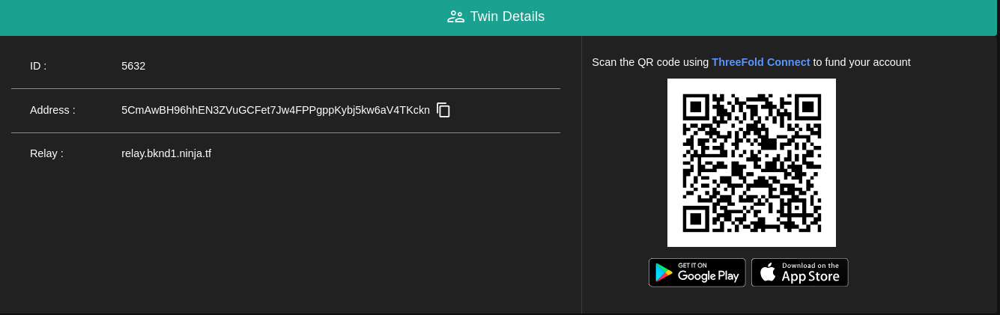

<h1>Twin Management</h1>

The TF Twin management feature of the ThreeFold Dashboard enables users to create, manage, and monitor their individual digital entities known as **Twins**. A Twin can represent a virtual machine (VM) or a container running on the ThreeFold Grid. With the Twin management, users can easily deploy and scale their workloads, allocate resources, and configure networking and storage settings for their Twins.

The twin details consists of three main items.

- `ID` Your unique identifier for your twin on the ThreeFold chain.
- `Address` Your public address on the ThreeFold chain.
- `Relay` A relay is a component that facilitates the reliable and secure transfer of messages between different entities within the ThreeFold ecosystem.

To create a twin check the [Wallet Connector](../wallet_connector.md) Section. 