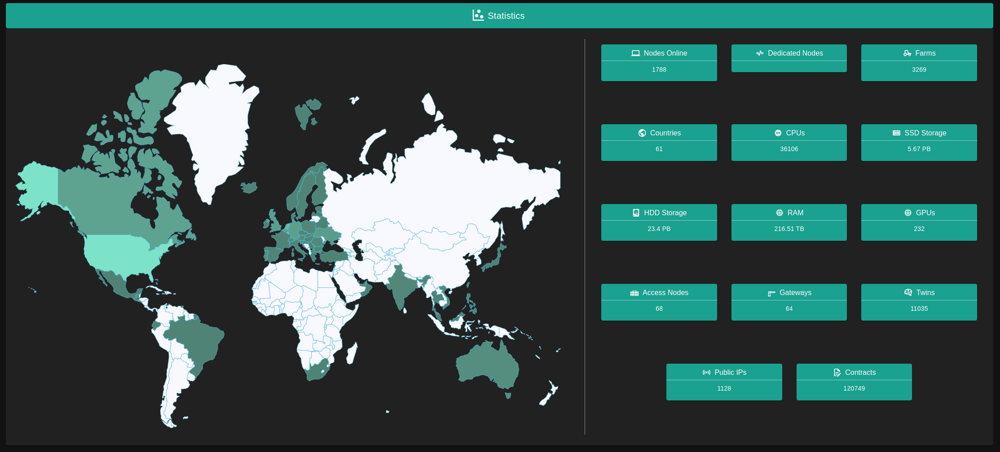

# Statistics

Statistics allows you to see the distribution of 3Nodes all over the world with information on how many nodes are available and in which country.

Here you can see generic overview about:

- Number of Nodes
- Number of Dedicated Nodes
- Number of Farms
- Number of Countries 
- The capacity CRU, SRU, HRU, MRU
- Number of GPUs
- Number of Gateways
- Number of Twins
- The number of public IPs available
- Number of Contracts