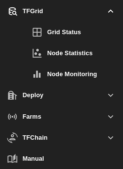

# TFGrid

Check and use all things related to the threefold grid. Including:

- The status of ThreeFold services from the [Grid Status](./grid_status.md) website.
- The statistics of all nodes that are available on the ThreeFold grid from [Node Statistics](./node_statistics.md).
- The health and status of Zero-OS nodes that are available on the ThreeFold grid from [Node Monitoring](./node_monitoring.md).

   

***

## Table of Content

- [Grid Status](./grid_status.md)
- [Node Statistics](./node_statistics.md)
- [Node Monitoring](./node_monitoring.md)