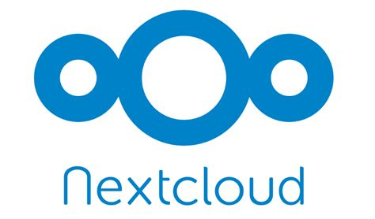

<h1>Weblet Case Study: Nextcloud AIO</h1>



<h2>Table of Contents</h2>

- [Introduction](#introduction)
- [Process Overview and Preparation Steps](#process-overview-and-preparation-steps)
- [Building a Weblet](#building-a-weblet)
  - [Add an Icon](#add-an-icon)
  - [Add a Description](#add-a-description)
  - [Update deployment\_list.ts](#update-deployment_listts)
  - [Update /types/index.ts](#update-typesindexts)
  - [Update /router/index.ts](#update-routerindexts)
  - [Update vm\_deployment\_table.vue](#update-vm_deployment_tablevue)
  - [Update App.vue](#update-appvue)
  - [Update delete\_deployment.ts](#update-delete_deploymentts)
  - [Update tf\_deployment\_list.vue](#update-tf_deployment_listvue)
  - [Create nextcloud\_view.vue](#create-nextcloud_viewvue)
  - [Create tf\_nextcloud.vue](#create-tf_nextcloudvue)
- [Questions and Feedback](#questions-and-feedback)

***

## Introduction

In this ThreeFold guide, we explore how to create a weblet on the Playground. To do so, we will use the Nextcloud weblet as a case study. This weblet is ideal to study since it uses many of the ThreeFold Grid functionalities, such as gateways and gateway domains.

By reading this guide, you should have a proper understanding of the general process of building a new weblet on the ThreeFold Grid. This might give you inspiration to build your own weblet and contribute to the ThreeFold Playground.

## Process Overview and Preparation Steps

The bulk of the files needed for the Nextcloud weblet can be found in the [ThreeFold tfgrid-sdk-ts repository](https://github.com/threefoldtech/tfgrid-sdk-ts) on GitHub. More specifically, we are interested in the subdirectory called [playground](https://github.com/threefoldtech/tfgrid-sdk-ts/tree/development/packages/playground).

While there are many ways to proceed in the development of a ThreeFold weblet for the Playground, we present here a general method that works efficiently and is well organized.

The information provided here are specific to the Nextcloud workload, but it can be applied to other types of workload.

Before building the Nextcloud weblet, we first deployed a [Nextcloud instance](../../terraform/advanced/terraform_nextcloud_aio.md) on the ThreeFold Grid with a full virtual machine. Once this deployment was working well, we built an [Nextcloud flist](../../flist/flist_case_studies/flist_nextcloud_case_study.md). You can consult the Nextcloud flist code in the ThreeFold Tech [tf-images repository](https://github.com/threefoldtech/tf-images/tree/development/tfgrid3/nextcloud). We note that the flist uses a micro VM. There are some differences between a full VM and a micro VM. We propose users to first start deploying with a full VM and then adjust their work when they want to publish an flist with a micro VM, since full VM are easier to work with. You can of course start directly with a micro VM if you want.

In sum, once we were confortable launching Nextcloud on a full VM and also using an flist, we were ready to tackle the building of a weblet. These steps should be taken into account when building your own weblet. We proceed this way to ensure that the workload is properly configured. Once we know the flist is working properly, we can focus on the weblet aspect of the deployment, knowing the deployment itself is working properly.

## Building a Weblet

In the subsections that follow, we cover all the different files that either need to be updated or created when building a weblet on the Playground. 

For the most part, the work consist of updating existing files to add the Nextcloud information. As you will see, the bulk of the work is happening with the file named **tf_nextcloud.vue**, where we set the main weblet page seen on the Playground.

### Add an Icon

We added a Nextcloud icon to be featured on the Playground by adding a **png** file at the following directory **packages/playground/public/images/icons/nextcloud.png**.

### Add a Description

We added a description to the Nextcloud weblet by adding a markdown file at the following directory **packages/playground/public/info/nextcloud.md**. This file contains a short description of Nextcloud for users to quickly understand what the weblet does.

### Update deployment_list.ts

In the file **deployment_list.ts**, we set parameters to be shared to the Nextcloud weblet during deployment. The file is available at the following directory **packages/playground/src/constants/deployment_list.ts**. 

In our case, the Nextcloud content is the following:

```
  nextcloud: {
    SSH_KEY: _ssh,
    NEXTCLOUD_AIO_LINK: "Nextcloud Setup",
    NEXTCLOUD_DOMAIN: "Nextcloud Domain",
  },
```

We can see here that the weblet will receive the SSH public key, the Nextcloud setup and domain links. The SSH public key will allow users to connect to the VM via SSH. The Nextcloud setup link is linked to the  The Nextcloud domain is used to set the domain name to the Nextcloud instance. The Nextcloud setup and domain links will be linked to the **Actions** buttons once the workload is deployed. 

### Update \/types\/index.ts

In the file **index.ts**, located at the directory **packages/playground/src/types/**, we set the **ProjectName**, **SolutionCode** and **solutionType** for the Nextcloud weblet.

We added the line **Nextcloud = "Nextcloud",** in the array **export enum ProjectName**. This will provide a name for the Nextcloud weblet, which will be used in the Deployment table shown on the Playground.

We added the line **nextcloud = "nc"** in the array **export enum SolutionCode**. This will be used notably as a prefix for the randomly generated deployment name. For example, when the user deploys a Nextcloud weblet, the name of the VM could be **ncxwbt2**.

We also added the line **nextcloud: "Nextcloud",** in the array **export const solutionType: { [key: string]: string } =**. This will be used when setting a contract with the TFGrid.

### Update \/router\/index.ts

In the file **index.ts**, located at the directory **packages/playground/src/router/**, we add the following lines in the array **const router = createRouter**:

```
    {
      path: "/nextcloud",
      component: () => import("../views/nextcloud_view.vue"),
      meta: { title: "Nextcloud", info: { page: "info/nextcloud.md" } },
    },
```

We can see that this section makes use of the Nextcloud description seen in the [description section](#add-a-description). It also sets the path to the **nextcloud_view.vue** file.

### Update vm_deployment_table.vue

In the file **vm_deployment_table.vue**, located at the directory **packages/playground/src/components/**, we added the line **ProjectName.Nextcloud** in the constant section named **IPV4Solutions**. 

The Nextcloud IPv4 address will thus be shown in the deployment table after the user has deployed the Nextcloud weblet.

If, for example, we wanted to display the WireGuard address in the deployment table, we would add **ProjectName.Nextcloud** in the array named **WireguardSolutions**.

### Update App.vue

In the file **App.vue**, located at the directory **packages/playground/src/**, we added the line **{ title: "Nextcloud", icon: "nextcloud.png", route: "/nextcloud" },** in the section named **const routes: AppRoute[]**.

### Update delete_deployment.ts

In the file **delete_deployment.ts**, located at the directory **packages/playground/src/utils/delete_deployment.ts**, we added the line **ProjectName.Nextcloud,** in the section named **const solutions**.

### Update tf_deployment_list.vue

In the file **tf_deployment_list.vue**, located at the directory **packages/playground/src/weblets/tf_deployment_list.vue**, we added the following code to set Actions buttons that are clickable once the workload is deployed:

```
        <template #Nextcloud-actions="{ item }">
          <IconActionBtn
            tooltip="Show Details"
            icon="mdi-eye-outline"
            @click="openDialog(tabs[activeTab].value, item)"
          />
          <IconActionBtn
            tooltip="Open Nextcloud"
            color="anchor"
            icon="mdi-web"
            :href="'https://' + item.value[0].env.NEXTCLOUD_DOMAIN"
          />
          <IconActionBtn
            tooltip="Nextcloud Setup"
            color="anchor"
            icon="mdi-view-dashboard"
            :href="'https://' + item.value[0].env.NEXTCLOUD_AIO_LINK"
          />
        </template>
```

We note that this section makes use of the **NEXTCLOUD_DOMAIN** and **NEXTCLOUD_AIO_LINK** environment variables shown the section [Update the Deployment List](#update-the-deployment-list).

At the end of the file, at the section **const tabs: Tab[]**, we also added the line **{ title: "Nextcloud", value: "Nextcloud", imgPath: "images/icons/nextcloud.png" },**. We note that this line makes use of the Nextcloud icon we set in the **icons** directory.

### Create nextcloud_view.vue

We created a file named **nextcloud_view.vue**. Instead of starting from scratch, we took a file template from an already existing file, in our case it was **owncloud_view.vue**. We only needed to change a few lines to make it work with the Nextcloud weblet.

```
<template>
  <view-layout>
    <TfNextcloud />

    <template #list>
      <TfDeploymentList title="Nextcloud Instances" :project-name="name" />
    </template>
  </view-layout>
</template>

<script lang="ts">
import { ProjectName } from "../types";
import TfDeploymentList from "../weblets/tf_deployment_list.vue";
import TfNextcloud from "../weblets/tf_nextcloud.vue";

export default {
  name: "NextcloudView",
  components: {
    TfNextcloud,
    TfDeploymentList,
  },
  setup() {
    return { name: ProjectName.Nextcloud };
  },
};
</script>
```

The line containing **TfDeploymentList title** sets the strings used to present the different Nextcloud instances in the deployment table, populated once we deploy a Nextcloud workload on the Playground.

We also note that this file imports the variables **TfDeploymentList** and **TfNextcloud** from the files **tf_deployment_list.vue** and **tf_nextcloud.vue** respectively. These variables are then exported in the section **export default**. We recall that in **tf_deployment_list.vue**, we set the Actions button, as well as set the weblet name and icon.

The file **tf_nextcloud.vue** is covered in the next section.

### Create tf_nextcloud.vue

We created a file named **tf_nextcloud.vue**. Instead of starting from scratch, we took a file template from an already existing file, in our case it was **owncloud.vue**. That being said, since the Nextcloud weblet uses the gateway as well as gateway domains, some major updates were necessary.

This file constitutes the bulk of the work when building a weblet for the Playground.

## Questions and Feedback

If you have any questions, you can ask the ThreeFold community for help on the [ThreeFold Forum](http://forum.threefold.io/) or on the [ThreeFold Grid Tester Community](https://t.me/threefoldtesting) chat on Telegram.