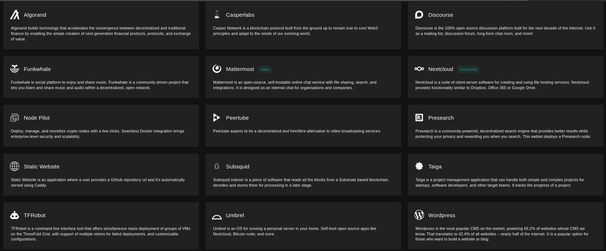

<h1> Ready Community Applications </h1>

Easily deploy your favourite applications on the ThreeFold grid with a click of a button.

***

<h2> Table of Contents </h2>

- [Algorand](../solutions/algorand.md)
- [CasperLabs](../solutions/casper.md)
- [Discourse](../solutions/discourse.md)
- [Funkwhale](../solutions/funkwhale.md)
- [Grid Stack Suite](../solutions/grid_stack_suite/grid_stack_suite.md)
  - [Dashboard Suite](../solutions/grid_stack_suite/dashboard_suite.md)
  - [ZOS Boot Generator](../solutions/grid_stack_suite/zos_boot_generator.md)
- [Mattermost](../solutions/mattermost.md)
- [Nextcloud](../solutions/nextcloud.md)
- [Node Pilot](../solutions/nodepilot.md)
- [Peertube](../solutions/peertube.md)
- [Presearch](../solutions/presearch.md)
- [Static Website](../solutions/static_website.md)
- [Subsquid](../solutions/subsquid.md)
- [Taiga](../solutions/taiga.md)
- [TFRobot](../solutions/tfrobot.md)
- [Umbrel](../solutions/umbrel.md)
- [WordPress](../solutions/wordpress.md)