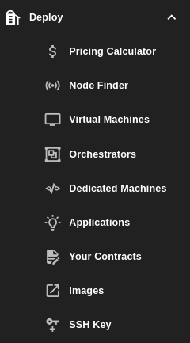

# Deploy

Here you will find everything related to deployments on the ThreeFold grid. This includes:

- Checking the cost of a deployment using [Pricing Calculator](./pricing_calculator.md)
- Finding a node to deploy on using the [Node Finder](./node_finder.md)
- Deploying your desired workload from [Virtual Machines](../solutions/vm_intro.md), [Orchestrators](./orchestrators.md), or [Applictions](./applications.md)
- Renting your own node on the ThreeFold grid from [Dedicated Machines](./dedicated_machines.md)
- Consulting [Your Contracts](./your_contracts.md) on the TFGrid
- Finding or publishing Flists from [Images](./images.md)
- Updating or generating your SSH key from [SSH Keys](./ssh_keys.md)

   

***

## Table of Content

- [Pricing Calculator](./pricing_calculator.md)
- [Node Finder](./node_finder.md)
- [Virtual Machines](../solutions/vm_intro.md)
- [Orchestrators](./orchestrators.md)
- [Dedicated Machines](./dedicated_machines.md)
- [Applications](./applications.md)
- [Your Contracts](./your_contracts.md)
- [Images](./images.md)
- [SSH Keys](./ssh_keys.md)