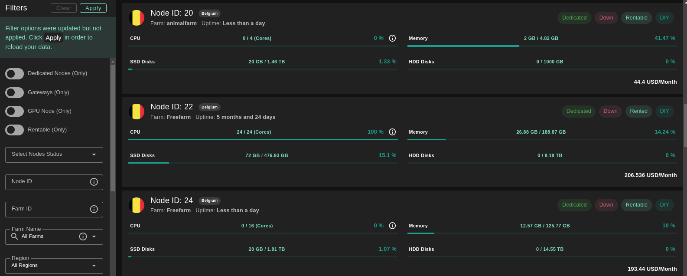
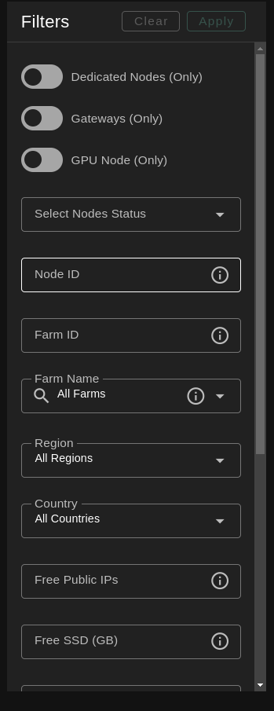
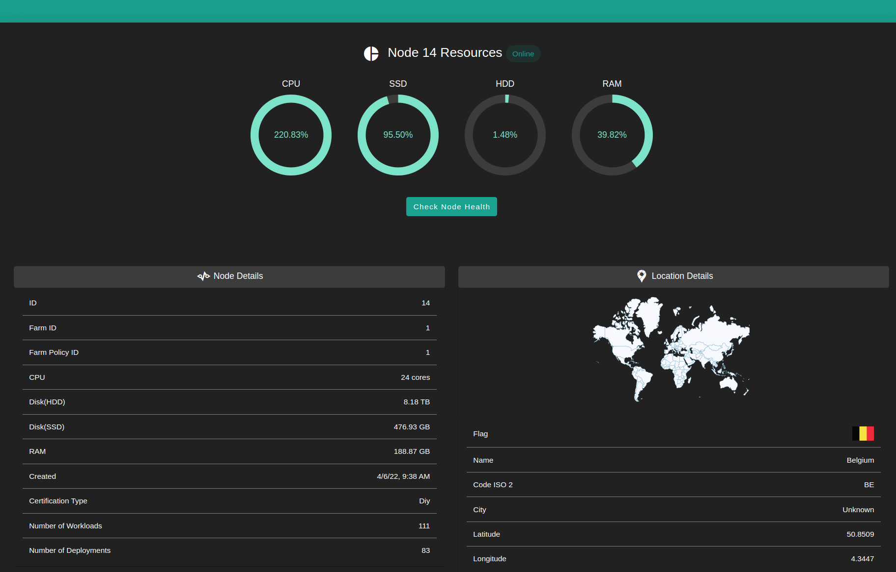
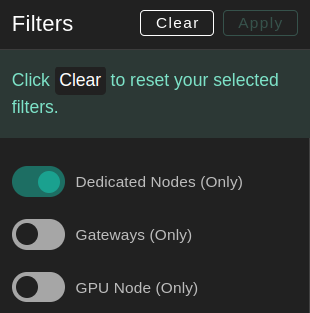
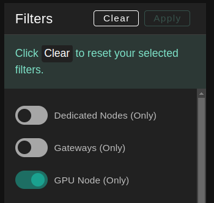
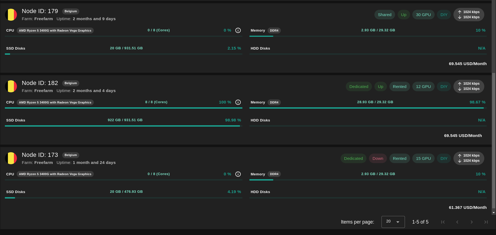
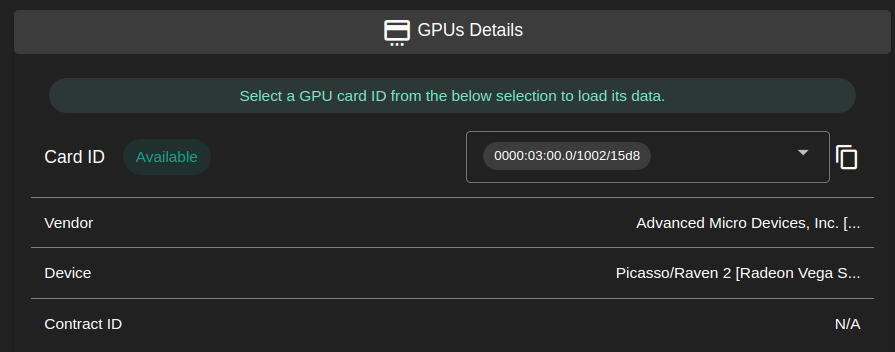

<h1>Node Finder</h1>

<h2>Table of Contents</h2>

- [Overview](#overview)
- [Filters](#filters)
- [Node Details](#node-details)
- [Dedicated Nodes](#dedicated-nodes)
- [GPU Nodes](#gpu-nodes)

***

## Overview

The Node Finder page provides a more detailed view for the nodes available on the ThreeFold grid with detailed information and statistics about nodes.

## Filters

You can use the filters to narrow your search and find a node with the desired specifications.

## Node Details

You can see all of the node details when you click on its row.

Note that the network speed test displayed in the Node Finder is updated every 6 hours.

## Dedicated Nodes

To see only dedicated nodes, enable **Dedicated Nodes** in the filters.

## GPU Nodes

To see only nodes with GPU, enable **GPU Node** in the filters.

This will filter nodes and only show nodes with GPU. You can see several information such as the model of the GPU and a GPU score. 

You can click on a given GPU node and see the GPU details.

The ID that’s needed to be used during deployments is easily accessible and has a button to copy to the clipboard.