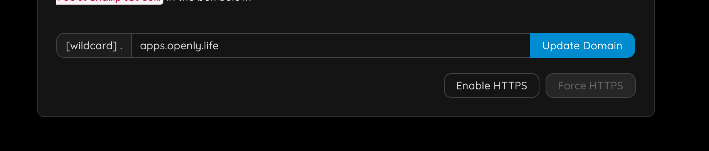
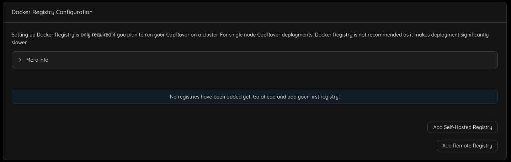
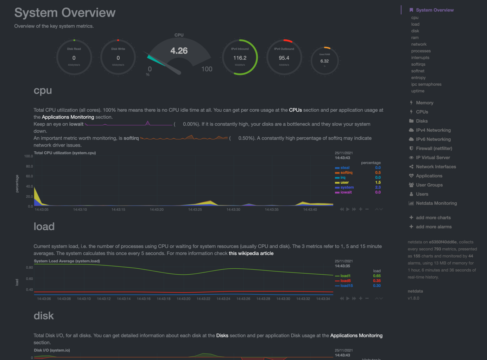

<h1> CapRover Admin <h1>

<h2> Table of Contents </h2>

- [Introduction](#introduction)
- [Step 1: Enable HTTPS](#step-1-enable-https)
- [Step 2: Add a Default Docker Registry](#step-2-add-a-default-docker-registry)
- [Step 3: Deploy an App](#step-3-deploy-an-app)
- [Step 4: Enable Monitoring](#step-4-enable-monitoring)
- [Step 5: Change Your Password](#step-5-change-your-password)

***

## Introduction

We present the steps to manage a CapRover Admin node.

## Step 1: Enable HTTPS

You need to specify your email address.

You will have to login again.

> Now force https.

You will have to login again, and you should notice https is now used.

## Step 2: Add a Default Docker Registry

You'll have to add a default docker registry so other CapRover nodes in the cluster can download images from, and it can be self-hosted (managed by CapRover itself), to add it, go to `Cluster` -> `Docker Registry Configuration`.

You can check [official documentation](https://caprover.com/docs/app-scaling-and-cluster.html#setup-docker-registry) to know more about Docker registry options.

## Step 3: Deploy an App

just go to apps & follow the instructions, there is much more info on caprover website.

## Step 4: Enable Monitoring

You should now see

## Step 5: Change Your Password

- Go to `Settings` and change your password. This is important for your own security.

> Further information regarding the process of attaching a new node to the cluster can be found through the following documentation link: [Attach a New Node to the Cluster](./caprover_worker.md/#step-2-attach-a-new-node-to-the-cluster)