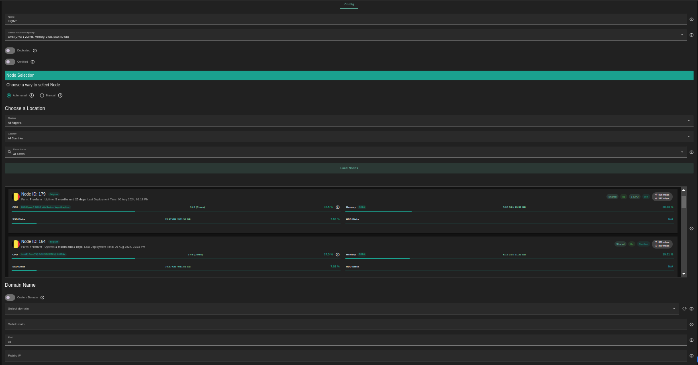
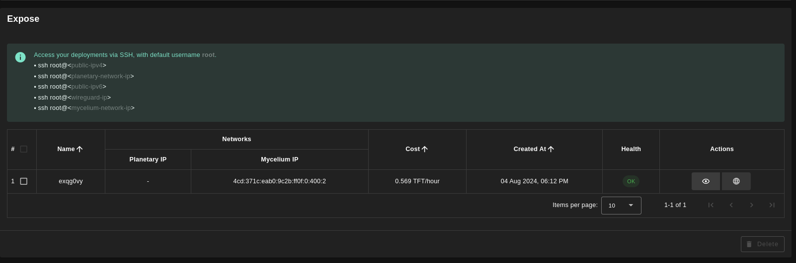

<h1> Expose </h1>

<h2>Table of Contents </h2>

- [Introduction](#introduction)
- [Prerequisites](#prerequisites)
- [Deployment](#deployment)

---

## Introduction

The Expose application allows users to securely expose servers hosted on local machines or VMs to the public internet. Users are required to specify the machine's IP, which can be a Mycelium IP, Yggdrasil IP, or a public IP (IPv4 or IPv6).

## Prerequisites

- Make sure you have a [wallet](../wallet_connector.md)
- From the sidebar click on **Applications**
- Click on **Expose**

## Deployment

- Enter an instance name

- Select a capacity package:

  - **Small**: {cpu: 1, memory: 2 , diskSize: 50 }
  - **Medium**: {cpu: 2, memory: 4, diskSize: 100 }
  - **Large**: {cpu: 4, memory: 16, diskSize: 250 }
  - Or choose a **Custom** plan

- `Dedicated` flag to retrieve only dedicated nodes
- `Certified` flag to retrieve only certified nodes
- Choose the location of the node
  - `Region`
  - `Country`
  - `Farm Name`
- Choose the node to deploy on
  - Note: You can select a specific node with manual selection
- `Custom Domain` flag allows the user to use a custom domain
- Choose a gateway node to deploy your static website

- Enter a subdomain to be added to your domain

- Enter port used to access the machine

- Enter user's machine's public IP , It could be Mycelium IP, Yggdrasil IP, or a public IP (IPv4 or IPv6).

Once this is done, you can see a list of all of your deployed instances:

Click on the button **Visit** under **Actions** to go to your exposed website!
