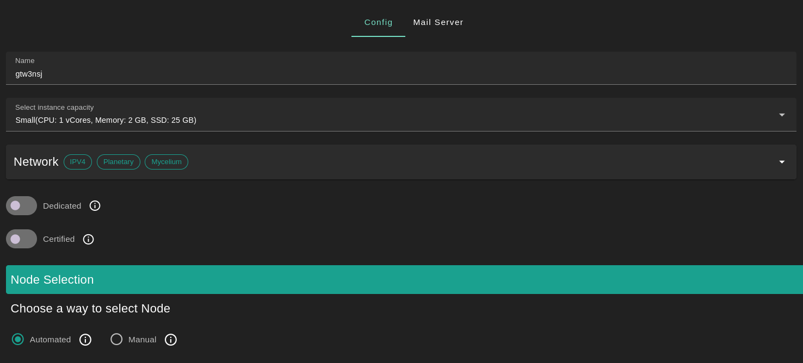
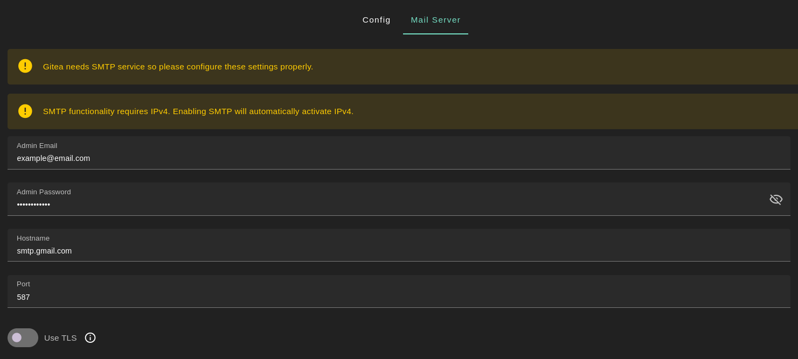
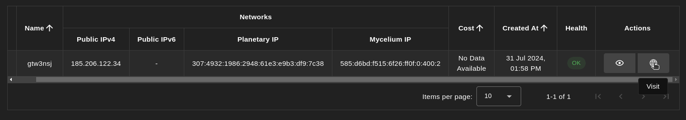
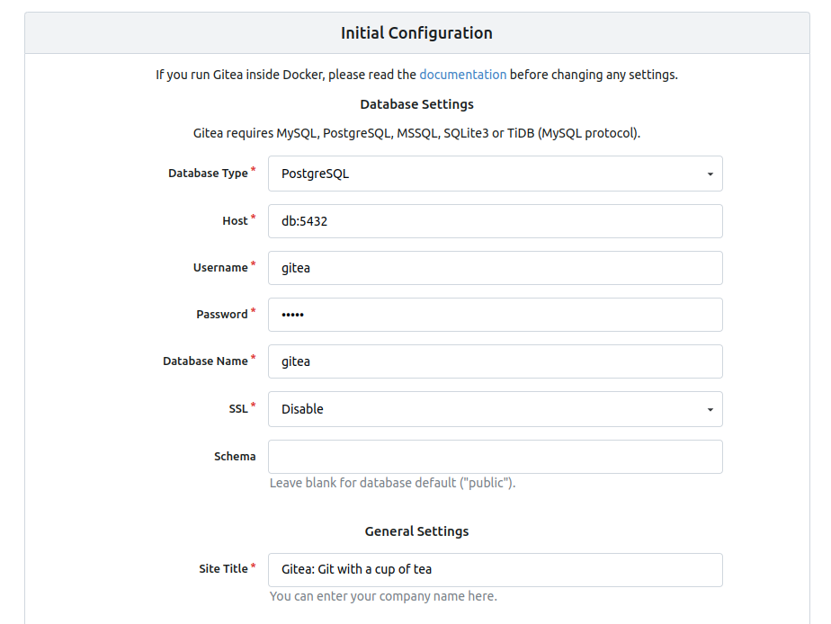
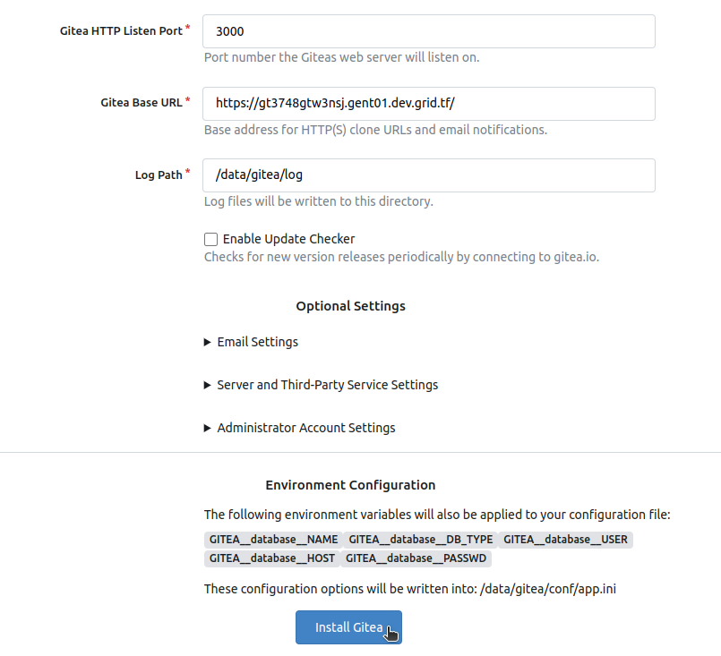
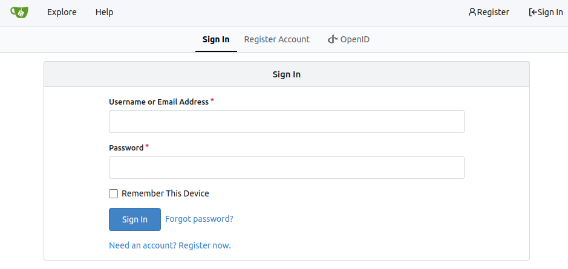

<h1> Gitea </h1>

<h2>Table of Contents</h2>

- [Introduction](#introduction)
- [Prerequisites](#prerequisites)
- [Deployment](#deployment)
- [Setting Up Gitea](#setting-up-gitea)

***

## Introduction

[Gitea](https://about.gitea.com/) is a forge software package for hosting software development version control using Git as well as other collaborative features like bug tracking, code review, continuous integration, kanban boards, tickets, and wikis.

## Prerequisites

- Make sure you have a [wallet](../wallet_connector.md)
- From the sidebar click on **Applications**
- Click on **Gitea**

## Deployment

- Enter a name for your deployment or keep the default name
- Select a capacity package:
    - **Small**: {cpu: 1, memory: 2, diskSize: 25 }
    - **Medium**: {cpu: 2, memory: 4, diskSize: 50 }
    - **Large**: {cpu: 4, memory: 16, diskSize: 100 }
    - Or choose a **Custom** plan
- Choose the network
   - `Public IPv4` flag gives the virtual machine a Public IPv4
   - `Public IPv6` flag gives the virtual machine a Public IPv6
   - `Planetary Network` flag gives the virtual machine an Yggdrasil address
   - `Mycelium` flag gives the virtual machine a Mycelium address

- `Dedicated` flag to retrieve only dedicated nodes 
- `Certified` flag to retrieve only certified nodes 
- Choose the node 
  - Automated
    - Choose the location of the node
       - `Region`
       - `Country`
       - `Farm Name`
    - Click on `Load Nodes`
    - Click on the node you want to deploy on
  - Manual selection
    - Select a specific node ID
- Choose a domain
  - Use a custom domain by enabling `Custom Domain`
  - Choose a gateway domain for your instance
- Set the `Mail Server`
  - In the tab `Mail Server` you can adjust the parameters or leave the default parameters
    - The `Admin Email` by default is the email you used when logging into the Dashboard
    - The `Admin Password` is generated automatically but you can modify it
    - By default the SMTP server used for the `Hostname` is `smtp.gmail.com` with its associated port `587`
    - Enable TLS by clicking on the `TLS` button
- Click `Deploy`

After deployment, you can see a list of all your deployed instances.

To access the Gitea instance, click on the `Actions` button called `Visit`.

## Setting Up Gitea

Once you've accessed the Gitea instance, you can adjust the `Initial Configuration` if needed. 

Once you're ready, click on `Install Gitea`.

Once the configuration is completed, you can register to the Gitea instance and start using it.

