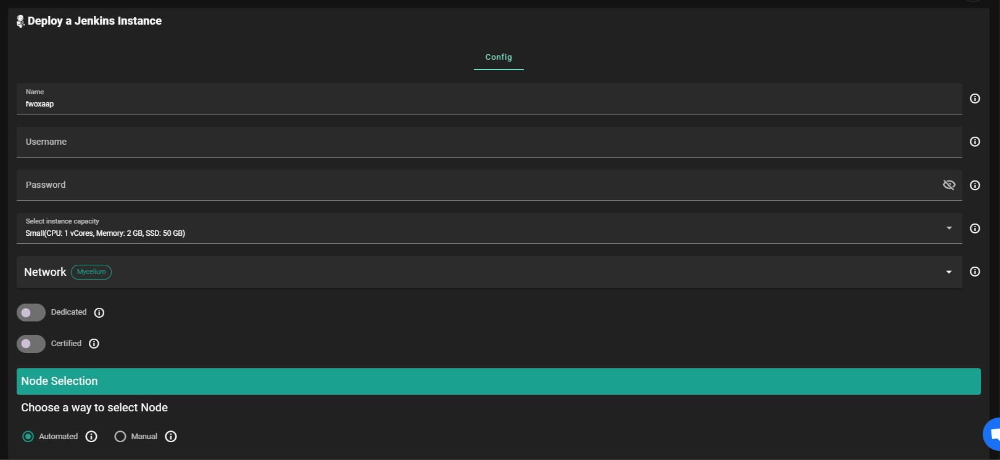
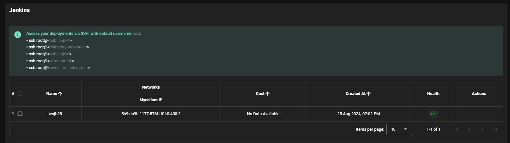
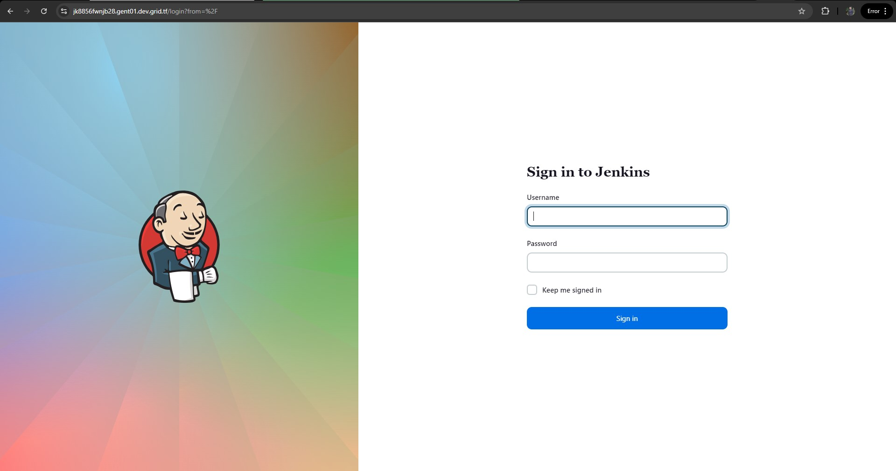

<h1> Jenkins </h1>

<h2>Table of Contents</h2>

- [Introduction](#introduction)
- [Prerequisites](#prerequisites)
- [Deployment](#deployment)
- [Troubleshooting](#troubleshooting)

***

## Introduction

[Jenkins](https://www.jenkins.io/) is a popular open-source automation server that enables developers to build, test, and deploy their applications continuously.

## Prerequisites

- Make sure you have a [wallet](../wallet_connector.md)
- From the sidebar click on **Applications**
- Click on **Jenkins**

## Deployment

__Process__ :

- Enter an Application Name. It's used in generating a unique subdomain on one of the gateways on the network alongside your twin ID. Ex. ***fw100myfunk*.gent02.dev.grid.tf**

- Enter administrator information including **Username**, and **Password**. This admin user will have full permission on the deployed instance.

- Select a capacity package:
    - **Small**: {cpu: 1, memory: 2, diskSize: 50 }
    - **Medium**: {cpu: 2, memory: 4, diskSize: 100 }
    - **Large**: {cpu: 4, memory: 16, diskSize: 250 }
    - Or choose a **Custom** plan
- Choose the network
   - `Public IPv4` flag gives the virtual machine a Public IPv4
   - `Mycelium` flag gives the virtual machine a Mycelium address
- `Dedicated` flag to retrieve only dedeicated nodes 
- `Certified` flag to retrieve only certified nodes 
- Choose the location of the node
   - `Region`
   - `Country`
   - `Farm Name`

- Choose the node to deploy on
> Or you can select a specific node with manual selection.
- `Custom Domain` flag lets the user to use a custom domain
- Choose a gateway node to deploy your Jenkins instance on.

After that is done you can see a list of all of your deployed instances

Use JENKINS_HOSTNAME to go to the homepage of your Jenkins instance!

## Troubleshooting

If you get a `Bad Gateway` while connecting to the website, you might simply need to wait for the deployment to complete.