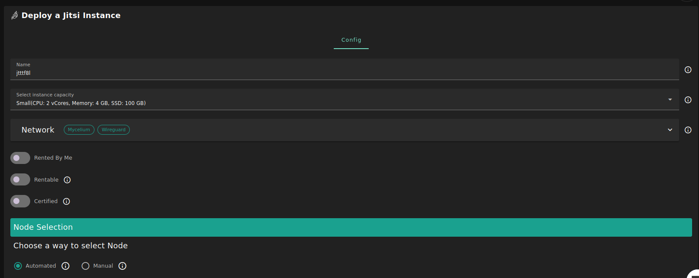

<h1> Jitsi </h1>

## Introduction

Jitsi Meet is a set of Open Source projects which empower users to use and deploy video conferencing platforms with state-of-the-art video quality and features. For more details, check [Jitsi documentation](https://jitsi.github.io/handbook/docs/intro/).

## Prerequisites

- Make sure you have a [wallet](../wallet_connector.md)
- From the sidebar click on **Applications**
- Click on **Jitsi**

## Deployment

**Process** :

- Enter an Application Name. It's used in generating a unique subdomain on one of the gateways on the network alongside your twin ID. Ex. **_fw100myfunk_.gent02.dev.grid.tf**

- Select a capacity package:
  - **Small**: {cpu: 1, memory: 2, diskSize: 50 }
  - **Medium**: {cpu: 2, memory: 4, diskSize: 100 }
  - **Large**: {cpu: 4, memory: 16, diskSize: 250 }
  - Or choose a **Custom** plan
- Choose the network
  - `Public IPv4` flag gives the virtual machine a Public IPv4
  - `Public IPv6` flag gives the virtual machine a Public IPv6
  - `Planetary Network` flag gives the virtual machine an Yggdrasil address
  - `Mycelium` flag gives the virtual machine a Mycelium address
- `Dedicated` flag to retrieve only [dedicated nodes](../deploy/node_finder.md#dedicated-nodes) (rentable or rented by you)
- `Certified` flag to retrieve only certified nodes
- Choose the location of the node

  - `Region`
  - `Country`
  - `Farm Name`

- Choose the node to deploy on
  > Or you can select a specific node with manual selection.
- `Custom Domain` flag lets the user to use a custom domain
- Choose a gateway node to deploy your Jitsi instance on.

After that is done you can see a list of all of your deployed instances

Click on **_Visit_** to go to the homepage of your Jitsi instance!

## Troubleshooting

If you get a `Bad Gateway` while connecting to the website, you might simply need to wait for the deployment to complete.
