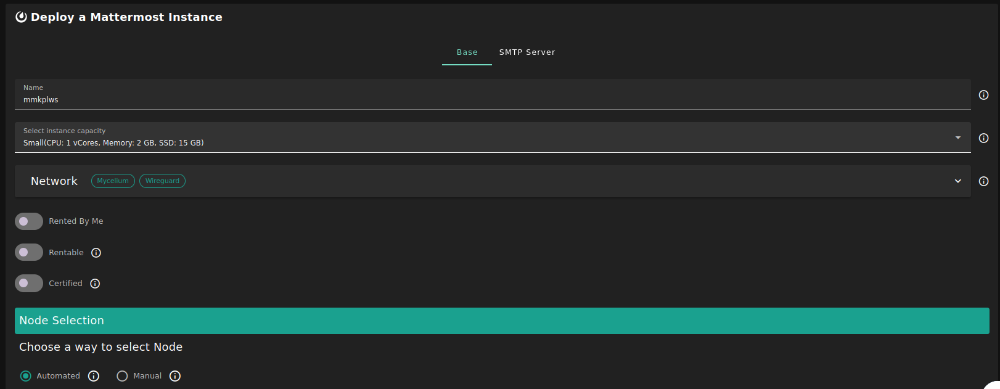

<h1> Mattermost <h1>

<h2>Table of Contents</h2>

- [Introduction](#introduction)
- [Prerequisites](#prerequisites)
- [Deployment](#deployment)

***

## Introduction

[Mattermost](https://mattermost.com/) A single point of collaboration. Designed specifically for digital operations.

## Prerequisites

- Make sure you have a [wallet](../wallet_connector.md)
- From the sidebar click on **Applications**
- Click on **Mattermost**

## Deployment

- Enter an Application Name. It's used in generating a unique subdomain on one of the gateways on the network alongside your twin ID. Ex. ***matter*.gent02.dev.grid.tf**

- Select a capacity package:
    - **Small**: {cpu: 1, memory: 2, diskSize: 15 }
    - **Medium**: {cpu: 2, memory: 4, diskSize: 50 }
    - **Large**: {cpu: 4, memory: 16, diskSize: 100 }
    - Or choose a **Custom** plan
- `Dedicated` flag to retrieve only dedeicated nodes 
- `Certified` flag to retrieve only certified nodes 
- Choose the location of the node
   - `Region`
   - `Country`
   - `Farm Name`

- Choose the node to deploy on
> Or you can select a specific node with manual selection.
- `Custom Domain` flag lets the user to use a custom domain
- Choose a gateway node to deploy your Mattermost instance on.

- There's also an optional **SMTP Server** tab if you'd like to have your Mattermost instance configured with an SMTP server.

   

After that is done you can see a list of all of your deployed instances

Click on ***Visit*** to go to the homepage of your Mattermost instance! You need to login using TFConnect so make sure you download the *TFConnect* app from your App Store.

