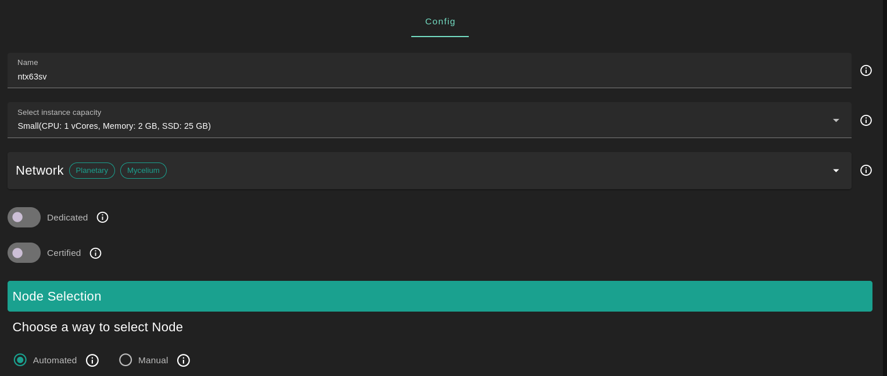
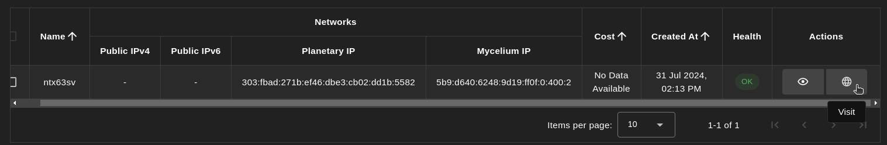

<h1> Nostr </h1>

## Introduction

[Nostr](https://nostr.com/) is a decentralized network protocol for a distributed social networking system. The name is an acronym for "Notes and Other Stuff Transmitted by Relays". It was designed with goals of censorship-resistance in mind. 

## Prerequisites

- Make sure you have a [wallet](../wallet_connector.md)
- From the sidebar click on **Applications**
- Click on **Nostr**

## Deployment

- Enter a name for your deployment or keep the default name
- Select a capacity package:
    - **Small**: {cpu: 1, memory: 2, diskSize: 25 }
    - **Medium**: {cpu: 2, memory: 4, diskSize: 50 }
    - **Large**: {cpu: 4, memory: 16, diskSize: 100 }
    - Or choose a **Custom** plan
- Choose the network
   - `Public IPv4` flag gives the virtual machine a Public IPv4
   - `Public IPv6` flag gives the virtual machine a Public IPv6
   - `Planetary Network` flag gives the virtual machine an Yggdrasil address
   - `Mycelium` flag gives the virtual machine a Mycelium address

- `Dedicated` flag to retrieve only [dedicated nodes](../deploy/node_finder.md#dedicated-nodes) (rentable or rented by you)
- `Certified` flag to retrieve only certified nodes 
- Choose the node 
  - Automated
    - Choose the location of the node
       - `Region`
       - `Country`
       - `Farm Name`

    - Click on `Load Nodes`
    - Click on the node you want to deploy on
  - Manual selection
    - Select a specific node ID
- Choose a domain
  - Use a custom domain by enabling `Custom Domain`
  - Choose a gateway domain for your instance
- Click `Deploy`

After deployment, you can see a list of all your deployed instances.

To access the Nostr instance, click on the `Actions` button called `Visit`.

