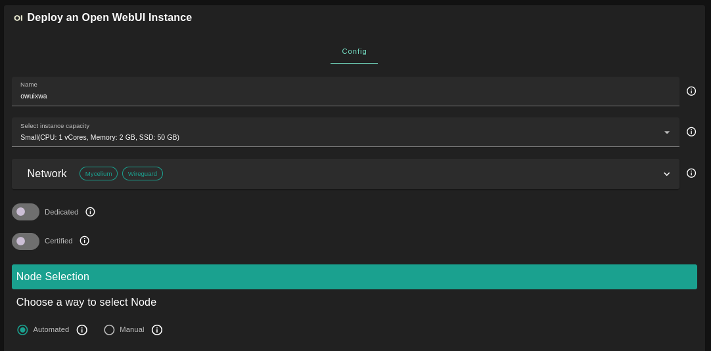
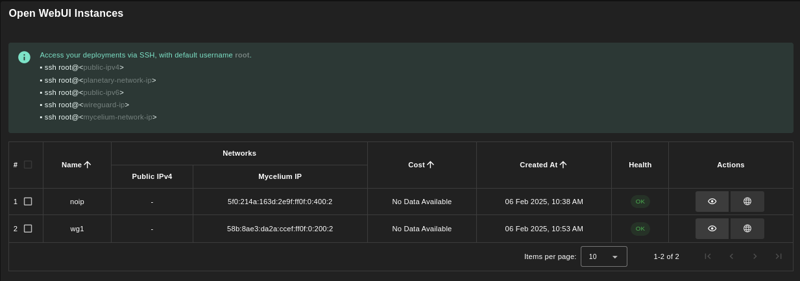

<h1> Open Webui </h1>

## Introduction

Open WebUI is an extensible, feature-rich, and user-friendly self-hosted AI platform designed to operate entirely offline. It supports various LLM runners like Ollama and OpenAI-compatible APIs, with built-in inference engine for RAG, making it a powerful AI deployment solution.

## Prerequisites

- Make sure you have a [wallet](../wallet_connector.md)
- From the sidebar click on **Applications**
- Click on **Open WebUI**

## Deployment



- Enter an instance name

- Select a capacity package:

  - **Small**: {cpu: 1, memory: 2 , diskSize: 50 }
  - **Medium**: {cpu: 2, memory: 4, diskSize: 100 }
  - **Large**: {cpu: 4, memory: 16, diskSize: 250 }
  - Or choose a **Custom** plan
- Choose the network
   - `Mycelium` flag gives the virtual machine a Mycelium address
   - `WireGuard` flag gives the virtual machine a Mycelium address
- `Dedicated` flag to retrieve only [dedicated nodes](../deploy/node_finder.md#dedicated-nodes) (rentable or rented by you)
- `Certified` flag to retrieve only certified nodes
- Choose the location of the node
  - `Region`
  - `Country`
  - `Farm Name`
- Choose the node to deploy on
  - Note: You can select a specific node with manual selection
- `Custom Domain` flag allows the user to use a custom domain (optional)
- Choose a gateway node to deploy your Open WebUI website

Once this is done, you can see a list of all of your deployed instances:



Click on the button **Visit** under **Actions** to go to your Open WebUI instance!

> Note: It will take a few minutes for the deployment to finalize. If you see `Bad Gateway`, simply wait some time and refresh the page.

## Troubleshooting

Models might require high resources. If you encounter the following error: `500: Ollama: 500, message='Internal Server Error', url='http://localhost:11434/api/chat'`, it might simply indicate that your need to provide higher resources (vcpu and GB of RAM). Check the logs for more information (using Mycelium or WireGuard)

```
ssh root@vm_ip
docker logs open-webui
```

## Check the GPU

You can verify that the GPU is working with the following.

> Note: Use `nvidia-smi` for Nvidia and `rocm-smi` for AMD.

- Check that the Docker container can access the GPU
  ```
  docker exec open-webui nvidia-smi
  ```
- Check the GPU resources live and run queries on Open WebUI. The resources allocated should vary:
  ```
  watch -n1 'docker exec open-webui nvidia-smi'
  ```