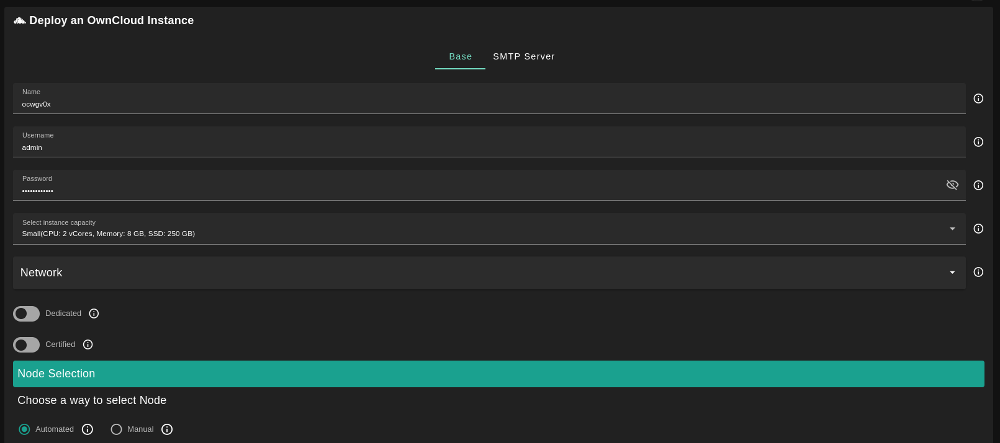
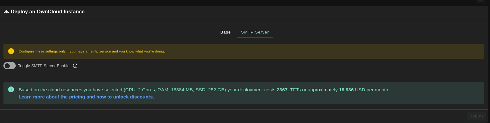
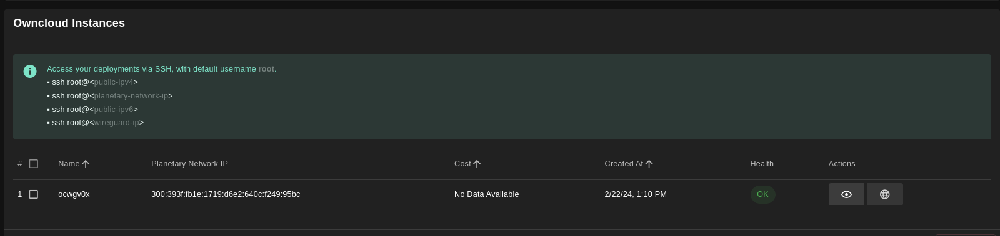
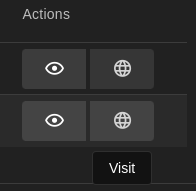

<h1> ownCloud</h1>

<h2>Table of Contents</h2>

- [Introduction](#introduction)
- [Prerequisites](#prerequisites)
- [Deploy ownCloud](#deploy-owncloud)
  - [Base](#base)
  - [SMTP](#smtp)
  - [List of Instances](#list-of-instances)
- [Admin Connection](#admin-connection)
- [TFConnect App Connection](#tfconnect-app-connection)

***

## Introduction

[ownCloud](https://owncloud.com/) develops and provides open-source software for content collaboration, allowing teams to easily share and work on files seamlessly regardless of device or location.

## Prerequisites

- Make sure you have a [wallet](../wallet_connector.md)
- From the sidebar click on **Solutions**
- Click on **ownCloud**

## Deploy ownCloud

### Base

- Enter an ownCloud deployment name.
  - The name is used in generating a unique subdomain on one of the gateways on the network alongside your twin ID.
  - Ex. ***oc98newcloud*.gent02.dev.grid.tf**

- Enter administrator information including **Username** and **Password**.
  - This admin user will have full permission on the deployed instance.
- Select a capacity package:
    - **Small**: {cpu: 2, memory: 8, diskSize: 250 }
    - **Medium**: {cpu: 2, memory: 16, diskSize: 500 }
    - **Large**: {cpu: 4, memory: 32, diskSize: 1000 }
    - Or choose a **Custom** plan
- Choose the network
   - `Public IPv4` flag gives the virtual machine a Public IPv4
- Enable the `Dedicated` flag to retrieve only dedicated nodes 
- Enable the `Certified` flag to retrieve only certified nodes 
- Choose the location of the node
   - `Region`
   - `Country`
   - `Farm Name`
- Choose the node to deploy on
> Or you can select a specific node with manual selection.
- Enable the `Custom Domain` flag to use a custom domain
- Choose a gateway node to deploy your ownCloud instance on.

Once you've set the deployment parameters, you can click on **Deploy**. 

### SMTP

On the SMTP window, you can enable the optional `SMTP Server` flag if you want to have your ownCloud instance configured with an SMTP server.

### List of Instances

When the deployment is ready, you will see a list of all of your deployed instances.

## Admin Connection

Click on the button **Visit** under **Actions** to open the ownCloud login window. If you see **bad gateway**, you might simply need to wait a couple of minutes until the deployment completes.

To consult the deployment details,  click on the button **Details** under **Actions**. On this page, you can access the **ownCloud Admin Username** and the **ownCloud Admin Password**. Use those credentials to log in as an administrator on your ownCloud deployment.

## TFConnect App Connection

To connect to your ownCloud instance with the ThreeFold Connect app, you need to add permissions to your ThreeFold 3Bot ID by first [connecting as an administrator](#admin-connection).

- Once you're connected as an admin, open the top-right menu and click on **Users**.
- To create a new user, set your 3Bot ID as the username with its corresponding email address, and set **Groups** as **admin**. Then click **Create**.
- You can now log out and connect to your ownCloud instance with the TF Connect app.