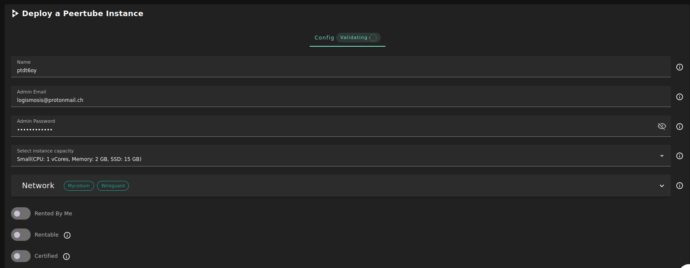

<h1> Peertube </h1>

<h2>Table of Contents</h2>

- [Introduction](#introduction)
- [Prerequisites](#prerequisites)
- [Deployment](#deployment)

***

## Introduction

[Peertube](https://joinpeertube.org/) aspires to be a decentralized and free/libre alternative to video broadcasting services.

## Prerequisites

- Make sure you have a [wallet](../wallet_connector.md)
- From the sidebar click on **Applications**
- Click on **Peertube**

## Deployment

- Enter an Application Name. It's used in generating a unique subdomain on one of the gateways on the network alongside your twin ID. 
  the applied format `<solution-code><twin-id><solution-name>.<gateway-subdomain>` Ex. ***pt100peerprod*.gent02.dev.grid.tf**
- Enter an email and password which will be used for the admin login.
- Select a capacity package:
    - **Small**: { cpu: 1, memory: 2, diskSize: 15 }
    - **Medium**: { cpu: 2, memory: 4, diskSize: 100 }
    - **Large**: { cpu: 4, memory: 16, diskSize: 250 }
    - Or choose a **Custom** plan

   - `Public IPv4` flag gives the virtual machine a Public IPv4
   - `Public IPv6` flag gives the virtual machine a Public IPv6
   - `Planetary Network` to connect the Virtual Machine to Planetary network
   - `Wiregaurd Access` to add a wiregaurd acces to the Virtual Machine
- `Dedicated` flag to retrieve only dedeicated nodes 
- `Certified` flag to retrieve only certified nodes 
- Choose the location of the node
   - `Region`
   - `Country`
   - `Farm Name`

- Choose the node to deploy on
> Or you can select a specific node with manual selection.
- `Custom Domain` flag lets the user to use a custom domain
- Choose a gateway node to deploy your Peertube instance on.

After that is done you can see a list of all of your deployed instances

Click on ***Visit*** to go to the homepage of your Peertube instance!

> Please note it may take sometime to be ready