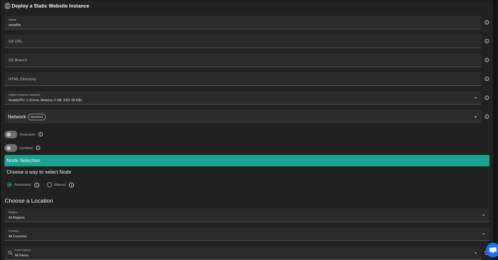

<h1> Static Website </h1>

## Introduction

Static Website is an application where a user provides a GitHub repository URL for the files to be automatically served online using Caddy.

## Prerequisites

- Make sure you have a [wallet](../wallet_connector.md)
- From the sidebar click on **Applications**
- Click on **Static Website**

## Deployment

- Enter an instance name

- Enter the HTTPS URL for the Git repository that needs to be cloned

- Enter the Git Branch if available

- Enter the html directory that needs to be served if available

- Select a capacity package:

  - **Small**: {cpu: 1, memory: 2 , diskSize: 50 }
  - **Medium**: {cpu: 2, memory: 4, diskSize: 100 }
  - **Large**: {cpu: 4, memory: 16, diskSize: 250 }
  - Or choose a **Custom** plan
- Choose the network
   - `Public IPv4` flag gives the virtual machine a Public IPv4
   - `Mycelium` flag gives the virtual machine a Mycelium address
- `Dedicated` flag to retrieve only dedicated nodes
- `Certified` flag to retrieve only certified nodes
- Choose the location of the node
  - `Region`
  - `Country`
  - `Farm Name`
- Choose the node to deploy on
  - Note: You can select a specific node with manual selection
- `Custom Domain` flag allows the user to use a custom domain
- Choose a gateway node to deploy your static website

Once this is done, you can see a list of all of your deployed instances:

Click on the button **Visit** under **Actions** to go to your static website!
