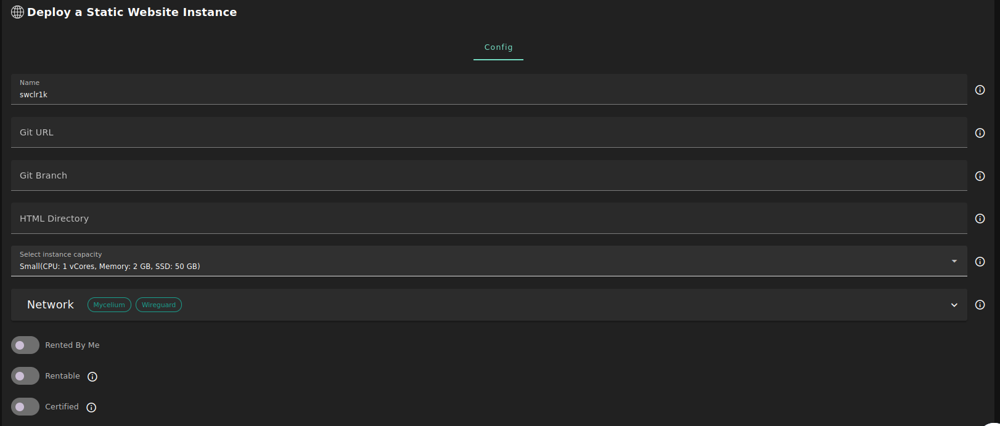

<h1> Static Website </h1>

<h2>Table of Contents </h2>

- [Introduction](#introduction)
- [Prerequisites](#prerequisites)
- [Deployment](#deployment)

---

## Introduction

Static Website is an application where a user provides a github repository url and its file are automatically served using caddy.

## Prerequisites

- Make sure you have a [wallet](../wallet_connector.md)
- From the sidebar click on **Applications**
- Click on **Static Website**

## Deployment

- Enter an instance name.

- Enter a Github repository url that needs to be clonned

- Enter the title for the clonned repository

- Select a capacity package:

  - **Small**: {cpu: 1, memory: 2 , diskSize: 50 }
  - **Medium**: {cpu: 2, memory: 4, diskSize: 100 }
  - **Large**: {cpu: 4, memory: 16, diskSize: 250 }
  - Or choose a **Custom** plan

- `Dedicated` flag to retrieve only dedeicated nodes
- `Certified` flag to retrieve only certified nodes
- Choose the location of the node
  - `Region`
  - `Country`
  - `Farm Name`
- Choose the node to deploy on
  > Or you can select a specific node with manual selection.
- `Custom Domain` flag lets the user to use a custom domain
- Choose a gateway node to deploy your Subsquid instance on.

After that is done you can see a list of all of your deployed instances

Click on **_Visit_** to go to your static website!
