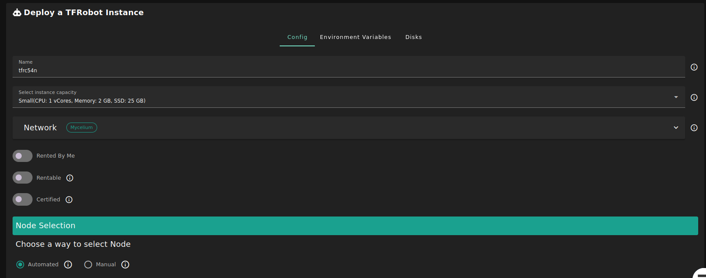
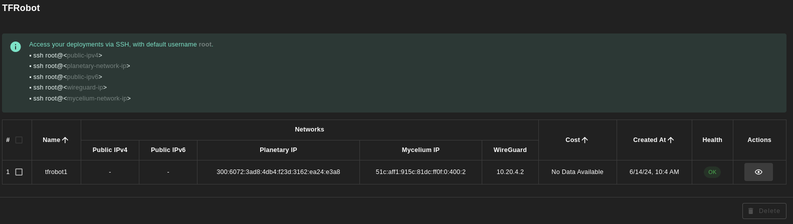

<h1> TFRobot </h1>

## Introduction

[TFRobot](https://github.com/threefoldtech/tfgrid-sdk-go/blob/development/tfrobot/README.md) is tool designed to automate mass deployment of groups of VMs on the ThreeFold Grid, with support of multiple retries for failed deployments.

## Features

- **Mass Deployment:** Deploy groups of VMs on the grid simultaneously.
- **Mass Cancellation:** Cancel simultaneously all VMs on the grid defined in the configuration file.
- **Load Deployments:** Load simultaneously groups of VMs deployed with TFRobot.
- **Customizable Configurations:** Define node groups, VMs groups and other configurations through YAML or JSON files.

## Prerequisites

- Make sure you have a [wallet](../wallet_connector.md)
- From the sidebar click on **Applications**
- Click on **TFRobot**

## Deployment

- Enter an Application Name.

- Select a capacity package:
    - **Small**: {cpu: 1, memory: 2, diskSize: 25 }
    - **Medium**: {cpu: 2, memory: 4, diskSize: 50 }
    - **Large**: {cpu: 4, memory: 16, diskSize: 100 }
    - Or choose a **Custom** plan
- Choose the network
  - `Public IPv4` flag gives the virtual machine a Public IPv4
  - `Public IPv6` flag gives the virtual machine a Public IPv6
  - `Planetary Network` to connect the Virtual Machine to Planetary network
  - `Mycelium` to enable Mycelium on the virtual machine
  - `Wireguard Access` to add a wireguard access to the Virtual Machine
- `Rented By Me` flag to retrieve nodes currently reserved by you
- `Rentable` flag to retrieve nodes that can be reserved as [dedicated nodes](../deploy/node_finder.md#dedicated-nodes)
- `Certified` flag to retrieve only certified nodes 
- Choose the location of the node
   - `Region`
   - `Country`
   - `Farm Name`
- Click on `Load Nodes`
- Select the node you want to deploy on
- Click `Deploy`

## Deployed Instances Table

At all time, you can see a list of all of your deployed instances:

