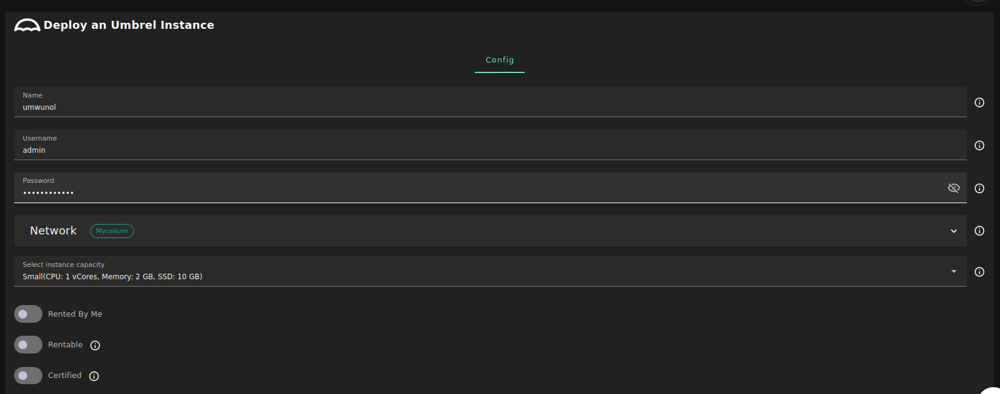

<h1> Umbrel </h1>

<h2>Table of Contents</h2>

- [Introduction](#introduction)
- [Prerequisites](#prerequisites)

***

## Introduction

[Umbrel](https://umbrel.com/) is an OS for running a personal server in your home. Self-host open source apps like Nextcloud, Bitcoin node, and more.

## Prerequisites

- Make sure you have a [wallet](../wallet_connector.md)
- From the sidebar click on **Applications**
- Click on **Umbrel**
  
**Process** :

- Enter an instance name.
- Enter a Username
  - will be used to create Umbrel dashboard account.
- Enter a Password
  - Will be used to login to the Umbrel dashboard.
  - Must be 12 to 30 characters .
- Select a capacity package:
  - **Small**: { cpu: 1, memory: 2, diskSize: 10 }
  - **Medium**: { cpu: 2, memory: 4 , diskSize: 50 }
  - **Large**: { cpu: 4, memory: 16 , diskSize: 100 }
  - Or choose a **Custom** plan

- `Dedicated` flag to retrieve only dedeicated nodes 
- `Certified` flag to retrieve only certified nodes 
- Choose the location of the node
   - `Region`
   - `Country`
   - `Farm Name`
- Choose the node to deploy the Umbrel instance on
> Or you can select a specific node with manual selection.

**After Deploying**:

You can see a list of all of your deployed instances

- you can click on `Show details` for more details about the Umbrel deployment.
    
    and for more detailed information switch to `JSON` tap.
    
- Click on ***Admin Panel*** to go to the dashboard of your Umbrel instance!
  - Enter the ***Password*** that you provided in `config` section to login into Umbrel dashboard.
  > Forget the credentials? You can find them with `Show details` button.

> **Warning**: Due to the nature of the grid, shutdown, or restart your umbrel from the dashboard **MAY** make some unwanted behaviors.
