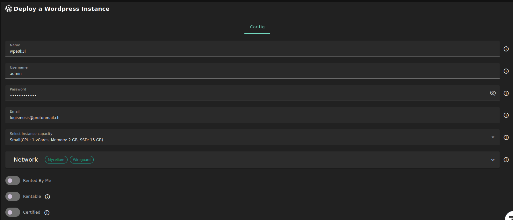

<h1> WordPress </h1>

<h2> Table of Contents </h2>

- [Introduction](#introduction)
- [Prerequisites](#prerequisites)
- [Domain Name and IP Address](#domain-name-and-ip-address)
- [DNS Details with Custom Domain](#dns-details-with-custom-domain)
  - [DNS Record with Public IPv4](#dns-record-with-public-ipv4)
  - [DNS Record with Gateway](#dns-record-with-gateway)
  - [DNS Propagation](#dns-propagation)
- [Deployment Process](#deployment-process)
- [Access WordPress](#access-wordpress)
  - [WordPress Instance Website](#wordpress-instance-website)
  - [WordPress Instance Admin Page](#wordpress-instance-admin-page)
- [WordPress Instance Credentials](#wordpress-instance-credentials)
- [Questions and Feedback](#questions-and-feedback)

***

# Introduction

[WordPress](https://wordpress.org/) is the most popular CMS on the market, powering 65.2% of websites whose CMS we know. That translates to 42.4% of all websites – nearly half of the internet. It is a popular option for those who want to build a website or a blog.

# Prerequisites

- Make sure you have a [wallet](../wallet_connector.md)
- From the sidebar click on **Solutions**
- Click on **Wordpress**

# Domain Name and IP Address

A domain name is required to use WordPress. You can either use your own, which we'll call a **custom domain**, or you can get a free subdomain from a gateway node. Note that this won't impact the function of your deployment, it's just a matter of preference. If you want to use your own domain, follow the steps for custom domain wherever you see them below.

Another choice to make before launching your WordPress instance is whether you want to reserve a public IPv4 for the deployment. Note that renting a public IPv4 address is an extra cost. If you do not enable IPv4, the deployment will be provided a gateway IPv4 address.

If you're not sure and just want the easiest, most affordable option, do not enable public IPv4 nor custom domain.

# DNS Details with Custom Domain

In this section, we cover the essential DNS information when deploying a WordPress instance with a custom domain.

You can skip this section if you did not enable **Custom Domain** in **Domain Name**.

As a general reference, here is what setting a DNS A record can look like:

This record type indicates the IP address of a given domain.

## DNS Record with Public IPv4

Consider the following if you've enabled **Custom Domain** in **Domain Name** and **Public IPv4** in **Network**.

After deployment, you will have access to the IPv4 address of the VM you deployed on. You will need to add a **DNS A record** (Host: "@", Value: <VM_IP_Address>) to your domain to access WordPress.

## DNS Record with Gateway

Consider the following if you've enabled **Custom domain** in **Domain Name** but did not enable **Public IPv4** in **Network**.

Before deploying the WordPress instance, you will have access to the gateway IPv4 address. You will need to add a **DNS A record** (Host: "@", Value: <Gateway_IP>) to your domain to access WordPress.

## DNS Propagation

When setting a DNS A record, it might take time for the DNS to propagate. It is possible that you see the following message when opening the WordPress page: 

>"This site can't be reached. DNS address could not be found. Diagnosing the problem."

This is normal. You might simply need to wait for the DNS to propagate completely.

You can check if the DNS records are propagated globally with DNS propagation check services such as [DNS Checker](https://dnschecker.org/). You can use this tool to verify that your domain is properly pointing to either the VM or the gateway IPv4 address.

# Deployment Process

In this section, we cover the steps to deploy a WordPress instance on the Playground.

- Enter an instance name or leave the auto-generated instance name
- Enter the admin information or leave the auto-generated information
  - **Username**: This will be used as the MySQL DB username and for Wp-admin
  - **Password**: This will be used as the MySQL DB password and for Wp-admin
  - **Email**: This will be used for Wp-admin
- Select a capacity package:
  - **Small**: { cpu: 1, memory: 2 , diskSize: 15 }
  - **Medium**: { cpu: 2, memory: 4 , diskSize: 50 }
  - **Large**: { cpu: 4, memory: 16 , diskSize: 100 }
  - Or choose a **Custom** plan

- Choose the network
   - **Public IPv4** flag gives the virtual machine a Public IPv4

- **Dedicated** flag to retrieve only dedicated nodes 
- **Certified** flag to retrieve only certified nodes 
- Choose the location of the node
   - **Country**
   - **Farm Name**
- Choose the node to deploy the WordPress instance on 
- **Custom Domain** flag lets the user to use a custom domain
- Choose a gateway node to deploy your WordPress instance on
  - If you've enabled IPv4, you do not need to choose a gateway node

# Access WordPress

In the section **WordPress Instances**, you can see a list of all of your deployed instances:

You can click on **Show details** under **Actions** for more details about the WordPress deployment.

For more detailed information, you can switch to the **Json** tab.

## WordPress Instance Website

Click on **Visit** under **Actions** to go to the homepage of your WordPress instance.

## WordPress Instance Admin Page

Click on **Admin Panel** to go to the WordPress admin page (**wp-admin**) of your WordPress instance.

Enter the **Username** and the **Password** that you provided in the **config** section to log into the admin panel.

# WordPress Instance Credentials

At any time, you can find the credentials of your WordPress instance by clicking on the **Show details** button under **Actions**.

# Questions and Feedback

If you have any questions, you can ask the ThreeFold community for help on the [ThreeFold Forum](http://forum.threefold.io/) or on the [ThreeFold Grid Tester Community](https://t.me/threefoldtesting) on Telegram.
