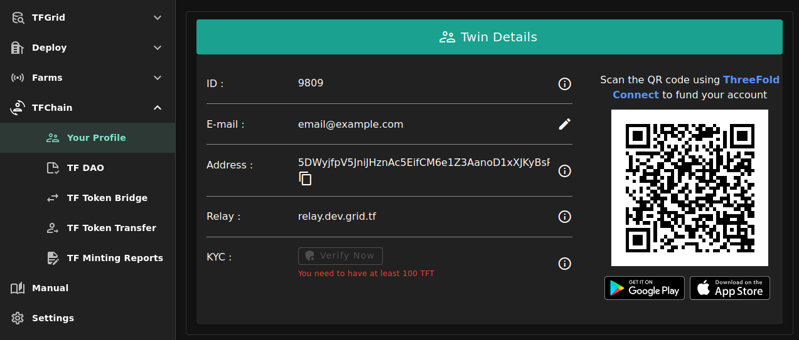
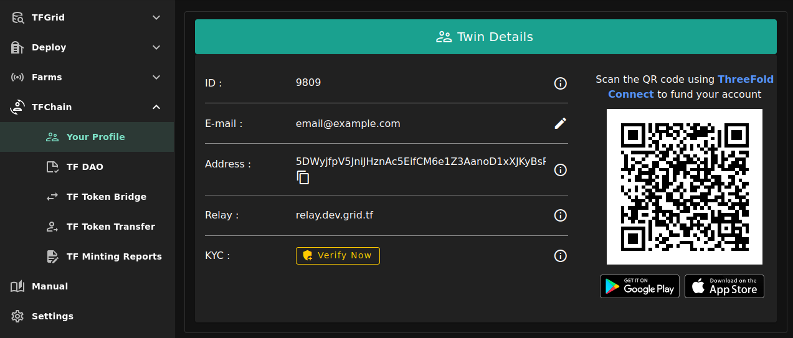

<h1>KYC</h1>

## Introduction

To maintain a secure and trusted ecosystem and to ensure compliance with regulatory standards across different regions, all users seeking to deploy resources on the TFGrid must complete a Know Your Customer (KYC) verification process.

This KYC requirement is essential to protect network participants, including farmers, and to prevent the potential misuse of the network. By completing the KYC process, users contribute to a safer and more transparent environment for all stakeholders.

## Prerequisites

- ThreeFold Chain account with at least 100 TFT
  - [Create a wallet on TFChain](../wallet_connector.md)
  - [Buy TFT](../../threefold_token/buy_sell_tft/tft_lobstr/tft_lobstr_complete_guide.md)
  - [Bridge TFT from Stellar to TFChain](../../tfconnect/tfconnect_wallet.md#bridge-assets)

## Steps

- Go to the section `Your Profile` of the `TFChain` section of the Dashboard
- Make sure that you have at least 100 TFT in the wallet
  - If you see `You need to have at least 100 TFT`, simply transfer a minimum of 100 TFT to your account

- Click on `Verify Now`

- Follow the steps provided by Idenfy
- When this is done, the Dashboard will reload automatically and should show `Verified`

> Note: The confirmation process done by Idenfy is usually very quick but can take up to several minutes in some cases.

## References

For further details regarding data storage and handling, please refer to [Idenfy Security and Compliance documentation](https://www.idenfy.com/security/).
