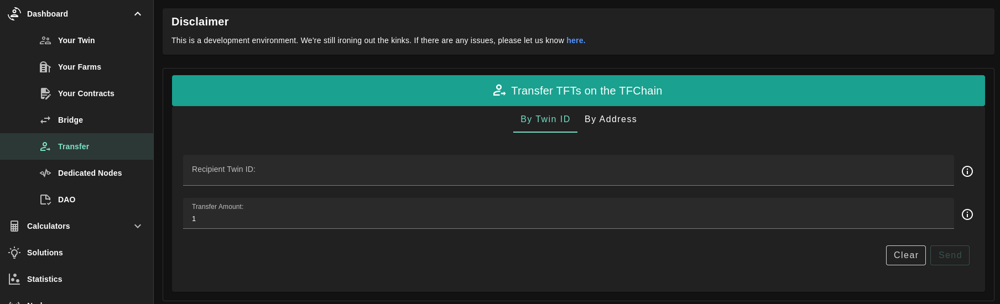
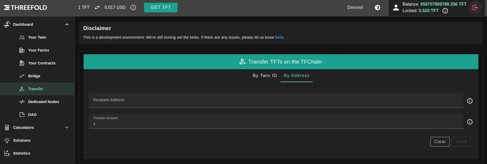

# TF Token Transfer

Manage your TFT on TFChain.

## Transfer TFT between TFChain accounts

You can transfer TFTs between two accounts that exist on the same chain.

> Remark: testnet and mainnet both have the same TFTs but as the 2 chains are different, there is no way to do a direct transfer between accounts on testnet and on mainnet.

You can transfer TFTs by recipient address or recipient twin id; by selecting the needed tab.

### Transfer by twin id

Fill in the recipient twin id, the amount of tokens to transfer, and click on `Send`.

### Transfer by address

Fill in the recipient address, the amount of tokens to transfer, and click on `Send`.

There is no transfer fee, just a signing fee of `0.001` TFT.
