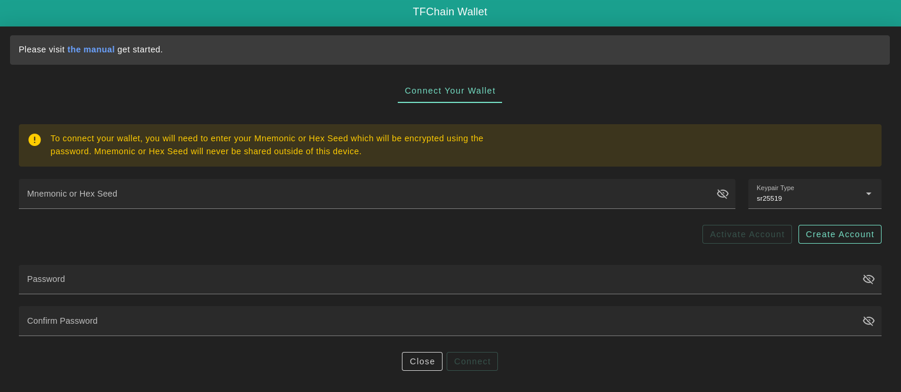
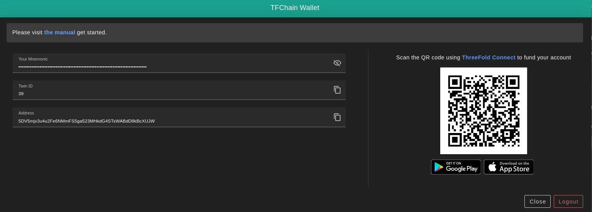

<h1> Wallet Connector </h1>

<h2>Table of Contents </h2>

- [Introduction](#introduction)
- [Supported Networks](#supported-networks)
- [Process](#process)

***

## Introduction

To interact with TFChain, users need to set a wallet connector.

## Supported Networks

Currently, we're supporting four different networks:

- Dev net, for development purposes
  - [https://dashboard.dev.grid.tf](https://dashboard.dev.grid.tf)
- QA net, for internal testing and verifications
  - [https://dashboard.qa.grid.tf](https://dashboard.qa.grid.tf)
- Test net, for testing purposes
  - [https://dashboard.test.grid.tf](https://dashboard.test.grid.tf)
- Main net, for production-ready purposes
  - [https://dashboard.grid.tf](https://dashboard.grid.tf)

## Process

Start entering the following information required to create your new profile.

- `Mnemonics` are the secret words of your Polkadot account. Click on the **Create Account** button to generate yours.
- `Password` is used to access your account
- `Confirm Password`

After you finish typing your credentials, click on **Connect**. Once your profile gets activated, you should find your **Twin ID** and **Address** generated under your **_Mnemonics_** for verification. Also, your **Account Balance** will be available at the top right corner under your profile name.

