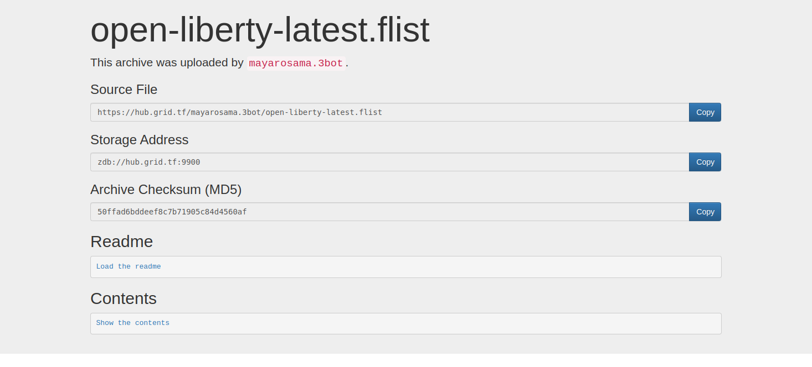

<h1> Convert Docker Image to Flist </h1>

<h2> Table of Contents </h2>

- [Introduction](#introduction)
- [Upload the Image](#upload-the-image)
- [Flist on the Hub](#flist-on-the-hub)

***

## Introduction

We show the steps to convert a docker image to an Flist.

## Upload the Image

1. Upload the Docker image to Docker Hub with the following command:

```bash
docker push <image_name>
```

2. Navigate to the docker converter link: https://hub.grid.tf/docker-convert
   

3. Copy the name of the uploaded Docker image to the Docker Image Name field.

4. Then press the convert button.

When the image is ready, some information will be displayed.


## Flist on the Hub

To navigate to the created flist, you can search with the newly created file name in the search tab.


You can also navigate to your repository in the contributors section from the Zero-Os Hub and navigate to the newly created flist.

Then press the preview button to display the flist's url and some other data.



