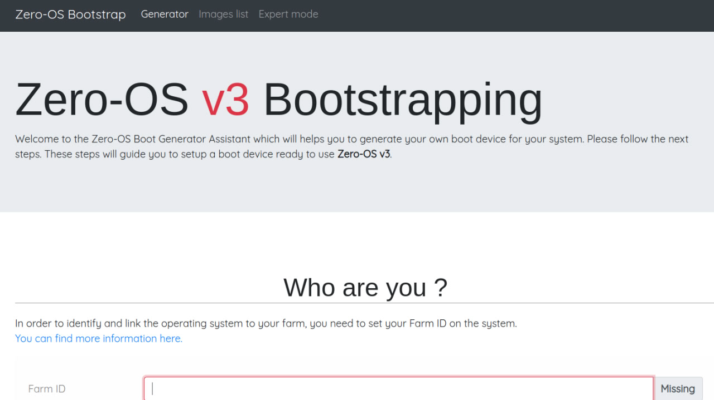

<h1>Zero-OS Boot Generator</h1>

<h2>Table of Contents</h2>

- [Introduction](#introduction)
- [Set the Environment](#set-the-environment)
  - [With Docker Ubuntu 22.04](#with-docker-ubuntu-2204)
  - [With Ubuntu 22.04 Micro VM on TFGrid](#with-ubuntu-2204-micro-vm-on-tfgrid)
- [Prepare the Machine](#prepare-the-machine)
- [Set a DNS A Record](#set-a-dns-a-record)
- [Run the Development Server](#run-the-development-server)
- [Visit the Boot Generator](#visit-the-boot-generator)

---

## Introduction

We cover how to deploy the development server of the Zero-OS Boot Generator Assistant.



Visit the [0-bootstrap repo](https://github.com/threefoldtech/0-bootstrap) for more information.

## Set the Environment

There are many ways to set your environment. Here we show with Docker and a micro VM.

Using Docker should only be used as a test before deploying on a micro VM with IPv4.

### With Docker Ubuntu 22.04

- Deploy Ubuntu 22.04 (Jammy) with Docker

```
sudo docker pull ubuntu:jammy
sudo docker pull -it ubuntu:jammy /bin/bash
```

### With Ubuntu 22.04 Micro VM on TFGrid

- Deploy an Ubuntu 22.04 micro VM on the [Dashboard](https://dashboard.grid.tf/)
  - Set IPv4 as `Network`

## Prepare the Machine

- Set the machine to deploy the server

```
# Set the machine in i386
dpkg --add-architecture i386

# Update the packages
apt update

# Install python3-flask
echo "2" | apt install -y python3-flask

# Install the prerequisites
apt install -y mtools syslinux isolinux libc6-dev-i386 libc6-dbg:i386 git wget genisoimage liblzma-dev build-essential sqlite3
```

## Set a DNS A Record

Set a DNS A Record pointing to the server hosting the micro VM.

<!---
## Set a Firewall

We can set a ufw firewall.

- Install ufw
```
apt install -y ufw
```
- Set the ports
```
ufw allow 80
ufw allow 443
ufw allow 22
ufw enable
ufw status
```

## Set HTTPS with Caddy


```
# Install Caddy
apt install -y debian-keyring debian-archive-keyring apt-transport-https curl
curl -1sLf 'https://dl.cloudsmith.io/public/caddy/stable/gpg.key' | gpg --dearmor -o /usr/share/keyrings/caddy-stable-archive-keyring.gpg
curl -1sLf 'https://dl.cloudsmith.io/public/caddy/stable/debian.deb.txt' > /etc/apt/sources.list.d/caddy-stable.list
apt update
apt install caddy

# Start Caddy
caddy reverse-proxy -r --from example.com --to :80
```

--->

## Run the Development Server

```
# Clone the repository
git clone https://github.com/threefoldtech/0-bootstrap
cd 0-bootstrap

# Run the template script
bash setup/template.sh

# Copy the sample file to config.py
cp config.py.sample config.py

# Create the database
cat db/schema.sql | sqlite3 db/bootstrap.sqlite3

# Run the development server with Python
python3 bootstrap.py
```

## Visit the Boot Generator

You can now access the boot generator on `example.com:5555`.