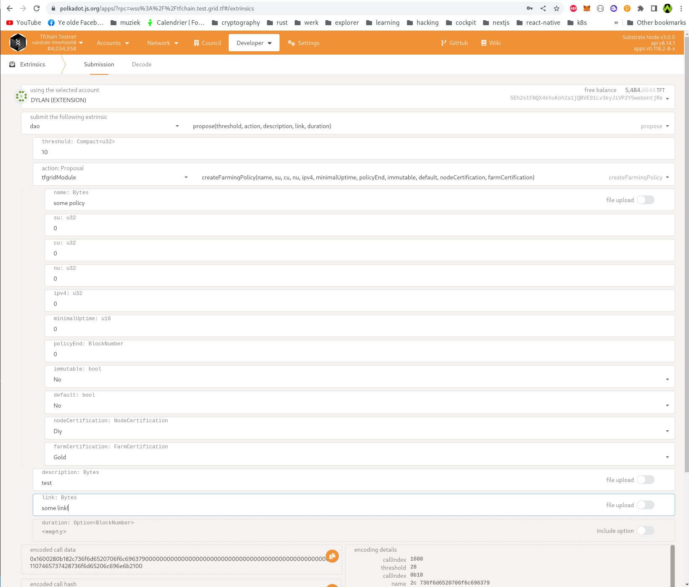

<h1> Farming Policies </h1>

<h2>Table of Contents</h2>

- [Introduction](#introduction)
- [Farming Policy Fields](#farming-policy-fields)
- [Limits on linked policy](#limits-on-linked-policy)
- [Creating a Policy](#creating-a-policy)
- [Linking a policy to a Farm](#linking-a-policy-to-a-farm)

***

## Introduction

A farming policy defines how farming rewards are handed out for nodes. Every node has a farming policy attached. A farming policy is either linked to a farm, in which case new nodes are given the farming policy of the farm they are in once they register themselves. Alternatively a farming policy can be a "default". These are not attached to a farm, but instead they are used for nodes registered in farms which don't have a farming policy. Multiple defaults can exist at the same time, and the most fitting should be chosen.

## Farming Policy Fields

A farming policy has the following fields:

- id (used to link policies)
- name
- Default. This indicates if the policy can be used by any new node (if the parent farm does not have a dedicated attached policy). Essentially, a `Default` policy serves as a base which can be overriden per farm by linking a non default policy to said farm.
- Reward tft per CU, SU and NU, IPV4
- Minimal uptime needed in integer format (example 995)
- Policy end (After this block number the policy can not be linked to new farms any more)
- If this policy is immutable or not. Immutable policies can never be changed again

Additionally, we also use the following fields, though those are only useful for `Default` farming policies:

- Node needs to be certified
- Farm needs to be certified (with certification level, which will be changed to an enum).

In case a farming policy is not attached to a farm, new nodes will pick the most appropriate farming policy from the default ones. To decide which one to pick, they should be considered in order with most restrictive first until one matches. That means:

- First check for the policy with highest farming certification (in the current case gold) and certified nodes
- Then check for a policy with highest farming certification (in the current case gold) and non certified nodes
- Check for policy without farming certification but certified nodes
- Last check for a policy without any kind of certification

Important here is that certification of a node only happens after it comes live for the first time. As such, when a node gets certified, farming certification needs to be re evaluated, but only if the currently attached farming policy on the node is a `Default` policy (as specifically linked policies have priority over default ones). When evaluating again, we first consider if we are eligible for the farming policy linked to the farm, if any.

## Limits on linked policy

When a council member attaches a policy to a farm, limits can be set. These limits define how much a policy can be used for nodes, before it becomes unusable and gets removed. The limits currently are:

- Farming Policy ID: the ID of the farming policy which we want to limit to a farm.
- CU. Every time a node is added in the farm, it's CU is calculated and deducted from this amount. If the amount drops below 0, the maximum amount of CU that can be attached to this policy is reached.
- SU. Every time a node is added in the farm, it's SU is calculated and deducted from this amount. If the amount drops below 0, the maximum amount of SU that can be attached to this policy is reached.
- End date. After this date the policy is not effective anymore and can't be used. It is removed from the farm and a default policy is used.
- Certification. If set, only certified nodes can get this policy. Non certified nodes get a default policy.

Once a limit is reached, the farming policy is removed from the farm, so new nodes will get one of the default policies until a new policy is attached to the farm.

## Creating a Policy

A council member can create a Farming Policy (DAO) in the following way:

1: Open [PolkadotJS](https://polkadot.js.org/apps/?rpc=wss%3A%2F%2Ftfchain.grid.tf#/extrinsics) apps on the corresponding network and go to `Extrinsics`
2: Now select the account to propose from (should be an account that's a council member).
3: Select as action `dao` -> `propose`
5: Set a `threshold` (amount of farmers to vote)
6: Select an actions `tfgridModule` -> `createFarmingPolicy` and fill in all the fields.
7: Create a forum post with the details of the farming policy and fill in the link of that post in the `link` field
8: Give it some good `description`.
9: Duration is optional (by default it's 7 days). A proposal cannot be closed before the duration is "expired". If you wish to set a duration, the duration should be expressed in number of blocks from `now`. For example, 2 hours is equal to 1200 blocks (blocktime is 6 seconds) in this case, the duration should be filled in as `1200`.
10: If all the fields are filled in, click `Propose`, now Farmers can vote. A proposal can be closed manually once there are enough votes AND the proposal is expired. To close go to extrinsics -> `dao` -> `close` -> fill in proposal hash and index (both can be found in chainstate).

All (su, cu, nu, ipv4) values should be expressed in units USD. Minimal uptime should be expressed as integer that represents an percentage (example: `95`).

Policy end is optional (0 or some block number in the future). This is used for expiration.

For reference:

## Linking a policy to a Farm

First identify the policy ID to link to a farm. You can check for farming policies in [chainstate](https://polkadot.js.org/apps/?rpc=wss%3A%2F%2Ftfchain.grid.tf#/chainstate) -> `tfgridModule` -> `farmingPolciesMap`, start with ID 1 and increment with 1 until you find the farming policy which was created when the proposal was expired and closed.

1: Open [PolkadotJS](https://polkadot.js.org/apps/?rpc=wss%3A%2F%2Ftfchain.grid.tf#/extrinsics) apps on the corresponding network and go to `Extrinsics`
2: Now select the account to propose from (should be an account that's a council member).
3: Select as proposal `dao` -> `propose`
4: Set a `threshold` (amount of farmers to vote)
5: Select an actions `tfgridModule` -> `attachPolicyToFarm` and fill in all the fields (FarmID and Limits).
6: Limits contains a `farming_policy_id` (Required) and cu, su, end, node count (which are all optional). It also contains `node_certification`, if this is set to true only certified nodes can have this policy.
7: Create a forum post with the details of why we want to link that farm to that policy and fill in the link of that post in the `link` field
8: Give it some good `description`.
9: Duration is optional (by default it's 7 days). A proposal cannot be closed before the duration is "expired". If you wish to set a duration, the duration should be expressed in number of blocks from `now`. For example, 2 hours is equal to 1200 blocks (blocktime is 6 seconds) in this case, the duration should be filled in as `1200`.
10: If all the fields are filled in, click `Propose`, now Farmers can vote. A proposal can be closed manually once there are enough votes AND the proposal is expired. To close go to extrinsics -> `dao` -> `close` -> fill in proposal hash and index (both can be found in chainstate).

For reference:

