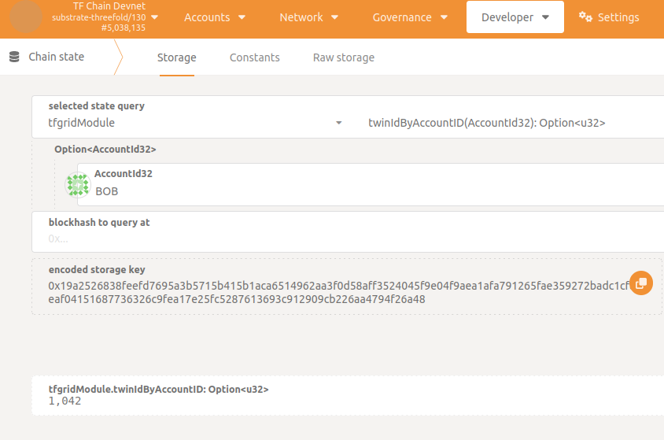

<h1>ThreeFold Chain</h1>

<h2>Table of Contents</h2>

- [Introduction](#introduction)
- [Deployed instances](#deployed-instances)
- [Create a TFChain twin](#create-a-tfchain-twin)
- [Get your twin ID](#get-your-twin-id)

***

## Introduction

ThreeFold blockchain (aka TFChain) serves as a registry for Nodes, Farms, Digital Twins and Smart Contracts.
It is the backbone of [ZOS](https://github.com/threefoldtech/zos) and other components.

## Deployed instances

- Development network (Devnet):

  - Polkadot UI: [https://polkadot.js.org/apps/?rpc=wss%3A%2F%2F/tfchain.dev.grid.tf#/explorer](https://polkadot.js.org/apps/?rpc=wss%3A%2F%2F/tfchain.dev.grid.tf#/explorer)
  - Websocket url: `wss://tfchain.dev.grid.tf`
  - GraphQL UI: [https://graphql.dev.grid.tf/graphql](https://graphql.dev.grid.tf/graphql)

- QA testing network (QAnet):

  - Polkadot UI: [https://polkadot.js.org/apps/?rpc=wss%3A%2F%2F/tfchain.qa.grid.tf#/explorer](https://polkadot.js.org/apps/?rpc=wss%3A%2F%2F/tfchain.qa.grid.tf#/explorer)
  - Websocket url: `wss://tfchain.qa.grid.tf`
  - GraphQL UI: [https://graphql.qa.grid.tf/graphql](https://graphql.qa.grid.tf/graphql)

- Test network (Testnet):

  - Polkadot UI: [https://polkadot.js.org/apps/?rpc=wss%3A%2F%2F/tfchain.test.grid.tf#/explorer](https://polkadot.js.org/apps/?rpc=wss%3A%2F%2F/tfchain.test.grid.tf#/explorer)
  - Websocket url: `wss://tfchain.test.grid.tf`
  - GraphQL UI: [https://graphql.test.grid.tf/graphql](https://graphql.test.grid.tf/graphql)

- Production network (Mainnet):

  - Polkadot UI: [https://polkadot.js.org/apps/?rpc=wss%3A%2F%2F/tfchain.grid.tf#/explorer](https://polkadot.js.org/apps/?rpc=wss%3A%2F%2F/tfchain.grid.tf#/explorer)
  - Websocket url: `wss://tfchain.grid.tf`
  - GraphQL UI: [https://graphql.grid.tf/graphql](https://graphql.grid.tf/graphql)

## Create a TFChain twin

A twin is a unique identifier linked to a specific account on a given TFChain network.
Actually there are 2 ways to create a twin:

- With the [Dashboard](../../dashboard/wallet_connector.md)
  - a twin is automatically generated while creating a TFChain account
- With the TFConnect app
  - a twin is automatically generated while creating a farm (in this case the twin will be created on mainnet)

## Get your twin ID

One can retrieve the twin ID associated to his account going to `Developer` -> `Chain state` -> `tfgridModule` -> `twinIdByAccountID()`.

