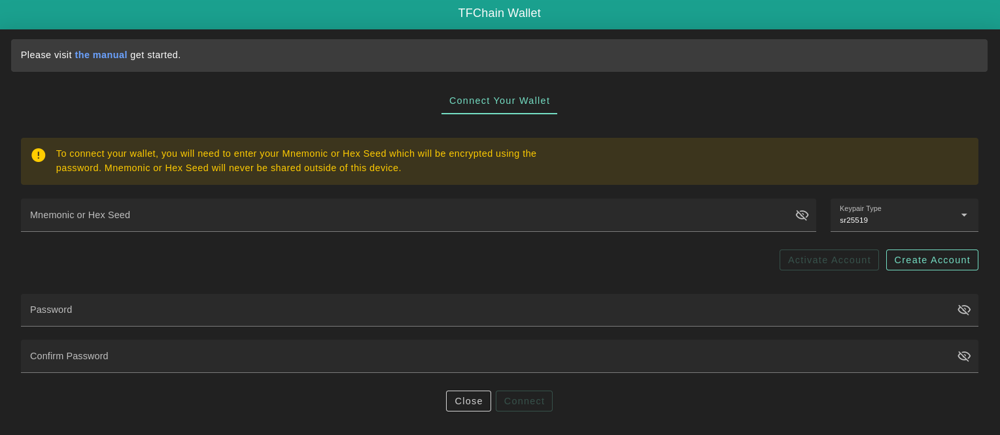
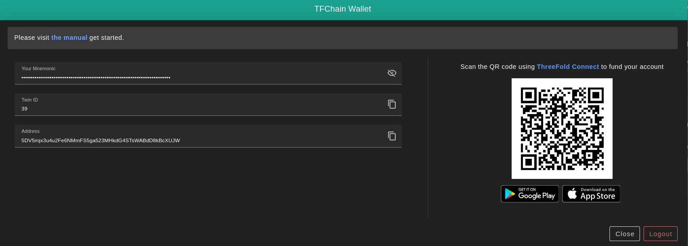
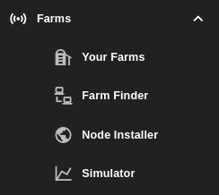
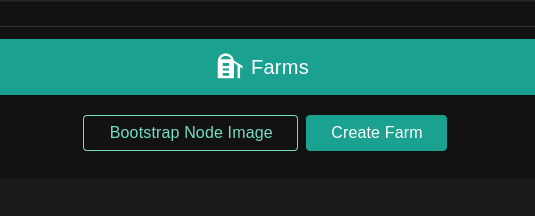
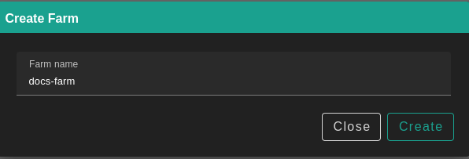
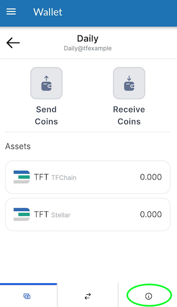
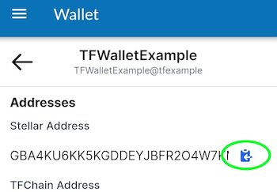
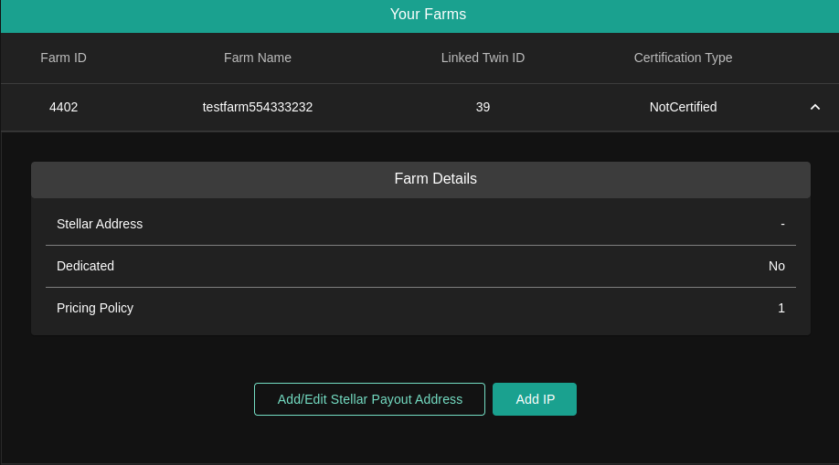
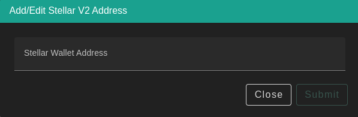

<h1> 1. Create a Farm </h1>

<h2> Table of Contents </h2>

- [Introduction](#introduction)
- [Create a TFChain Account](#create-a-tfchain-account)
- [Create a Farm](#create-a-farm)
- [Create a ThreeFold Connect Wallet](#create-a-threefold-connect-wallet)
- [Add a Stellar Address for Payout](#add-a-stellar-address-for-payout)
  - [Farming Rewards Distribution](#farming-rewards-distribution)
- [More Information](#more-information)

***

## Introduction

We cover the basic steps to create a farm with the ThreeFold Dashboard. We also create a TFConnect app wallet to receive the farming rewards. 

## Create a TFChain Account

We create a TFChain account using the ThreeFold Dashboard.

Go to the [ThreeFold Dashboard](https://dashboard.grid.tf/), click on **Create Account**, choose a password and click **Connect**.

Once your profile gets activated, you should find your Twin ID and Address generated under your Mnemonics for verification. Also, your Account Balance will be available at the top right corner under your profile name.

## Create a Farm

We create a farm using the dashboard.

In the left-side menu, select **Farms** -> **Your Farms**.

Click on **Create Farm**, choose a farm name and then click **Create**.

## Create a ThreeFold Connect Wallet

Your farming rewards should be sent to a Stellar wallet with a TFT trustline enabled. The simplest way to proceed is to create a TF Connect app wallet as the TFT trustline is enabled by default on this wallet. For more information on TF Connect, read [this section](../../threefold_token/storing_tft/tf_connect_app.md).

Let's create a TFConnect Wallet and take note of the wallet address. First, download the app.

This app is available for [Android](https://play.google.com/store/apps/details?id=org.jimber.threebotlogin&hl=en&gl=US) and [iOS](https://apps.apple.com/us/app/threefold-connect/id1459845885).

- Note that for Android phones, you need at minimum Android Nougat, the 8.0 software version.
- Note that for iOS phones, you need at minimum iOS 14.5. It will be soon available to iOS 13.

Open the app, click **SIGN UP**, choose a ThreeFold Connect Id, write your email address, take note of the seed phrase and choose a pin. Once this is done, you will have to verify your email address. Check your email inbox.

In the app menu, click on **Wallet** and then click on **Create Initial Wallet**.

To find your wallet address, click on the **circled i** icon at the bottom of the screen.

Click on the button next to your Stellar address to copy the address.

You will need the TF Connect wallet address for the next section.

> Note: Make sure to keep your TF Connect Id and seed phrase in a secure place offline. You will need these two components to recover your account if you lose access.

## Add a Stellar Address for Payout

In the **Your Farms** section of the dashboard, click on **Add/Edit Stellar Payout Address**.

Paste your Stellar wallet address and click **Submit**.

### Farming Rewards Distribution

Farming rewards will be sent to your farming wallet around the 8th of each month. This can vary depending on the situation. The minting is done automatically by code and verified by humans as a double check.

## More Information

For more information, such as setting IP addresses, you can consult the [Dashboard Farms section](../../dashboard/farms/farms.md).