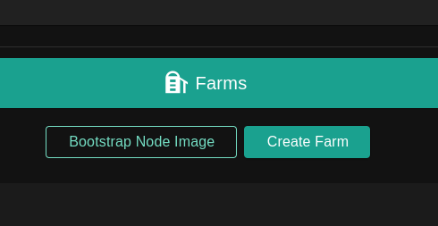
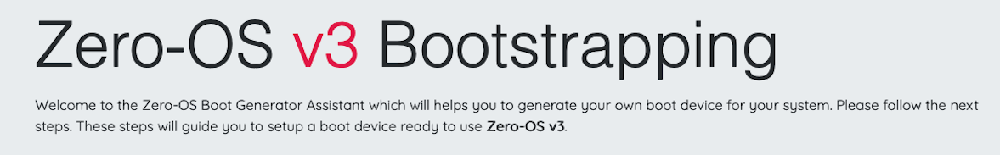
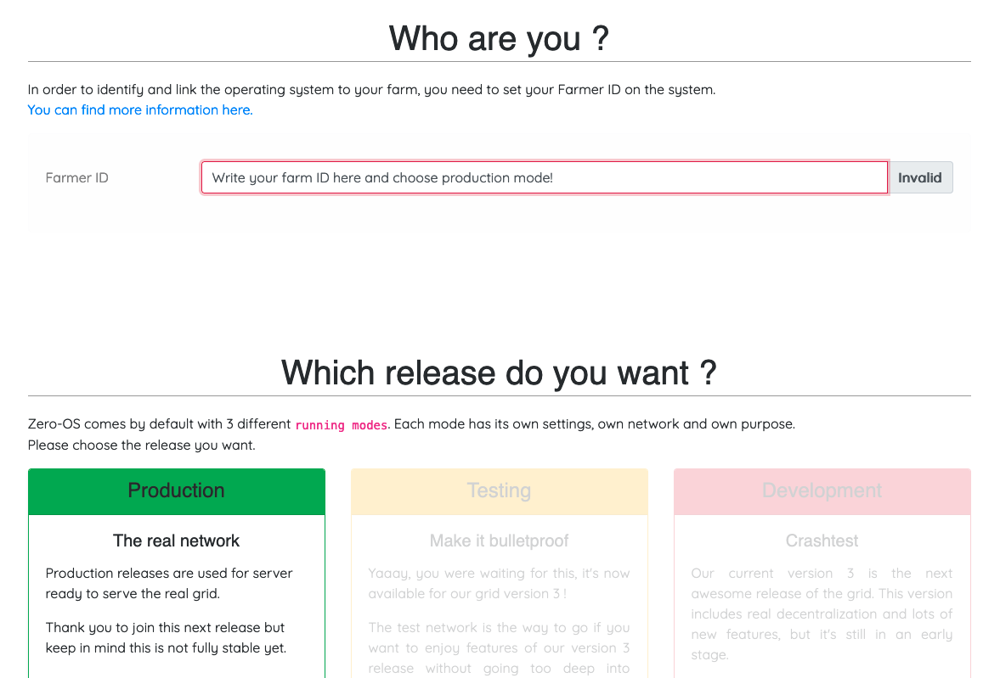
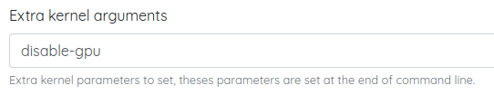

<h1> 2. Create a Zero-OS Bootstrap Image </h1>

<h2> Table of Contents </h2>

- [Introduction](#introduction)
- [Download the Zero-OS Bootstrap Image](#download-the-zero-os-bootstrap-image)
- [Burn the Zero-OS Bootstrap Image](#burn-the-zero-os-bootstrap-image)
  - [CD/DVD BIOS](#cddvd-bios)
  - [USB Key BIOS+UEFI](#usb-key-biosuefi)
    - [BalenaEtcher (MAC, Linux, Windows)](#balenaetcher-mac-linux-windows)
    - [CLI (Linux)](#cli-linux)
    - [Rufus (Windows)](#rufus-windows)
- [Additional Information (Optional)](#additional-information-optional)
  - [Expert Mode](#expert-mode)
    - [Use a Specific Kernel](#use-a-specific-kernel)
    - [Disable GPU](#disable-gpu)
  - [Bootstrap Image URL](#bootstrap-image-url)
    - [Zeros-OS Bootstrapping](#zeros-os-bootstrapping)
    - [Zeros-OS Expert Bootstrap](#zeros-os-expert-bootstrap)

***

## Introduction

We will now learn how to create a Zero-OS bootstrap image in order to boot a DIY 3Node.

## Download the Zero-OS Bootstrap Image

Let's download the Zero-OS bootstrap image.

In the Farms section of the Dashboard, click on **Bootstrap Node Image** 



or use the direct link [https://v3.bootstrap.grid.tf](https://v3.bootstrap.grid.tf):

```
https://v3.bootstrap.grid.tf
```

 

This is the Zero-OS v3 Bootstrapping page.

  

Write your farm ID and choose production mode.

  

If your system is new, you might be able to run the bootstrap in UEFI mode.

 

For older systems, run the bootstrap in BIOS mode. For BIOS CD/DVD, choose **ISO**. For BIOS USB, choose **USB**

Download the bootstrap image. Next, we will burn the bootstrap image.


## Burn the Zero-OS Bootstrap Image

We show how to burn the Zero-OS bootstrap image. A quick and modern way is to burn the bootstrap image on a USB key.

### CD/DVD BIOS 

For the BIOS **ISO** image, download the file and burn it on a DVD.

### USB Key BIOS+UEFI

There are many ways to burn the bootstrap image on a USB key. The easiest way that works for all operating systems is to use BalenaEtcher. We also provide other methods.

#### BalenaEtcher (MAC, Linux, Windows)

For **MAC**, **Linux** and **Windows**, you can use [BalenaEtcher](https://www.balena.io/etcher/) to load/flash the image on a USB stick. This program also formats the USB in the process. This will work for the option **EFI IMG** for UEFI boot, and with the option **USB** for BIOS boot. Simply follow the steps presented to you and make sure you select the bootstrap image file you downloaded previously.

> Note: There are alternatives to BalenaEtcher (e.g. [usbimager](https://gitlab.com/bztsrc/usbimager/)).

**General Steps with BalenaEtcher:**

1. Download BalenaEtcher
2. Open BalenaEtcher
3. Select **Flash from file**
4. Find and select the bootstrap image (with your correct farm ID)
5. Select **Target** (your USB key)
6. Select **Flash**

That's it. Now you have a bootstrap image on Zero-OS as a bootable removable media device.


#### CLI (Linux)

For the BIOS **USB** and the UEFI **EFI IMG** images, you can do the following on Linux:

    sudo dd status=progress if=FILELOCATION.ISO(or .IMG) of=/dev/sd*

Here the * is to indicate that you must adjust according to your disk. To see your disks, write lsblk in the command window. Make sure you select the proper disk!

*If you USB key is not new, make sure that you format it before burning the Zero-OS image.

#### Rufus (Windows)

For Windows, if you are using the "dd" able image, instead of writing command line, you can use the free USB flashing program called [Rufus](https://sourceforge.net/projects/rufus.mirror/) and it will automatically do this without needing to use the command line. Rufus also formats the boot media in the process.

## Additional Information (Optional)

We cover some additional information. Note that the following information is not needed for a basic farm setup.

### Expert Mode

You can use the [expert mode](https://v3.bootstrap.grid.tf/expert) to generate specific Zero-OS bootstrap images.

Along the basic options of the normal bootstrap mode, the expert mode allows farmers to add extra kernel arguments and decide which kernel to use from a vast list of Zero-OS kernels.

#### Use a Specific Kernel

You can use the expert mode to choose a specific kernel. Simply set the information you normally use and then select the proper kernel you need in the **Kernel** drop-down list.


#### Disable GPU

You can use the expert mode to disable GPU on your 3Node.



In the expert mode of the Zero-OS Bootstrap generator, fill in the following information:

- Farmer ID
  - Your current farm ID
- Network
  - The network of your farm
- Extra kernel arguments
  - ```
    disable-gpu
    ```
- Kernel
  - Leave the default kernel
- Format
  - Choose a bootstrap image format
- Click on **Generate**
- Click on **Download**

### Bootstrap Image URL

In both normal and expert mode, you can use the generated URL to quickly download a Zero-OS bootstrap image based on your farm specific setup. 

Using URLs can be a very quick and efficient way to create new bootstrap images once your familiar with the Zero-OS bootstrap URL template and some potential varations. 

```
https://<grid_version>.bootstrap.grid.tf/<image_format>/<network>/<farm_ID>/<arg1>/<arg2>/.../<kernel>
```

Note that the arguments and the kernel are optional.

The following content will provide some examples.

#### Zeros-OS Bootstrapping

On the [main page](https://v3.bootstrap.grid.tf/), once you've written your farm ID and selected a network, you can copy the generated URL of any given image format.

For example, the following URL is a download link to an **EFI IMG** of the Zero-OS bootstrap image of farm 1 on the main TFGrid v3 network:

```
https://v3.bootstrap.grid.tf/uefimg/prod/1
```

#### Zeros-OS Expert Bootstrap

You can use the generated sublink at the **Generate step** of the expert mode to get a quick URL to download your bootstrap image.

- After setting the parameters and arguments, click on **Generate**
- Add the **Target** content to the following URL `https://v3.bootstrap.grid.tf`
  - For example, the following URL sets an **ipxe** script of the Zero-OS bootstrap of farm 1 on the main TFGrid v3 network, with the **disable-gpu** function enabled as an extra kernel argument and a specific kernel:
    -  ```
       https://v3.bootstrap.grid.tf/ipxe/test/1/disable-gpu/zero-os-development-zos-v3-generic-b8706d390d.efi
       ```