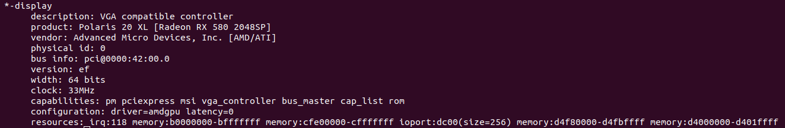

<h1>GPU Farming</h1>

Welcome to the *GPU Farming* section of the ThreeFold Manual! 

In this guide, we delve into the realm of GPU farming, shedding light on the significance of Graphics Processing Units (GPUs) and how they can be seamlessly integrated into the ThreeFold ecosystem.

<h2>Table of Contents</h2>

- [Understanding GPUs](#understanding-gpus)
- [Get Started](#get-started)
- [Install the GPU](#install-the-gpu)
- [GPU Node and the Farmerbot](#gpu-node-and-the-farmerbot)
- [Set a Price for the GPU Node](#set-a-price-for-the-gpu-node)
- [Check the GPU Node on the Node Finder](#check-the-gpu-node-on-the-node-finder)
- [Reserving the GPU Node](#reserving-the-gpu-node)
- [Questions and Feedback](#questions-and-feedback)

***

## Understanding GPUs

A Graphics Processing Unit, or GPU, is a specialized electronic circuit designed to accelerate the rendering of images and videos. Originally developed for graphics-intensive tasks in gaming and multimedia applications, GPUs have evolved into powerful parallel processors with the ability to handle complex computations, such as 3D rendering, AI and machine learning. 

In the context of ThreeFold, GPU farming involves harnessing the computational power of Graphics Processing Units to contribute to the decentralized grid. This empowers users to participate in the network's mission of creating a more equitable and efficient internet infrastructure.

## Get Started

In this guide, we focus on the integration of GPUs with a 3Node, the fundamental building block of the ThreeFold Grid. The process involves adding a GPU to enhance the capabilities of your node, providing increased processing power and versatility for a wide range of tasks. Note that any Nvidia or AMD graphics card should work as long as it's supported by the system.

## Install the GPU

We cover the basic steps to install the GPU on your 3Node.

* Find a proper GPU model for your specific 3Node hardware
* Install the GPU on the server 
  * Note: You might need to move or remove some pieces of your server to make room for the GPU
* (Optional) Boot the 3Node with a Linux distro (e.g. Ubuntu) and use the terminal to check if the GPU is recognized by the system
  * ```
    sudo lshw -C Display
    ```
  * Output example with an AMD Radeon (on the line `product: ...`)

* Boot the 3Node with the ZOS bootstrap image

## GPU Node and the Farmerbot

If you are using the Farmerbot, it might be a good idea to first boot the GPU node without the Farmerbot (i.e. to remove the node in the config file and restart the Farmerbot). Once you've confirmed that the GPU is properly detected by TFChain, you can then put back the GPU node in the config file and restart the Farmerbot. While this is not necessary, it can be an effective way to test the GPU node separately.

## Set a Price for the GPU Node

You can [set additional fees](../farming_optimization/set_additional_fees.md) for your GPU dedicated node on the [TF Dashboard](https://dashboard.grid.tf/). 

When a user reserves your 3Node as a dedicated node, you will receive TFT payments once every 24 hours. These TFT payments will be sent to the TFChain account of your farm's twin.

## Check the GPU Node on the Node Finder

You can use the [Node Finder](../../dashboard/deploy/node_finder.md) on the [TF Dashboard](https://dashboard.grid.tf/) to verify that the node is displayed as having a GPU.

* On the Dashboard, go to the Node Finder
* Under **Node ID**, write the node ID of the GPU node
* Once the results are displayed, you should see **1** under **GPU**
   * If you are using the Status bot, you might need to change the node status under **Select Nodes Status** (e.g. **Down**, **Standby**) to see the node's information

> Note: It can take some time for the GPU parameter to be displayed.

## Reserving the GPU Node

Now, users can reserve the node in the **Dedicated Nodes** section of the Dashboard and then deploy workloads using the GPU. For more information, read [this documentation](../../dashboard/deploy/dedicated_machines.md).

## Questions and Feedback

If you have any questions or feedback, we invite you to discuss with the ThreeFold community on the [ThreeFold Forum](https://forum.threefold.io/) or on the [ThreeFold Farmer chat](https://t.me/threefoldfarmers) on Telegram.