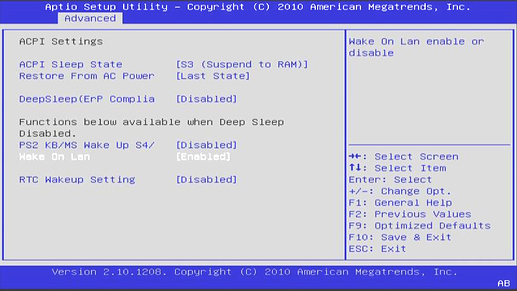
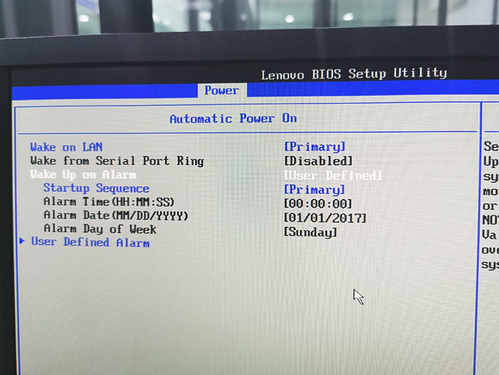
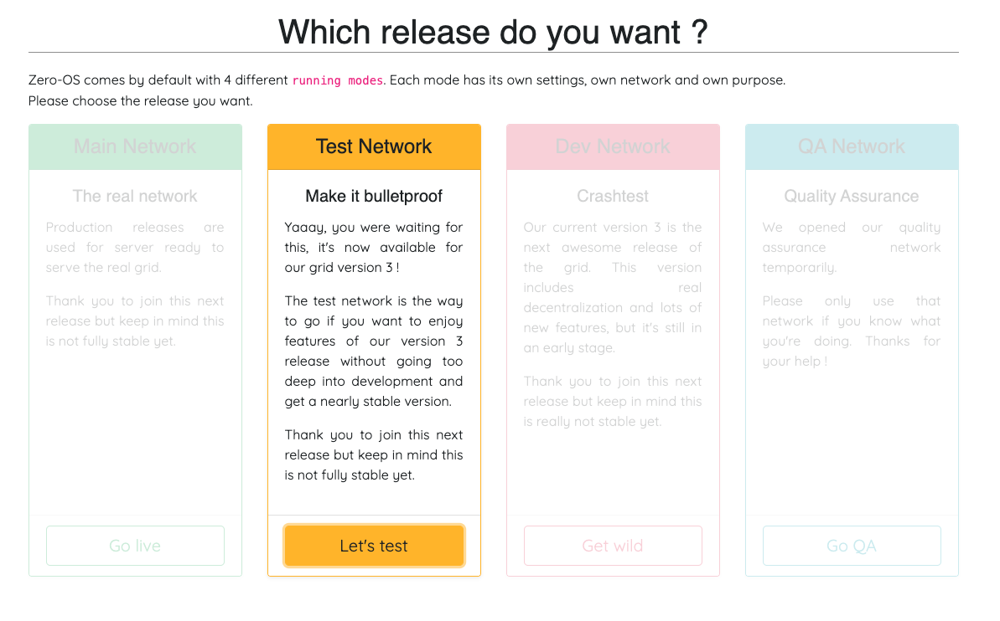

<h1> Farmerbot Additional Information </h1>

<h2> Table of Contents </h2>

- [Introduction](#introduction)
- [Additional Information](#additional-information)
  - [General Considerations](#general-considerations)
  - [YAML Configuration File Template](#yaml-configuration-file-template)
  - [Supported Commands and Flags](#supported-commands-and-flags)
  - [Minimum specs to run the Farmerbot](#minimum-specs-to-run-the-farmerbot)
  - [How to Prepare Your Farm for the Farmerbot with WOL](#how-to-prepare-your-farm-for-the-farmerbot-with-wol)
  - [WOL Requirements](#wol-requirements)
    - [Enabling WOL in the BIOS](#enabling-wol-in-the-bios)
    - [ZOS Nodes and NIC](#zos-nodes-and-nic)
    - [NIC Firmware and WOL](#nic-firmware-and-wol)
  - [How to Move Your Farm to a Different Network](#how-to-move-your-farm-to-a-different-network)
  - [The differences between power "state" and power "target"](#the-differences-between-power-state-and-power-target)
  - [The differences between uptime, status and power state](#the-differences-between-uptime-status-and-power-state)
  - [The sequence of events for a node managed by the Farmerbot](#the-sequence-of-events-for-a-node-managed-by-the-farmerbot)
  - [The problematic states of a 3node set with the Farmerbot](#the-problematic-states-of-a-3node-set-with-the-farmerbot)
  - [Using the ThreeFold Node Status Bot](#using-the-threefold-node-status-bot)
  - [CPU overprovisioning](#cpu-overprovisioning)
  - [Seed phrase and HEX secret](#seed-phrase-and-hex-secret)
  - [Farmerbot directory tree](#farmerbot-directory-tree)
  - [Dedicated Nodes and the Farmerbot](#dedicated-nodes-and-the-farmerbot)
  - [Periodic wakeup](#periodic-wakeup)
  - [Time period between random wakeups and power target update](#time-period-between-random-wakeups-and-power-target-update)
  - [Upgrade to the new Farmerbot](#upgrade-to-the-new-farmerbot)
  - [Set the Farmerbot without the mnemonics of a ThreeFold Dashboard account](#set-the-farmerbot-without-the-mnemonics-of-a-threefold-dashboard-account)
- [Maintenance](#maintenance)
  - [See the power state and power target of 3Nodes](#see-the-power-state-and-power-target-of-3nodes)
    - [With GraphQL](#with-graphql)
    - [With Grid Proxy](#with-grid-proxy)
  - [Change manually the power target of a 3Node](#change-manually-the-power-target-of-a-3node)
  - [Properly reboot the node if power target "Down" doesn't work](#properly-reboot-the-node-if-power-target-down-doesnt-work)
  - [Add a 3Node to a running Farmerbot](#add-a-3node-to-a-running-farmerbot)
  - [Update the Farmerbot with a new release](#update-the-farmerbot-with-a-new-release)
- [Questions and Feedback](#questions-and-feedback)

***

# Introduction

We present some general information concerning the Farmerbot as well as some advice for proper maintenance and troubleshooting.

# Additional Information

We present additional information to complement the [Quick Guide](farmerbot_quick.md).

## General Considerations

The Farmerbot doesn’t have to run physically in the farm since it instructs nodes over RMB to power on and off. The Farmerbot should be running at all time. 

The Farmerbot uses the nodes in the farm to send WOL packets to the node that needs to wakeup. For this reason, you need at least one node per farm to be powered on at all time. If you do not specify one node to be always on, the Farmerbot will randomly choose a node to stay on for each cycle. If all nodes in a subnet are powered off, there is no way other nodes in other subnets will be able to power them on again.

Note that if you run the Farmerbot on your farm, it is logical to set the node running the Farmerbot as always on. In this case, it will always be this node that wakes up the other nodes.

Currently, you can run only one Farmerbot per farm. Since you can only deploy one Farmerbot per farm, the Farmerbot can only run on one node at a time. 

Since you need at least one node to power up a second node, you can't use the Farmerbot with just one node. You need at least two 3Nodes in your farm to correctly use the Farmerbot.

The Farmerbot gets its data completely from TFChain. This means that, unlike the previous version, the Farmerbot will not start all the nodes when it restarts.

## YAML Configuration File Template

The quick guide showed a simple form of the YAML configuration file. Here are all the parameters that can be set for the configuration file.

```
farm_id: "<your farm ID, required>"
included_nodes: [optional, if no nodes are added then the farmerbot will include all nodes in the farm, farm should contain at least 2 nodes]
  - "<your node ID to be included, required at least 2>"
excluded_nodes:
  - "<your node ID to be excluded, optional>"
never_shutdown_nodes:
  - "<your node ID to be never shutdown, optional>"
power:
  periodic_wake_up_start: "<daily time to wake up nodes for your farm, default is the time your run the command, format is 00:00AM or 00:00PM, optional>"
  wake_up_threshold: "<the threshold number for resources usage that will need another node to be on, default is 80, optional>"
  periodic_wake_up_limit: "<the number (limit) of nodes to be waken up everyday, default is 1, optional>"
  overprovision_cpu: "<how much node allows over provisioning the CPU , default is 1, range: [1;4], optional>"
```

## Supported Commands and Flags

We present the different commands for the Farmerbot. 

- `start`: to start (power on) a node

```bash
farmerbot start --node <node ID> -m <mnemonic> -n dev -d
```

Where:

```bash
Flags:
    --node uint32       the node ID you want to use

Global Flags:
-d, --debug             by setting this flag the farmerbot will print debug logs too
-m, --mnemonic string   the mnemonic of the account of the farmer
-n, --network string    the grid network to use (default "main")
-s, --seed string       the hex seed of the account of the farmer
-k, --key-type string   key type for mnemonic (default "sr25519")
```

- `start all`:  to start (power on) all nodes in a farm

```bash
farmerbot start all --farm <farm ID> -m <mnemonic> -n dev -d
```

Where:

```bash
Flags:
    --farm uint32       the farm ID you want to start your nodes ins

Global Flags:
-d, --debug             by setting this flag the farmerbot will print debug logs too
-m, --mnemonic string   the mnemonic of the account of the farmer
-n, --network string    the grid network to use (default "main")
-s, --seed string       the hex seed of the account of the farmer
-k, --key-type string   key type for mnemonic (default "sr25519")
```

- `version`: to get the current version of farmerbot

```bash
farmerbot version
```

## Minimum specs to run the Farmerbot

The Farmerbot can run on any computer/server, it could even run on a laptop, so to speak. As long as it has an internet connection, the Farmerbot will be working fine.

The Farmerbot runs fine on a VM with a single vcore and 2GB of RAM. For the storage, you need to have room for Docker and its dependencies. Thus 1 or 2GB of free storage, with the OS already installed, should be sufficient.

## How to Prepare Your Farm for the Farmerbot with WOL

ZOS can utilize 2 NIC's (Network Interface Card) of a node (server, workstation, desktop, ..). The first NIC on the motherboard will always be what we call the ZOS/dmz NIC, the second one is used for public config's (Gateway, public IP's for workloads, ..). So if you don't have public IP's in your farm, only the first NIC of your ZOS node will be used. This subnet is where the farmerbot operates. If you do have public IP's the same applies.

Wake On LAN (WOL) is used to be able to boot (start) a ZOS node remotely that was shut down by the farmerbot. It works by sending what is called a 'magic packet' to the NIC MAC address of a ZOS node. If that NIC is setup correctly, aka 'listening' for the packet, the node will start up, post and boot ZOS. The farmerbot will keep a list of MAC addresses for nodes under it's management, so it knows where to send the packet if it's required.

## WOL Requirements

WOL comes with a few requirements. We list them in the sections that follow.

### Enabling WOL in the BIOS

Enable WOL in the BIOS of your ZOS node.

A ZOS node must be capable of doing WOL. Have a look at your node hardware / BIOS manual. If so make sure to enable it in the BIOS! A bit of research will quickly tell you how to enable for your hardware. Some older motherboards do not support this, sometimes you can be lucky it does after a BIOS upgrade, but that is brand/model specific.

Some examples:

 

 

### ZOS Nodes and NIC

All your ZOS nodes and their first NIC (ZOS/dmz) should be in the same network subnet (also called network segment or broadcast domain).

This requires some basic network knowledge. WOL packets can not be send across different subnets by default, it can but this requires specific configuration on the firewall that connects the two subnets. Though cross-subnet WOL is currently not supported by the farmerbot.

A 'magic' WOL packet is sent only on networking layer 2 (L2 or the 'data link layer') based on MAC address. So not on L3 based on ip address. This is why all nodes that should be brought up via WOL, need to be in the same subnet.

You can check if this is the case like this: if for example one node has the ip 192.168.0.20/24, then all other nodes should have an ip between 192.168.0.1 and 192.168.0.254. You can calculate subnet ranges easely here: https://www.tunnelsup.com/subnet-calculator/

So for the 192.168.0.0/24 example, you can see the range under 'Usable Host Range':

 

### NIC Firmware and WOL

Some NIC's require WOL to be set on the NIC firmware.

This is fully handled by ZOS. Every time ZOS boots it will enable WOL on links if they require it. So if a ZOS node then is added to a farmerbot, it will have WOL enabled on its NIC when it's turned off (by the farmerbot).

Your farmerbot can be run on any system, including on a node. It doesn't have to be on the same network subnet as the nodes from the farm. The nodes of the farm on the other hand have to be in the same LAN. Don't hesitate to ask your technical questions here, we and the community will help you set things up!

## How to Move Your Farm to a Different Network

Note that the Farmerbot is currently available for Dev Net, QA Net, Test Net and Main Net. Thus, it might not be necessary to move your farm to a different network.

To move your farm to a different network, you need to create a new bootstrap image for the new network instead of your current network. You should also wipe your 3Nodes' disks before moving to a different network.

To download the Zero-OS bootstrap image, go to the usual bootstrap link [https://v3.bootstrap.grid.tf/](https://v3.bootstrap.grid.tf/) and select the network you want.

 

Once you have your new bootstrap image for the new network, [wipe your disks](../3node_building/4_wipe_all_disks.md), insert the new bootstrap image and reboot the 3Node.

## The differences between power "state" and power "target"

The target is what is set by the Farmerbot or can be set by the farmer manually on TF Chain. Power state can only be set by the node itself, in response to power targets it observes on chain.


## The differences between uptime, status and power state

There are three distinctly named endpoints or fields that exist in the back end systems:

* Uptime
  * number of seconds the node was up, as of it's last uptime report. This is the same on GraphQL and Grid Proxy.
* Status
  * this is a field that only exists on the Grid Proxy, which corresponds to whether the node sent an uptime report within the last 40 minutes.
* Power state
  * this is a field that only exists on GraphQL, and it's the self reported power state of the node. This only goes to "down" if the node shut itself down at request of the Farmerbot.

## The sequence of events for a node managed by the Farmerbot

The sequence of events for a node managed by farmerbot should look like this:

1. Node is online. Target, state, and status are all "Up".
2. Farmerbot sets node's target to "Down".
3. Node sets its state to "Down" and then shuts off.
4. Three hours later the status switches to "Down" because the node hasn't been updated.
5. At periodic wake up time, Farmerbot sets node's target to "Up".
6. Node receives WoL packet and starts booting.
7. After boot is complete, node sets its state to "Up" and also submits uptime report.
8. updatedAt is updated with time that uptime report was received and status changes to "Up".

At that point the cycle is completed and will repeat. 

## The problematic states of a 3node set with the Farmerbot

These are problematic states:

1. Target is set to "Up" but state and status are "Down" for longer than normal boot time (node isn't responding).
2. Target has been set to "Down" for longer than ~23.5 hours (farmerbot isn't working properly).
3. Target is "Down" but state and status are up (Zos is potentially not responding to power target correctly).
4. State is "Up" but status is "Down" (node shutdown unexpectedly).

## Using the ThreeFold Node Status Bot

You can use the [ThreeFold Node Status Bot](https://t.me/tfnodestatusbot) to see the nodes' status in relation to the Farmerbot.

## CPU overprovisioning

In the context of the ThreeFold grid, overprovisioning a CPU means that you can allocate more than one deployment to one CPU.

In relation to the Farmerbot, you can set a value between 1 and 4 of how much the CPU can be overprovisioned. For example, a value of 2 means that the Farmerbot can allocate up to 2 deployments to one CPU.

## Seed phrase and HEX secret

When setting up the Farmerbot, you will need to enter either the seed phrase or the HEX secret of your farm. For farms created in the TF Connect app, the HEX secret from the app is correct. For farms created in the TF Dashboard, you'll need the seed phrase provided when you created the account.

## Farmerbot directory tree

As a general template, the directory tree of the Farmerbot will look like this:

```
└── farmerbot_directory
    ├── .env
    └── conf.yml
```

## Dedicated Nodes and the Farmerbot

Dedicated nodes are managed like any other node. Nodes marked as dedicated can only be rented completely. Whenever a user wants to rent a dedicated node the user sends a find_node job to the farmerbot. The farmerbot will find such a node, power it on if it is down and reserve the full node (for 30 minutes). The user can then proceed with creating a rent contract for that node. The farmerbot will get that information and keep that node powered on. It will no longer return that node as a possible node in future find_node jobs. Whenever the rent contract is canceled the farmerbot will notice this and shutdown the node if the resource usage allows it.

## Periodic wakeup

The minimum period between two nodes to be waken up is currently 5 minutes. This means that every 5 minutes a new node wakes up during the periodic wakeup.

Once all nodes are awaken, they all shut down at the same time, except the node that stays awaken to wake up the other during the next periodic wake.

## Time period between random wakeups and power target update

The time period between a random wakeup and the moment the power target is set to down is between 30 minutes and one hour.

Whenever a random wakeup is initiated, the Farmerbot will wait 30 minutes for the node to be up. Once the node is up, the Farmerbot will keep that node up for 30 minutes for the two following reasons:

* The node can send uptime report
* If the node was put online for a given user deployment, this time priod gives ample time for the user to deploy their workload.

This ensures an optimal user experience and reliablity in 3Nodes' reports.

Note that each node managed by the Farmerbot will randomly wakeup on average 10 times a month.

## Upgrade to the new Farmerbot

If you are still running the old version of the Farmerbot (written in V), you can easily upgrade to the new Farmerbot (written in Go). You simply need to properly stop the old Farmerbot and then follow the new [Farmerbot guide](./farmerbot_quick.md).

Here are the steps to properly stop the old Farmerbot.

* Go to the diretory with the old Farmerbot docker files and fully stop the old Farmerbot:
  ```
  docker compose rm -f -s -v
  ```
* You should also make sure that there are no containers left from the previous runs. First, list all containers:
  ```
  docker container ls --all
  ```
* Then delete the remaining containers:
  ```
  docker container rm -f -v NAME_OF_CONTAINER
  ```

Once the old Farmerbot is properly stopped and deleted, follow the new [Farmerbot guide](./farmerbot_quick.md).

## Set the Farmerbot without the mnemonics of a ThreeFold Dashboard account

If you've lost the mnemonics associated with an account created on the ThreeFold Dashboard, it is still possible to set the Farmerbot with this account, but it's easier to simply create a new account and a new farm. Hopefully, the process is simple.

- Create a new account on the Dashboard. This will generate a new twin.
- Create a new farm and create new bootstrap images of your new farm.
- Reboot your nodes with the new bootstrap images. This will automatically migrate your nodes with their current node IDs to the new farm.

If you are using the Farmerbot, at this point, you will be able to set it with the mnemonics associated with the new farm.

# Maintenance

## See the power state and power target of 3Nodes

### With GraphQL

You can use [GraphQL](https://graphql.grid.tf/graphql) to see the power state and power target of 3Nodes. 

To find all nodes within one farm, use the following line with the proper farm ID (here we set farm **1** as an example):

```
query MyQuery {
  nodes(where: {farmID_eq: 1}) {
    power {
      target
      state
    }
    nodeID
  }
}
```

To find a specific node, write the following with the proper nodeID (here we set node **655** as an example):

```
query MyQuery {
  nodes(where: {nodeID_eq: 655}) {
    power {
      state
    }
    nodeID
  }
}
```

### With Grid Proxy

You can also see the power state and power target of a 3Node with Grid proxy.

Use the following URL while adjusting the proper node ID (here we set node **1** as an example):

```
https://gridproxy.grid.tf/nodes/1
```

Then, in the response, you will see the following:

```
"power": {
"state": "string",
"target": "string"
},
```

If the state and target are not defined, the string will be empty.

## Change manually the power target of a 3Node

You can use the Polkadot Extrinsics for this.

* Go to the Polkadot.js.org website's endpoint based on the network of your 3Node:
  * [Main net](https://polkadot.js.org/apps/?rpc=wss%3A%2F%2Ftfchain.grid.tf#/extrinsics)
  * [Test net](https://polkadot.js.org/apps/?rpc=wss%3A%2F%2Ftfchain.test.grid.tf#/extrinsics)
  * [Dev net](https://polkadot.js.org/apps/?rpc=wss%3A%2F%2Ftfchain.dev.grid.tf#/extrinsics)
  * [QA net](https://polkadot.js.org/apps/?rpc=wss%3A%2F%2Ftfchain.qa.grid.tf#/extrinsics)
* Make sure that **Developer -> Extrinsics** is selected
* Select your account
* Select **tfgridModule**
* Select **changepowertarget(nodeId,powerTarget)**
* Select the node you want to change the power target
* Select the power target (**Up** or **Down**)
* Click **Submit Transaction** at the bottom of the page


## Properly reboot the node if power target "Down" doesn't work

* Set the power target to "Down" manually
* Reboot the node and wait for it to set its power state to "Down"
* Once power target and state are both set to "Down", you can manually power off the node and reboot it

## Add a 3Node to a running Farmerbot

If the Farmerbot is running and you want to add a new 3Node to your farm, you can proceed as follows.

- Boot the new 3Node
  - Once the node is registered to the grid, a new node ID will be generated
- If you set the section `included_nodes` in the YAML configuration file
  - Add the new node ID to the configuration file
- Restart the Farmerbot with the systemd command `restart` (in this example, the service is called `farmerbot`)
  ```
  systemctl restart farmerbot
  ```

## Update the Farmerbot with a new release

There are only a few steps needed to update the Farmerbot to a new release.

- Download the latest [ThreeFold tfgrid-sdk-go release](https://github.com/threefoldtech/tfgrid-sdk-go/releases) and extract the farmerbot for your specific setup (here we use `x86_64`). On the line `wget ...`, make sure to replace `<latest_release>` with the latest Farmerbot release.
    ```
    wget https://github.com/threefoldtech/tfgrid-sdk-go/releases/download/<latest_release>/tfgrid-sdk-go_Linux_x86_64.tar.gz
    tar xf tfgrid-sdk-go_Linux_x86_64.tar.gz farmerbot
    ```
- Make a copy of the old version in case you need it in the future:
    ```
    mv /usr/local/bin/farmerbot /usr/local/bin/farmerbot_archive
    ```
- Move the new Farmerbot to the local bin
    ```
    mv farmerbot /usr/local/bin
    ```
- Restart the bot
  ```
  systemctl restart farmerbot
  ```
- Remove the tar file
  ```
  rm tfgrid-sdk-go_Linux_x86_64.tar.gz
  ```

# Questions and Feedback

If you have questions concerning the Farmerbot, feel free to ask for help on the [ThreeFold Forum](https://forum.threefold.io/) or on the [ThreeFold Farmer chat](https://t.me/threefoldfarmers).