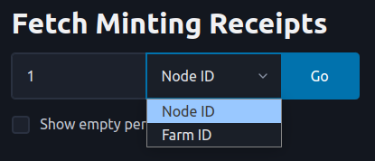
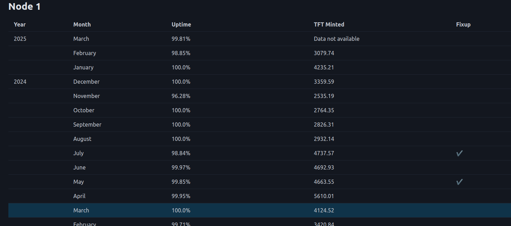
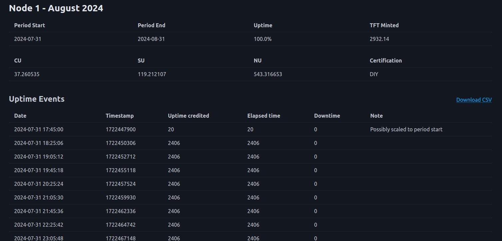
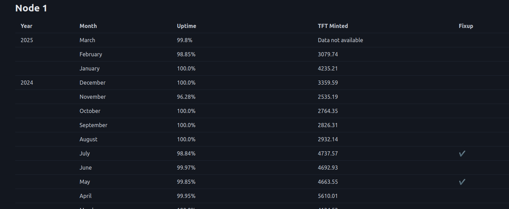
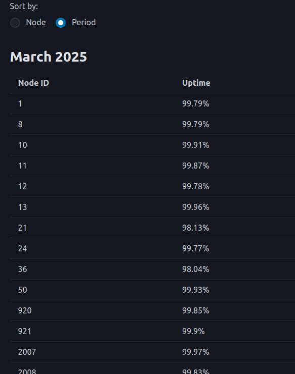

# Minting Tool

## Introduction

We present the Peppermint tool. This tool is very useful to track uptime of your nodes and also to check minting receipts.

## Access

The tool is available at the following URL:

- [https://peppermint.gent01.test.grid.tf](https://peppermint.gent01.test.grid.tf)

## How to Use the Tool

Using the tool is straightforward.

- Search either by node ID or by farm ID

### Node ID Search

- Searching by node ID, you can see the uptime of all past minting periods

- By clicking on a row, you access a node's specific minting period
  - You can download CSV files of the minting reports (See button on the right)

### Farm ID Search

- Search by farm ID, you can see the total minting periods of all nodes, where nodes are presented in ascending order

- You can sort by `Period` to see the uptime of all the farm's nodes sorted by periods

