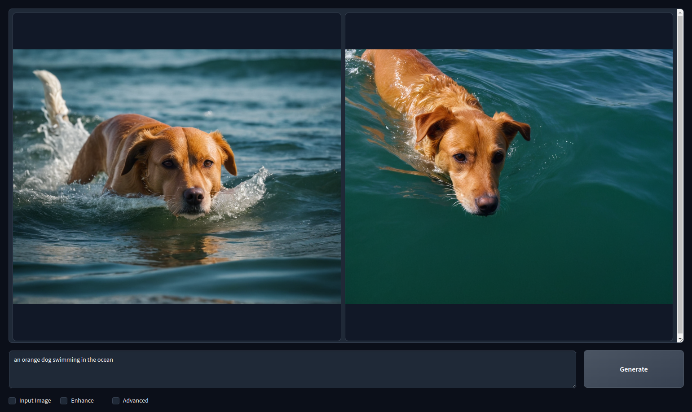
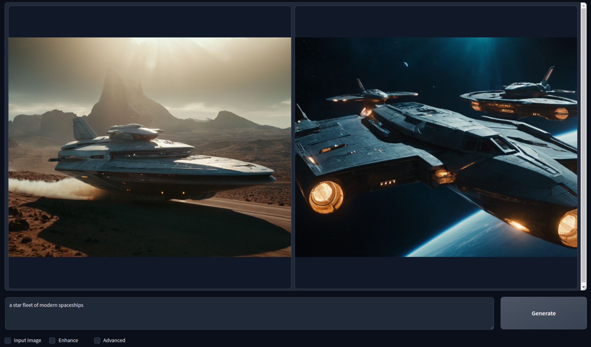
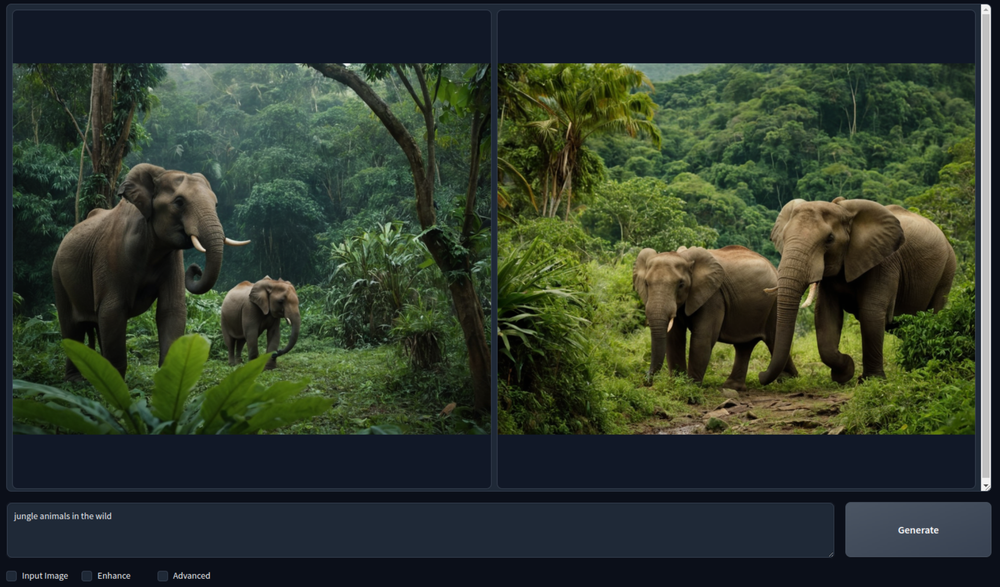
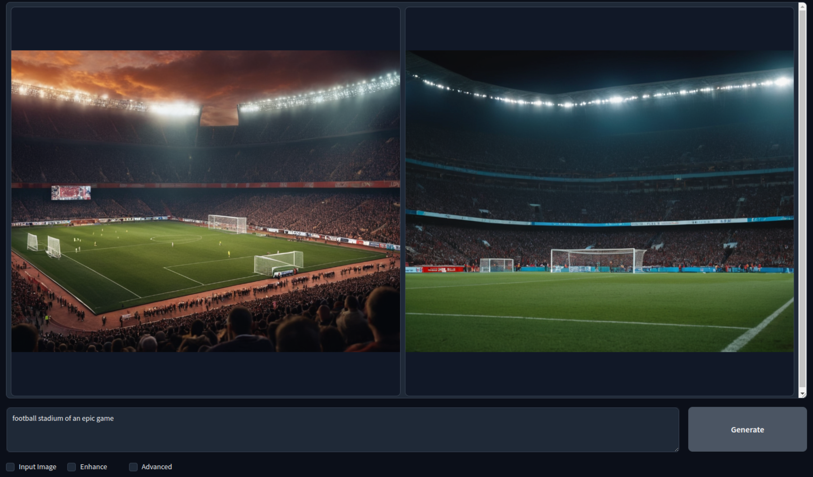

<h1>AI & ML Workloads: GPU and Fooocus</h1>


## Introduction

We show how to use a ThreeFold GPU node on the grid to deploy AI workloads for graphics and image generation. We will be using [Fooocus](https://github.com/lllyasviel/Fooocus) and a full virtual machine with a GPU card.

## Prerequisites

- [A TFChain account](../../../dashboard/wallet_connector.md)
- TFT in your TFChain account
  - [Buy TFT](../../../threefold_token/buy_sell_tft/buy_sell_tft.md)
  - [Send TFT to TFChain](../../../threefold_token/tft_bridges/tfchain_stellar_bridge.md)
- Reserve a [dedicated GPU node](../../../dashboard/deploy/node_finder.md#dedicated-nodes) on the ThreeFold Grid
- Deploy a full VM running Ubuntu 22.04
- [SSH](../../getstarted/ssh_guide/ssh_guide.md) into the node with [Wireguard](../../getstarted/ssh_guide/advanced_methods/ssh_wireguard.md) 

## Prepare the System

- Update the system
    ```
    dpkg --add-architecture i386
    apt-get update
    apt-get dist-upgrade
    reboot
    ```
- Check the GPU info
    ```
    lspci | grep VGA
    lshw -c video
    ```

## Install the GPU Driver

- Download the latest Nvidia driver
  - Check which driver is recommended
      ```
      apt install ubuntu-drivers-common
      ubuntu-drivers devices
      ```
  - Install the recommended driver (e.g. with 535)
      ```
      apt install nvidia-driver-535
      ```
- Check the GPU status
    ```
    nvidia-smi
    ```

Now that the GPU node is set, let's install and launch Fooocus.

## Install the Prerequisites and Launch Fooocus

We install the prerequisites, including Miniconda, clone the repository, download the models and launch Fooocus.

- Install the prerequisites
  ```
  apt update
  apt install python3-pip python3-dev
  pip3 install --upgrade pip
  wget https://repo.anaconda.com/miniconda/Miniconda3-latest-Linux-x86_64.sh
  bash Miniconda3-latest-Linux-x86_64.sh
  ```
- Reload the shell to enable Conda
- Clone the Fooocus directory and install the Python requirements with Miniconda
  ```
  git clone https://github.com/lllyasviel/Fooocus.git
  cd Fooocus
  conda env create -f environment.yaml
  conda activate fooocus
  pip install -r requirements_versions.txt
  ```
- Download the models with conda and deploy Fooocus
  ```
  conda activate fooocus
  python entry_with_update.py
  ```
- Create an SSH tunnel to the VM
  ```
  ssh -4 -L 7865:127.0.0.1:7865 root@10.20.4.2
  ```

## Use Fooocus

You can then access Fooocus:

```
127.0.0.1:7865
```

Here are some image generated with Fooocus:







