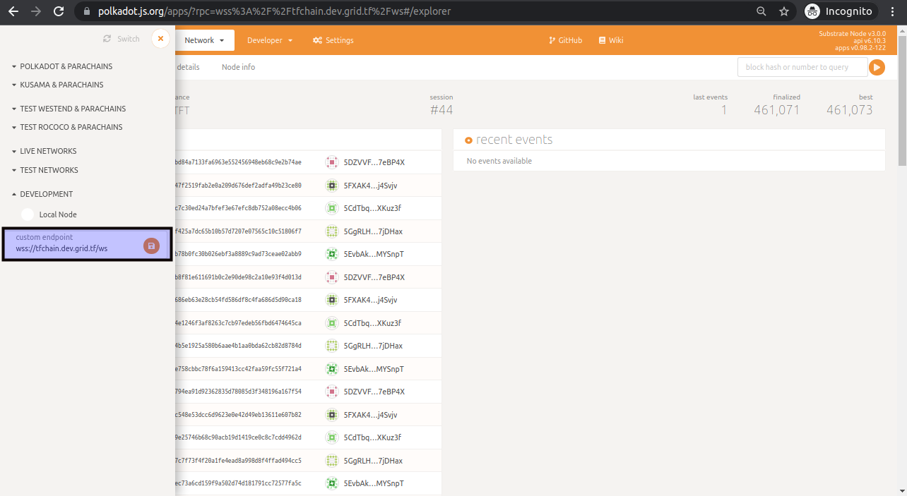

<h1> Cancel Contracts </h1>

<h2>Table of Contents </h2>

- [Introduction](#introduction)
- [Using the Dashboard](#using-the-dashboard)
- [Using GraphQL and Polkadot UI](#using-graphql-and-polkadot-ui)
- [Using grid3\_client\_ts](#using-grid3_client_ts)

***

## Introduction

We present different methods to delete contracts on the TFGrid.

## Using the Dashboard

To cancel contracts with the Dashboard, consult the [Contracts List](../../dashboard/deploy/your_contracts.md) documentation.

## Using GraphQL and Polkadot UI

From the QraphQL service execute the following query.

```
query MyQuery {

  nodeContracts(where: {twinId_eq: TWIN_ID, state_eq: Created}) {
    contractId
  }
}

```

replace `TWIN_ID` with your twin id. The information should be available on the [Dashboard](../../dashboard/dashboard.md).

Then from [polkadot UI](https://polkadot.js.org/apps/), add the tfchain endpoint to development.



Go to `Extrinsics`, choose the `smartContract` module and `cancelContract` extrinsic and use the IDs from GraphQL to execute the cancelation.


## Using grid3_client_ts

In order to use the `grid3_client_ts` module, it is essential to first clone our official mono-repo containing the module and then navigate to it. If you are looking for a quick and efficient way to cancel contracts, we offer a code-based solution that can be found [here](https://github.com/threefoldtech/tfgrid-sdk-ts/blob/development/packages/grid_client/scripts/delete_all_contracts.ts).

To make the most of `grid_client`, we highly recommend following our [Grid-Client guide](https://github.com/threefoldtech/tfgrid-sdk-ts/blob/development/packages/grid_client/README.md) for a comprehensive overview of the many advanced capabilities offered by this powerful tool. With features like contract creation, modification, and retrieval, `grid_client` provides an intuitive and easy-to-use solution for managing your contracts effectively.
