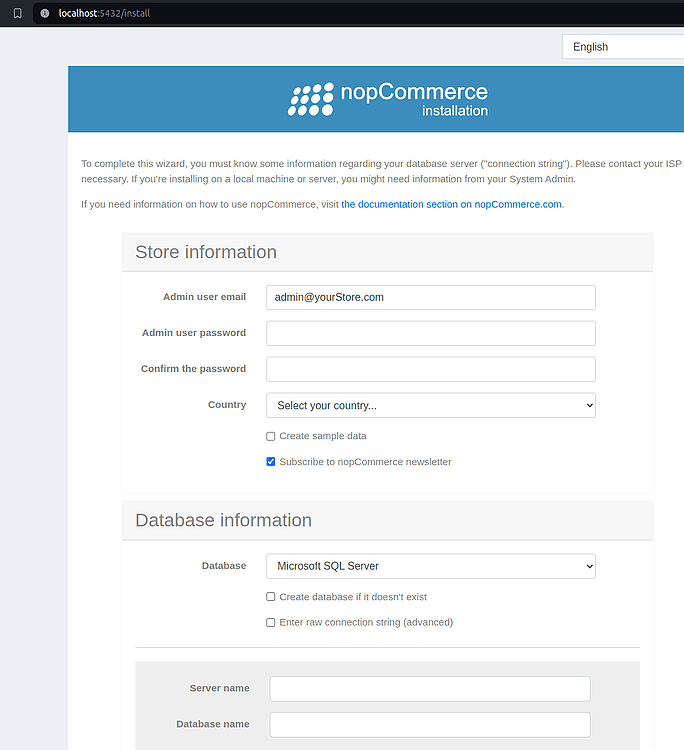
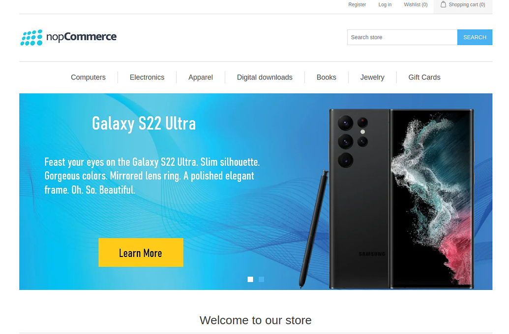
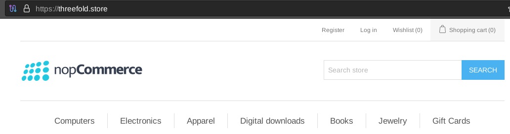
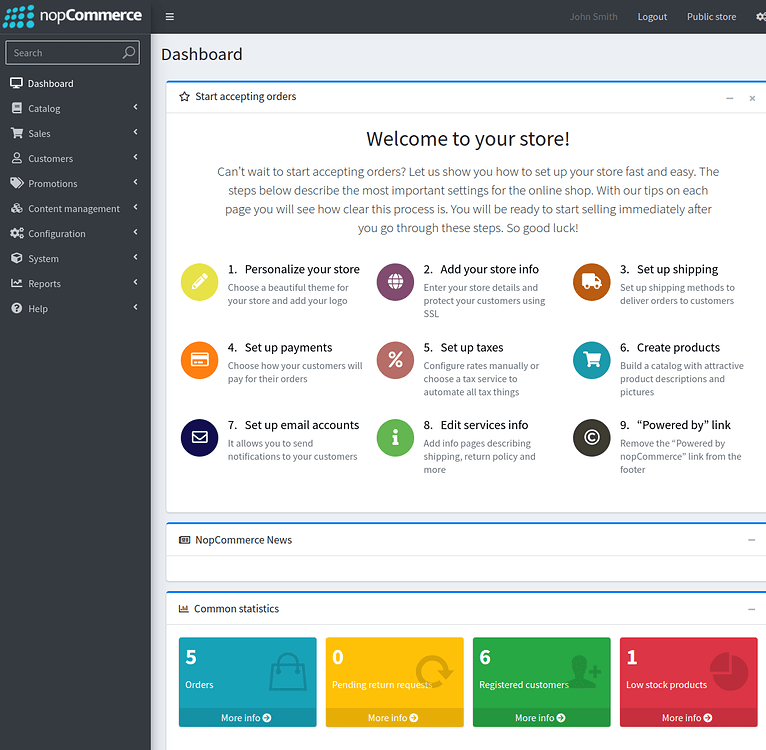

<h1>Ecommerce on the TFGrid</h1>

<h2>Table of Contents</h2>

- [Introduction](#introduction)
- [Prerequisites](#prerequisites)
- [Deploy a Full VM](#deploy-a-full-vm)
- [Create an SSH Tunnel](#create-an-ssh-tunnel)
- [Preparing the VM](#preparing-the-vm)
- [Set a Firewall](#set-a-firewall)
- [Download nopCommerce](#download-nopcommerce)
- [Access nopCommerce](#access-nopcommerce)
- [Install nopCommerce](#install-nopcommerce)
- [Access the Ecommerce from the Public Internet](#access-the-ecommerce-from-the-public-internet)
  - [Set a DNS Record](#set-a-dns-record)
  - [Access the Ecommerce](#access-the-ecommerce)
  - [HTTPS with Caddy](#https-with-caddy)
    - [Manage with Systemd](#manage-with-systemd)
- [Access Admin Panel](#access-admin-panel)
- [Manage nopCommerce with Systemd](#manage-nopcommerce-with-systemd)
- [References](#references)
- [Questions and Feedback](#questions-and-feedback)
---

## Introduction

We show how to deploy a free and open-source ecommerce on the ThreeFold Grid. We will be deploying on a full VM with an IPv4 address.

[nopCommerce](https://www.nopcommerce.com/en) is an open-source ecommerce platform based on Microsoft's ASP.NET Core framework and MS SQL Server 2012 (or higher) backend Database. 

## Prerequisites

- [A TFChain account](../../../dashboard/wallet_connector.md)
- TFT in your TFChain account
  - [Buy TFT](../../../threefold_token/buy_sell_tft/buy_sell_tft.md)
  - [Send TFT to TFChain](../../../threefold_token/tft_bridges/tfchain_stellar_bridge.md)

## Deploy a Full VM

We start by deploying a full VM on the ThreeFold Dashboard.

* On the [Threefold Dashboard](https://dashboard.grid.tf/#/), go to the [full virtual machine deployment page](https://dashboard.grid.tf/#/deploy/virtual-machines/full-virtual-machine/)
* Deploy a full VM (Ubuntu 22.04) with an IPv4 address and at least the minimum specs shown below
  * IPv4 Address
  * Minimum vcores: 2 vcores
  * Minimum GB of RAM: 4 GB
  * Minimum storage: 50 GB
* After deployment, note the VM IPv4 address

## Create an SSH Tunnel

We create an SSH tunnel with port 5432:80, as it is this combination that we will set for nopCommerce on the docker-compose file.

- Open a terminal and create an SSH tunnel
    ```
    ssh -4 -L 5432:127.0.0.1:80 root@VM_IPv4_address>
    ```

Simply leave this window open and follow the next steps.

## Preparing the VM

We prepare the full to run nopCommerce.

* Connect to the VM via SSH
    ``` 
    ssh root@VM_IPv4_address
    ```
* Update the VM
   ```
   apt update
   ```
* [Install Docker](../../computer_it_basics/docker_basics.html#install-docker-desktop-and-docker-engine)
* Install docker-compose
    ```
    apt install docker-compose -y
    ```

## Set a Firewall

You can set a firewall to your VM for further security. This should be used in production mode.

* Add the permissions
  * ```
    ufw allow 80
    ufw allow 443
    ```
* Enable the firewall
  * ```
    ufw enable
    ```
* Verify the fire wall status
  * ```
    ufw status verbose
    ```

## Download nopCommerce

* Clone the repository
   ```
   git clone https://github.com/nopSolutions/nopCommerce.git
   cd nopCommerce
   ```
* Build the image
   ```
   cd nopCommerce
   docker-compose -f ./postgresql-docker-compose.yml build
   ```
* Run the image
    ```
    docker-compose -f ./postgresql-docker-compose.yml up
    ```

## Access nopCommerce

You can access the nopCommerce interface on a browser with port 5432 via the SSH tunnel:

```
localhost:5432
```



For more information on how to use nopCommerce, refer to the [nopCommerce docs](https://docs.nopcommerce.com/en/index.html).

## Install nopCommerce

You will need to set your ecommerce store and database information.

- Enter an email for your website (e.g. `admin@example.com`)
- For the database, choose PostgreSQL and check both options `Create a database` and `Enter raw connection`. Enter the following information (as per the docker-compose information)
    ```
    Server=nopcommerce_database;Port=5432;Database=nop;User Id=postgres;Password=nopCommerce_db_password;
    ```
- Note: For production, you will need to set your own username and password.

## Access the Ecommerce from the Public Internet

### Set a DNS Record

* Go to your domain name registrar
  * In the section **Advanced DNS**, add a **DNS A Record** to your domain and link it to the IP address of the VM you deployed on:
    * Type: A Record
    * Host: @
    * Value: <IPv4_Address>
    * TTL: Automatic
  * It might take up to 30 minutes to set the DNS properly.
  * To check if the A record has been registered, you can use a common DNS checker:
    * ```
      https://dnschecker.org/#A/example.com
      ```

### Access the Ecommerce

You can now go on a web browser and access your website via your domain, e.g. `example.com`.



### HTTPS with Caddy

We set HTTPS with Caddy.

- Install Caddy
    ```
    apt install -y debian-keyring debian-archive-keyring apt-transport-https curl
    curl -1sLf 'https://dl.cloudsmith.io/public/caddy/stable/gpg.key' | gpg --dearmor -o /usr/share/keyrings/caddy-stable-archive-keyring.gpg
    curl -1sLf 'https://dl.cloudsmith.io/public/caddy/stable/debian.deb.txt' > /etc/apt/sources.list.d/caddy-stable.list
    apt update
    apt install caddy
    ```
- Set a reverse proxy on port 80 with your own domain
    ```
    caddy reverse-proxy -r --from example.com --to :80
    ```

You should see in the logs that it successfully obtains an SSL certificate, and after that you can try navigating to your site's domain again to verify it's working. Using a private window or adding `https://` specifically might be necessary until your browser drops its cache.



When you're satisfied that everything looks good, hit `ctl-c` to exit Caddy and we'll proceed to making this persistent.

#### Manage with Systemd

We create a systemd service to always run the reverse proxy for port 80.

- Create a caddy service
    ```bash
    nano /etc/systemd/system/caddy.service
    ```
- Set the service with your own domain
    ```
    [Unit]
    Description=Caddy Service
    StartLimitIntervalSec=0

    [Service]
    Restart=always
    RestartSec=5
    ExecStart=caddy reverse-proxy -r --from example.com --to :80

    [Install]
    WantedBy=multi-user.target   
    ```
- Enable the service
    ```
    systemctl daemon-reload
    systemctl enable caddy
    systemctl start caddy
    ```
- Verify that the Caddy service is properly running
    ```
    systemctl status caddy
    ```

Systemd will start up Caddy immediately, restart it if it ever crashes, and start it up automatically after any reboots.

## Access Admin Panel

You can access the admin panel by clicking on `Log in` and providing the admin username and password set during the nopCommerce installation.



In `Add your store info`, you can set the HTTPS address of your domain and enable SSL.

You will need to properly configure your ecommerce instance for your own needs and products. Read the nopCommerce docs for more information.

## Manage nopCommerce with Systemd

We create a systemd service to always run the nopCommerce docker-compose file.

- Create a nopcommerce service
    ```bash
    nano /etc/systemd/system/nopcommerce.service
    ```
- Set the service with your own domain
    ```
    [Unit]
    Description=nopCommerce Service
    StartLimitIntervalSec=0

    [Service]
    Restart=always
    RestartSec=5
    StandardOutput=append:/root/nopcommerce.log
    StandardError=append:/root/nopcommerce.log
    ExecStart=docker-compose -f /root/nopCommerce/postgresql-docker-compose.yml up
    [Install]
    WantedBy=multi-user.target   
    ```
- Enable the service
    ```
    systemctl daemon-reload
    systemctl enable nopcommerce
    systemctl start nopcommerce
    ```
- Verify that the Caddy service is properly running
    ```
    systemctl status nopcommerce
    ```

Systemd will start up the nopCommerce docker-compose file, restart it if it ever crashes, and start it up automatically after any reboots.

## References

For further information on how to set nopCommerce, read the [nopCommerce documentation](https://docs.nopcommerce.com/en/index.html?showChildren=false).

## Questions and Feedback

If you have any questions or feedback, please let us know by either writing a post on the [ThreeFold Forum](https://forum.threefold.io/), or by chatting with us on the [TF Grid Tester Community](https://t.me/threefoldtesting) Telegram channel.